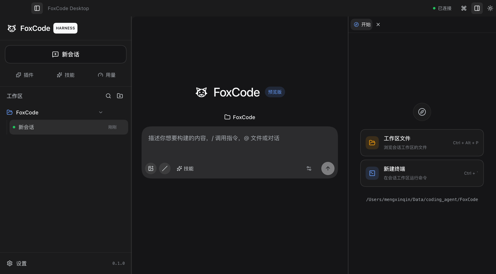
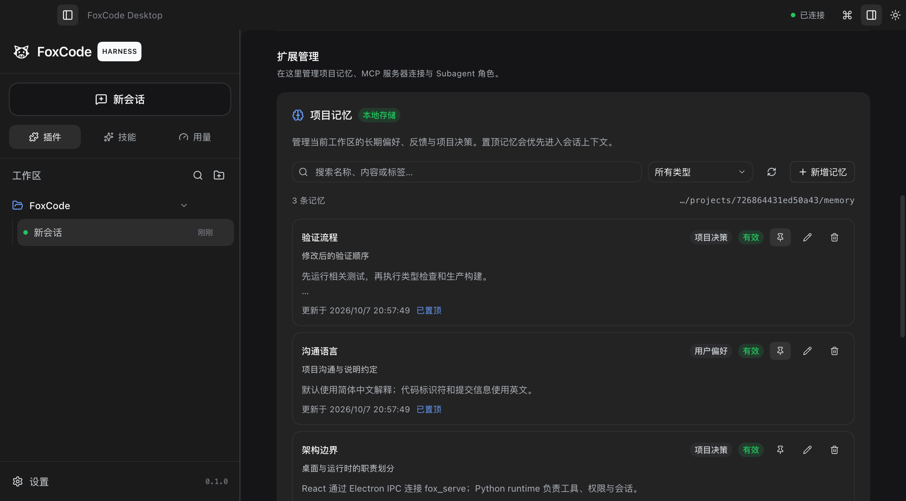
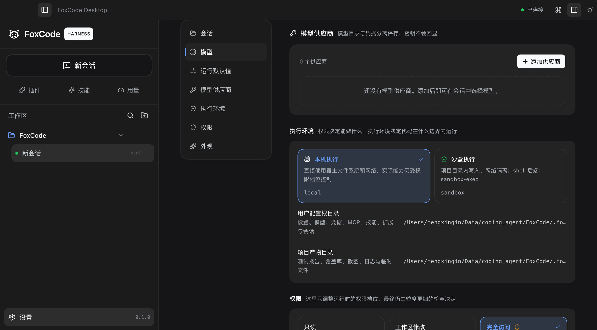
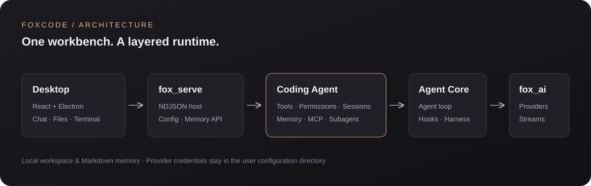

<div align="center">
  
  <h1>FoxCode</h1>
  <p><strong>在本地工作区里，让 AI 理解代码、执行任务、记住项目。</strong></p>
  <p>React · Electron · Python · 多模型 · Memory · MCP · Subagent</p>
  <p>
    <a href="#快速开始">快速开始</a> ·
    <a href="#界面预览">界面预览</a> ·
    <a href="#项目结构">架构与文档</a> ·
    <a href="#开发与验证">开发指南</a>
  </p>
</div>



FoxCode 是一个本地优先的桌面 Coding Agent。你可以在同一工作台中与模型对话、操作代码、
查看 Diff、处理审批，并用长期记忆延续项目约定。桌面端通过 Python sidecar 连接真实运行时；
模型请求发送到你配置的供应商。

## 主要能力

| 能力 | 使用方式 |
| --- | --- |
| 编码工作台 | 流式回复与思考、工具调用、图片输入、文件预览、Diff 和内嵌终端 |
| 会话管理 | 新建、恢复、分支、重命名、导出与上下文压缩 |
| 执行控制 | Auto / Default / Plan 模式，权限档位、逐次审批和沙盒 |
| 多模型配置 | 配置供应商、模型参数、API Key 与推理强度 |
| 项目记忆 | 查看、搜索、新增、编辑、置顶与删除；写入真实后端存储 |
| 扩展能力 | 静态 Skills、MCP 工具服务器与受限 Subagent |
| 用量统计 | 上下文、tokens、费用估算与回合信息 |

## 界面预览

### 项目记忆

在侧栏「插件」启用 `memory` 后，可以直接管理当前工作区的记忆。记录保存在本机 Markdown 文件中，
编辑或删除立即同步到后端；不同工作区彼此隔离。



### 设置中心

配置模型供应商、API Key 和运行默认值。MCP 与 Subagent 的配置入口位于「插件」页。
凭据只存入用户目录，设置快照不会回显密钥。



> 展示图来自真实 Electron 界面；记忆内容是隔离数据目录中的示例，未包含个人凭据或私人会话。

## 快速开始

准备 Python **3.14+**、[uv](https://docs.astral.sh/uv/)、Node.js **22.12+** 和 npm。

```bash
git clone https://github.com/HMnZn/FoxCode.git
cd FoxCode
uv sync

cd desktop
npm ci
npm run dev
```

开发启动器会启动 Vite 和 Electron，并自动使用仓库 `.venv` 中的 Python 拉起 `fox_serve`。
界面就绪后：

1. 打开「设置」，添加模型供应商与模型，保存 API Key。
2. 选择工作区，确认项目的信任状态、权限和执行环境。
3. 在「插件」中按需启用 Memory、MCP 或 Subagent。
4. 创建会话并开始任务。

只体验浏览器界面：

```bash
cd desktop
npm run dev:web
```

浏览器版使用 Mock host；真实文件、记忆和模型操作需要 Electron 连接 Python sidecar。
首次没有模型配置时，设置中心仍可打开，不会因为启动界面而发送模型请求。

<details>
<summary>CLI 与自定义 sidecar</summary>

在仓库根目录使用 CLI：

```bash
uv run fox --trust-project --interactive
uv run fox --list-models
uv run fox --model provider/model-id -p "解释这个仓库"
```

指定外部 Python 和工作区：

```bash
cd desktop
export FOXCODE_SERVE_CMD=/path/to/python
export FOXCODE_SERVE_ARGS_JSON='["-m","fox_serve","--quiet","--cwd","/path/to/workspace"]'
npm run dev
```

该 Python 环境需已安装 FoxCode 的运行时依赖，并能导入 `fox_serve`。

</details>

## 项目结构



依赖方向为 `fox-coding-agent → fox-agent-core → fox-ai`；React 通过 Electron IPC 和
NDJSON 使用 Python 能力。

| 目录 | 职责 | 文档 |
| --- | --- | --- |
| [`desktop/`](desktop/) | Electron 壳、React 工作台、终端与 bridge | [桌面端](desktop/README.md) |
| [`fox_serve/`](fox_serve/) | NDJSON 协议、配置控制面、会话与记忆接口 | [Sidecar](fox_serve/README.md) |
| [`packages/fox_coding_agent/`](packages/fox_coding_agent/) | CLI、工具、权限、资源与扩展 | [Coding Agent](packages/fox_coding_agent/README.md) |
| [`packages/fox_agent_core/`](packages/fox_agent_core/) | Agent 循环、事件、工具协议与 harness | [Agent Core](packages/fox_agent_core/README.md) |
| [`packages/fox_ai/`](packages/fox_ai/) | 模型类型、供应商适配、流式事件与重试 | [模型层](packages/fox_ai/README.md) |
| [`tests/`](tests/) | 运行时回归测试与记忆评估 fixtures | [记忆扩展](packages/fox_coding_agent/src/extensions/memory/README.md) |

扩展文档：[Memory](packages/fox_coding_agent/src/extensions/memory/README.md) ·
[MCP](packages/fox_coding_agent/src/extensions/mcp/README.md) ·
[Subagent](packages/fox_coding_agent/src/extensions/subagent/README.md)。

## 配置与数据

默认用户目录为 `~/.foxcode`，可用 sidecar 的 `--user-dir` 指定其他位置。

| 路径 | 内容 |
| --- | --- |
| `settings.json` | 模型选择、权限、执行环境和扩展列表 |
| `models.json` | 供应商、Base URL、适配协议和模型元数据 |
| `auth.json` | API Key / OAuth 凭据，始终为用户级数据 |
| `mcp.json`、`agents/*.md` | MCP 服务器与 Subagent 角色 |
| `skills/`、`extensions/`、`prompts/` | 用户资源 |
| `sessions/` | 按工作区隔离的会话 |
| `projects/<workspace-hash>/memory/` | 当前工作区的长期记忆 |

项目设置位于 `<workspace>/.foxcode/`，受信任后才会加载。项目级 `extensions` 列表整体覆盖
用户级列表。配置、凭据、会话、测试输出与构建缓存已纳入 `.gitignore`。

## 权限与执行环境

| 权限 | 行为 |
| --- | --- |
| `read-only` | 只允许读取和搜索 |
| `workspace-modify` | 工作区内写入可执行，Shell 与越界写入需审批 |
| `full-access` | 允许系统级操作，宿主与扩展 hook 仍可拒绝调用 |

权限与执行隔离独立：`local` 使用本机环境；`sandbox` 限制文件边界，并在原生后端可用时
隔离 Shell 和网络。原生后端不可用时，沙盒 Shell 会被禁用。
详见 [文件系统与沙盒](docs/FILESYSTEM_AND_SANDBOX.md)。

## 开发与验证

在仓库根目录运行：

```bash
uv run --with pytest python -m pytest tests fox_serve/tests -q
uv run python tests/memory_eval.py

npm --prefix desktop test
npm --prefix desktop run build
```

`build` 包含 TypeScript 检查与 Vite 生产构建。测试使用离线 provider 和固定样例。
真实模型 smoke test 需要已配置的供应商与密钥，会产生模型用量：

```bash
uv run python fox_serve/scripts/ndjson_client.py --prompt "只回复：ready" --approve
```

临时截图、日志与报告放在 `.foxcode/artifacts/`；公开展示图保存在 `docs/images/`。

## 桌面打包

```bash
cd desktop
npm run dist:mac
```

生成的 DMG/ZIP 位于 `desktop/release/`。当前桌面打包不内置 Python runtime；安装包使用者需要
单独准备 sidecar 环境并配置 `FOXCODE_SERVE_CMD`。发布验证与常见问题见
[桌面端文档](desktop/README.md)。
