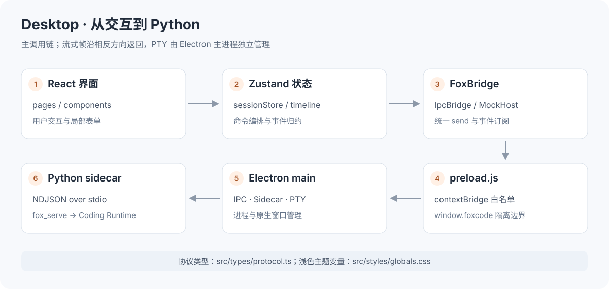
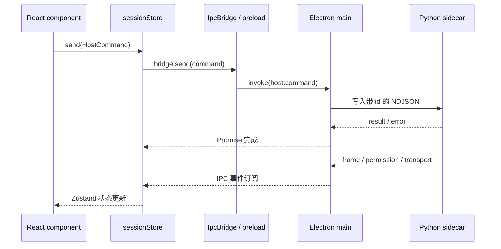
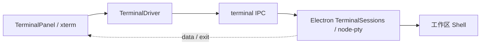
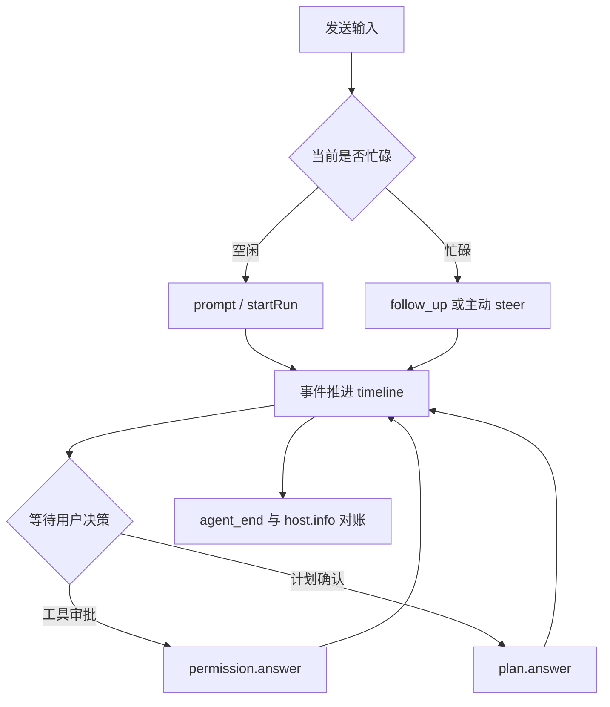

# FoxCode Desktop 学习指南

Desktop 是 FoxCode 的 Electron + React 工作台。它将会话、工具执行、文件预览、终端、
项目记忆和配置管理放在一个窗口中，通过 `FoxBridge` 连接 Python `fox_serve`。

本文从可见界面讲到进程边界、状态流转与开发方法。除启动示例另有说明外，npm 命令都在 **`desktop/` 目录**执行。

> 阅读路线：[启动](#1-启动与运行模式) → [界面导览](#2-从界面认识功能) →
> [进程与 Bridge](#3-理解三个进程边界) → [状态与流式事件](#4-理解状态管理与流式时间线) →
> [记忆调用实例](#5-用记忆管理串起前后端) → [开发与验证](#7-开发调试与验证)。


## 1. 启动与运行模式

### 1.1 真实桌面开发

准备 Python 3.14+、uv、Node.js 22.12+ 和 npm。先在仓库根目录同步 Python 依赖：

```bash
uv sync
cd desktop
npm ci
npm run dev
```

开发启动器 [scripts/dev.mjs](scripts/dev.mjs) 启动 Vite，确认 HTTP 服务就绪后拉起 Electron。
Electron 在源码 checkout 中发现仓库 `.venv`，启动 `python -m fox_serve`。
默认 Vite 地址是 `http://127.0.0.1:5273`，真实后端走子进程 stdio，不走这个 HTTP 地址。

首次启动的使用顺序：

1. 选择工作区，确认界面与宿主的 cwd 一致。
2. 在「设置」添加模型供应商与模型，保存凭据。
3. 确认项目信任、权限档位与执行环境。
4. 在「插件」按需启用 Memory、MCP 和 Subagent。
5. 创建会话并发送任务。

没有模型配置时，设置控制面仍能启动；打开应用本身不发送模型请求。

### 1.2 浏览器演示与真实 sidecar

```bash
npm run dev:web
```

浏览器没有 preload 注入的 `window.foxcode`，使用前端 `MockHost`。
两种模式复用相同组件与 `FoxBridge` 协议，但数据来源不同：

| 模式 | Bridge | 数据与能力 | 适合学习什么 |
| --- | --- | --- | --- |
| Electron + sidecar | `IpcBridge` | Python 模型、会话、文件与持久化记忆 | 端到端调用与真实后端 |
| 浏览器 | `MockHost` | 模拟事件与窗口内业务数据 | 布局、表单、交互与时间线 |
| Electron 未配置 sidecar | `MockHost` + 原生能力 | 演示宿主；仍可使用主进程的终端等能力 | 壳层与演示 UI |

`getBridge()` 选择的是渲染进程里的单例。preload 的 `available` 表示**是否配置 sidecar**，
不等同于 Python 已健康启动；实际连接状态还要看 `host:transport` 和 `host.info`。
配置了 sidecar 但 Python 启动失败时，应排查连接错误，不能把演示数据当成后端结果。

### 1.3 自定义 Python 与隔离数据目录

```bash
export FOXCODE_SERVE_CMD=/absolute/path/to/python
export FOXCODE_SERVE_ARGS_JSON='["-m","fox_serve","--quiet","--cwd","/absolute/path/to/workspace","--user-dir","/absolute/path/to/learning-user"]'
npm run dev
```

该 Python 环境需要能导入 runtime 依赖与 `fox_serve`。主进程会设置仓库 import 路径；
如果自己设置 `PYTHONPATH`，要确保其中包含所需源码路径。
`--user-dir` 隔离后端数据；Electron 自己的主题、工作区等界面偏好属于另一套存储。

| 环境变量 | 用途 |
| --- | --- |
| `FOXCODE_DEV_PORT` | 修改开发端口，例如 `FOXCODE_DEV_PORT=5300 npm run dev` |
| `FOXCODE_SERVE_CMD` | sidecar 可执行文件 |
| `FOXCODE_SERVE_ARGS_JSON` | JSON 参数数组，适合带空格的路径 |
| `FOXCODE_SIDECAR_DEBUG=1` | 主进程打印截断后的协议行；排查后关闭 |
| `FOXCODE_ELECTRON_FLAGS` | 给 Electron 追加参数，例如隔离的 `--user-data-dir` |

## 2. 从界面认识功能

### 2.1 页面与入口

| 区域 | 作用 | 对应源码 |
| --- | --- | --- |
| 左侧栏 | 切换工作区、会话和功能页 | [Sidebar.tsx](src/components/layout/Sidebar.tsx) |
| 会话页 | 正文、思考、工具、计划、审批和输入队列 | [ChatPage.tsx](src/pages/ChatPage.tsx) |
| 全部会话 | 恢复、分支、重命名与删除 | [SessionsPage.tsx](src/pages/SessionsPage.tsx) |
| 插件 | 扩展启停；下方扩展管理包含记忆、MCP、Subagent | [ExtensionsPage.tsx](src/pages/ExtensionsPage.tsx) |
| 技能 | 静态 Skills 列表和调用 | [SkillsPage.tsx](src/pages/SkillsPage.tsx) |
| 用量 | tokens、上下文、费用估算和回合统计 | [UsagePage.tsx](src/pages/UsagePage.tsx) |
| 设置 | 供应商、凭据、默认值与诊断 | [SettingsPage.tsx](src/pages/SettingsPage.tsx) |
| 右侧面板 | 文件浏览、Diff、预览与内嵌终端 | [Inspector.tsx](src/components/layout/Inspector.tsx) |

`App.tsx` 根据 `uiStore.view` 切换页面，没有单独的页面 URL 路由。
没有选择工作区时，`WorkspacePicker` 先占据主窗口；工作区是会话、工具路径和信任的共同锚点。

### 2.2 记忆管理在扩展管理区


启用 Memory 且项目可信后，可查看正文、搜索、类型筛选、新增、编辑、置顶、删除与刷新。
列表可包含已替代或已过期记录；置顶不改变记录生命周期。
切换工作区后重新读取对应存储。删除需要确认，保存失败保留编辑内容。

界面中的搜索是后端文本搜索，类型筛选在前端进行。Agent 执行期间后端拒绝修改和删除。
真实记录保存在用户数据目录按工作区隔离的 Markdown 中，浏览器 Mock 只模拟这一行为。

### 2.3 设置与插件控制面


设置与插件页共用 [SettingsControlPlane.tsx](src/components/settings/SettingsControlPlane.tsx)。
`surface` 决定展示的配置区域：供应商与 runtime 默认值放设置页，MCP 与 Subagent 放插件页。

API Key 用 password 输入，保存后不回显；MCP env 返回变量名。
表单从 `config.get` 获取后端快照，通过 `config.*` 保存，不能直接改本地 JSON 文件来绕过校验。
项目 scope 和用户 scope 的区别由后端执行。

### 2.4 常用快捷键

以下 `Mod` 在 macOS 为 Command，在 Windows/Linux 为 Ctrl：

| 快捷键 | 动作 |
| --- | --- |
| `Mod + K` | 命令面板 |
| `Mod + N` | 新建会话 |
| `Mod + B` | 显示/隐藏侧栏 |
| `Mod + J` | 显示/隐藏右侧面板 |
| `Mod + Backquote` | 切换内嵌终端 |
| `Mod + Alt + P` | 打开文件工作台 |
| `Escape` | 关闭命令面板；非输入框中可中止流式运行 |

## 3. 理解三个进程边界



### 3.1 Renderer：界面与状态

React renderer 展示 UI，维护 Zustand store，通过 `FoxBridge` 调用宿主。
它不能直接 import Node 文件系统或启动 Python。
主窗口开启 `contextIsolation`、`sandbox` 与 `webSecurity`，关闭 `nodeIntegration`。

### 3.2 Preload：有限的原生入口

[electron/preload.js](electron/preload.js) 使用 `contextBridge` 暴露 `window.foxcode`，
枚举允许的 invoke 与订阅通道。订阅函数只把 payload 交给 renderer，返回取消订阅函数。
`host:transport` 订阅后会回放主进程当前状态，避免 Python 先就绪、React 后挂载导致漏掉通知。

### 3.3 Main：进程、窗口与终端

[electron/main.js](electron/main.js) 拥有 BrowserWindow、Sidecar 和 PTY 会话。
[electron/sidecar.js](electron/sidecar.js) 拆分 NDJSON 行、按 id 完成 Promise，
把无请求 id 的帧与事件重新发到 IPC。



浏览器 Mock 实现同样的 `info / sessions / send / onFrame / onPermission / onTransport` 契约。
前端业务组件依赖这个接口，因此不需要知道请求经过 IPC 还是模拟器。
`info()` 和 `sessions()` 都通过 `host:command` 发送；preload 只开放实际使用的 IPC 通道，
新增业务能力优先扩展 `HostCommand` 与 Python handler。

聊天工具卡、审批预览和文件预览共享 [lib/diff.ts](src/lib/diff.ts) 的 Diff 类型与解析器。
渲染组件只处理展示；调整解析规则时运行 [diff.test.ts](src/lib/diff.test.ts)，检查文件状态和两侧行号。

### 3.4 终端是另一条通道



内嵌终端由主进程直接创建，与 Python Agent 的 Shell 工具分开。
键盘输入、窗口尺寸和退出通过 `terminal:*` 通道传递，输出用事件推送。
Electron 中即使使用 MockHost，原生终端仍然可用；纯浏览器使用演示 driver。
Agent 的权限与沙盒不是用户手动终端命令的执行机制。

## 4. 理解状态管理与流式时间线

### 4.1 Store 分工

| Store | 持有内容 | 主要消费方 |
| --- | --- | --- |
| [sessionStore](src/store/sessionStore.ts) | host、transport、sessions、timeline、queue、命令动作 | 会话与管理页面 |
| [workspaceStore](src/store/workspaceStore.ts) | 当前/最近工作区、别名、隐藏项、宿主同步结果 | 工作区选择与侧栏 |
| [uiStore](src/store/uiStore.ts) | 主题、页面、面板宽度、命令面板状态 | App 与布局 |
| [filesStore](src/store/filesStore.ts) | 工作区改动与刷新 | Inspector |
| [railStore](src/store/railStore.ts) | 文件标签与右侧工作台切换 | 预览与终端面板 |
| [terminalStore](src/store/terminalStore.ts) | PTY 会话与终端生命周期 | TerminalPanel |
| [pinStore](src/store/pinStore.ts) | 界面固定条目 | 侧栏等界面；与 Memory 的 pinned 字段不同 |
| [toastStore](src/store/toastStore.ts) | 提示状态、自动关闭计时与审批通知 | Toaster |

业务状态放共享 store，临时编辑内容放组件 state；不要把每个输入框都提升为全局状态。
`busyCount` 统计正在等待的命令调用，**不等于 Agent 正在生成**。
Agent 状态由 timeline 和后端 `busy` 共同判断。

### 4.2 初始化顺序

`App` 调用 `useSession.init()`，先订阅 transport、frame、permission，再获取 host 与 sessions。
随后工作区 store 对照 `host.cwd`，必要时发送 `cwd.change`。

工作区列表里的“记住的路径”与后端已生效路径可能不同。
切换失败会保留目标并展示错误；只有 `changeCwd` 成功后才清理旧的文件标签和相关状态。
运行中选择另一目录可以先加入侧栏，结束后再切换。

### 4.3 timeline 是事件归约器

[store/timeline.ts](src/store/timeline.ts) 的 `applyFrame(state, frame)` 将事件折叠为可显示的块：
用户、Assistant、工具、计划、通知与恢复信息。

| 事件 | UI 中的效果 |
| --- | --- |
| `session_start` | 重置时间线，开始展示打开的会话 |
| `agent_start` | 标记运行中 |
| `message_update` | 按 `content_index` 追加正文或思考 delta |
| `tool_execution_start/update/end` | 创建工具卡，显示中间结果与成功/错误 |
| `message_end` | 用最终消息收敛内容与 usage |
| `turn_end` | 收束当前回合，不能把整轮任务改为空闲 |
| `agent_end` | 结束整轮，触发 host、会话列表和文件改动刷新 |
| `compaction_*` | 更新压缩状态与上下文统计 |
| `model_retry/context_overflow_retry` | 合并恢复信息，避免把中间重试显示成最终失败 |
| `error` | 呈现失败并收束相应运行状态 |

`message_update` 中的模型事件不是完整 AssistantMessage。
流式时累积 delta，结束时使用最终消息；不能每次把同一 partial 全量追加一次。

### 4.4 插话、排队、审批与状态恢复



默认忙碌时发送输入会进入 follow-up；主动插话走 steer。
权限事件不经过 `applyFrame`，由 `applyPermissionRequest` 建立审批状态，用户答复后清理对应通知。
计划接受/拒绝使用另一套 decision 类型。

界面不能只靠结束帧判断 Agent 是否忙碌。`reconcile()` 对照 `host.info.busy` 与 `lastFrameAt`：
长时间无帧先提示可能卡住，宿主连续报告空闲且足够安静后才解除生成锁定。
当前阈值为 45 秒无输出提示、8 秒宿主安静、两次空闲确认；代码常量是最终依据。
这套机制避免模型长思考、重试窗口或帧传输延迟被立即判成结束。

## 5. 用记忆管理串起前后端

### 5.1 从页面定位服务

| 步骤 | 代码位置 | 关键行为 |
| --- | --- | --- |
| 页面入口 | [ExtensionsPage](src/pages/ExtensionsPage.tsx) | MemoryManager 放在下方「扩展管理」区域 |
| 门控与组件重建 | [MemoryManager](src/components/extensions/MemoryManager.tsx) | 检查扩展和 trust；按工作区重新挂载 |
| 列表与搜索 | `refresh()` | `memory.list({query})`；200ms 防抖 |
| 过时请求保护 | `request` / `mounted` refs | 旧搜索结果不能覆盖新查询，卸载后不更新 state |
| 保存与删除 | `mutate()` | 等待后端成功后关对话框并刷新，失败保留内容 |
| 后端入口 | [ServeHost Memory handlers](../fox_serve/host.py) | 校验字段、运行状态，复用 Memory 服务 |
| 持久化 | [MemoryStore](../packages/fox_coding_agent/src/extensions/memory/store.py) | 原子写入 Markdown 并重建索引 |

### 5.2 在组件中调用接口

下面展示现有调用模式；需放在 React 组件中，或在非组件代码中使用 `useSession.getState()`：

```tsx
import { useSession } from '@/store/sessionStore'
import type { MemoryList } from '@/types/protocol'

// 在组件函数内取得动作
const send = useSession((state) => state.send)

// 例如在刷新按钮的 async handler 中调用
const result = await send(
  { method: 'memory.list', params: { query: '验证' } },
  { silent: true },
) as MemoryList
```

`send()` 返回 `Promise<unknown>`，`HostCommand` 只检查命令输入。
上述 `as MemoryList` 是消费方的类型断言，不是运行时数据验证。
`silent: true` 抑制通用 toast，让表单自己展示错误，但 Promise 仍会 reject，调用方仍需 catch。

新增传 `name / description / type / content / pinned`，编辑使用列表返回的 `filename`，
只改 `description / content / pinned`。不能通过编辑改名、改变类型或恢复失效记录。

### 5.3 学习验收

在隔离数据目录下新增“验证流程”，搜索、查看正文、编辑、置顶，再重启应用查看是否保留。
最后删除并刷新。使用 `host.info.transport` 确认为 `sidecar`，不能仅凭 UI 显示判断已调用真实后端。

这些步骤验证不同边界：保存成功验证 API，刷新验证读取，重启验证持久化，切换工作区验证隔离。

## 6. 目录与源码阅读顺序

```text
desktop/
├── electron/
│   ├── main.js           窗口、IPC、sidecar 与原生能力
│   ├── preload.js        白名单 API 与事件订阅
│   ├── sidecar.js        NDJSON 客户端
│   └── terminal.js       PTY 进程管理
├── scripts/              开发启动、截图、图标与原生依赖
├── src/
│   ├── App.tsx           工作区门控与页面布局
│   ├── bridge/           FoxBridge、IPC、Mock、terminal driver
│   ├── store/            状态与 timeline 归约
│   ├── pages/            页面入口
│   ├── components/       会话、配置、记忆、文件和基础组件
│   ├── lib/              格式化、共享 Diff 解析、预览与高亮
│   ├── styles/           主题与设计变量
│   └── types/protocol.ts 前后端共享协议约定
└── package.json          脚本与 Electron 打包配置
```

建议按这个顺序阅读，每一步追一条行为即可：

1. `App.tsx` 与 `uiStore.ts`：页面怎么切换，为什么先选工作区。
2. `bridge/types.ts`、`bridge/index.ts`、`bridge/ipc.ts`：业务如何脱离具体宿主。
3. `sessionStore.init/send` 与 `timeline.applyFrame`：回复如何从事件成为界面。
4. `electron/preload.js`、`main.js`、`sidecar.js`：IPC 与 NDJSON 如何衔接。
5. `MemoryManager.tsx` 与 `SettingsControlPlane.tsx`：表单如何读写真实接口。
6. `workspaceStore.ts`、`railStore.ts`、`TerminalPanel.tsx`：目录切换和原生资源如何清理。
7. 对应 `.test.ts(x)`：失败、取消、旧响应与恢复行为如何验证。

## 7. 开发、调试与验证

### 7.1 常用命令

| 命令 | 用途 |
| --- | --- |
| `npm run dev` | Vite + Electron + sidecar |
| `npm run dev:web` | 浏览器演示 |
| `npm run dev:no-gpu` | 显式兼容模式 |
| `npm run dev -- --reset-gpu` | 重置自动兼容记录 |
| `npm run typecheck` | TypeScript 检查 |
| `npm test` / `npm run test:watch` | 单次测试 / 监听测试 |
| `npm run build` | 类型检查与生产构建 |
| `npm run build:web` | 仅 Vite 构建，不包含 TypeScript 检查 |
| `npm run shot -- ../.foxcode/artifacts/studio.png` | 构建并截取真实 Electron 窗口 |
| `npm run icon` | 生成打包图标 |
| `npm run dist:mac` | macOS DMG / ZIP |

修改 React 通常可热更新；修改 main/preload/sidecar 应重启 Electron。
只运行浏览器版无法验证 Python 持久化、IPC、原生终端和进程退出行为。

### 7.2 推荐的验证层次

```bash
npm test -- src/components/extensions/MemoryManager.test.tsx src/pages/ExtensionsPage.test.tsx
npm test -- src/store/timeline.test.ts src/store/sessionStore.test.ts
npm run build
```

前端测试关注实际行为：事件产生的显示、表单失败保留、删除确认、工作区同步、工具状态和文件预览。
后端边界验证从仓库根目录执行：

```bash
uv run --with pytest python -m pytest fox_serve/tests -q
```

增加命令时同步更新协议 union、Python handler 和 MockHost；增加帧类型时同步更新 serializer、
timeline 和相应测试。只有新增原生能力才需要考虑新增 preload IPC 白名单。

### 7.3 截图与浅色展示

```bash
npm run shot -- ../.foxcode/artifacts/extensions.png --workspace=/absolute/path/to/workspace --click=插件
```

截图工具支持 `--no-build`、`--delay=ms`、`--eval-file=path` 和 `--eval-result=path`。
需要精确定位下方记忆区域时，用 eval 脚本等待真实 host 就绪后再滚动；固定延迟不能证明业务数据已经加载。
主题通过 UI 切换到浅色，设计变量在 [globals.css](src/styles/globals.css)。

后端通过 `--user-dir` 使用隔离示例数据，Electron 通过独立 `--user-data-dir` 使用隔离界面偏好。
临时产物放 `.foxcode/artifacts/`，公开图片放 `docs/images/`。
本文截图来自真实 Electron + sidecar，记忆为示例记录。

### 7.4 三个开发练习

| 练习 | 修改范围 | 验收标准 |
| --- | --- | --- |
| 改进空状态文案 | MemoryManager 或页面组件 | 空列表、查询无结果、后端失败三种状态清晰 |
| 增加已有字段展示 | protocol DTO 与列表/详情组件 | 缺字段有回退；Mock 和真实后端都可显示 |
| 调整工具进度展示 | timeline 与 ToolCallCard | 中间结果不会重复，结束状态正确，取消仍可用 |

练习优先从已有服务与 DTO 出发，避免为了展示字段新增重复的存储或接口。

## 8. 常见问题与发布边界

| 现象 | 检查方法 |
| --- | --- |
| 显示演示模式 | 检查是否有 sidecar 配置或仓库 `.venv`，再查 `transport` |
| Python 连接失败 | 看启动终端 stderr，检查解释器、依赖、cwd 与 `PYTHONPATH` |
| 端口占用 | 使用 `FOXCODE_DEV_PORT=5300 npm run dev`；确认已有进程再处理 |
| GPU 初始化失败 | 启动器会尝试兼容模式，也可运行 `dev:no-gpu` |
| 保存记忆失败 | 检查 trust、扩展、Agent 忙碌、字段校验与错误提示 |
| 切换目录后仍显示旧文件 | 检查 `cwd.change` 是否成功，宿主 cwd 是否更新 |
| 生成状态不结束 | 检查结束帧与 `reconcile()`，不要只手动改 UI 状态 |
| PTY 安装异常 | 重新执行 `npm ci`，安装脚本会准备 `node-pty` |

开发缓存位于仓库 `.build-cache/`。关闭窗口或 Ctrl+C 触发开发启动器清理子进程。
安装包输出在 `desktop/release/`，当前不内置 Python sidecar，需要外部运行环境和 `FOXCODE_SERVE_CMD`。
签名、公证和目标系统兼容性还需按发布渠道验证。

发布验证应包含真实 sidecar 的会话、配置、记忆 CRUD、MCP、Subagent、审批、Plan、
取消、断线与终端，并检查界面和公开截图不含凭据。

继续阅读：[Serve 学习指南](../fox_serve/README.md) · [Coding Runtime](../packages/fox_coding_agent/README.md) ·
[根文档](../README.md)。
