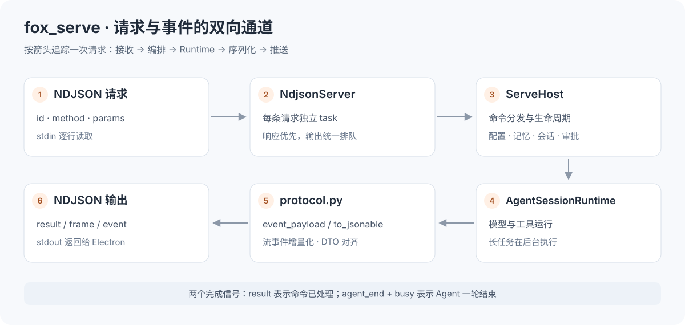
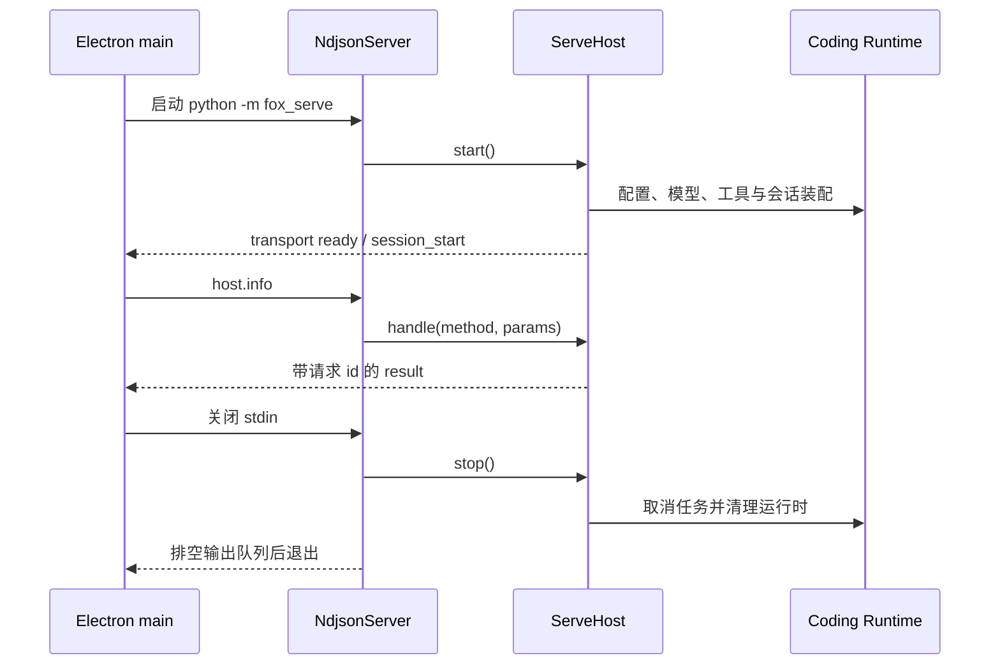
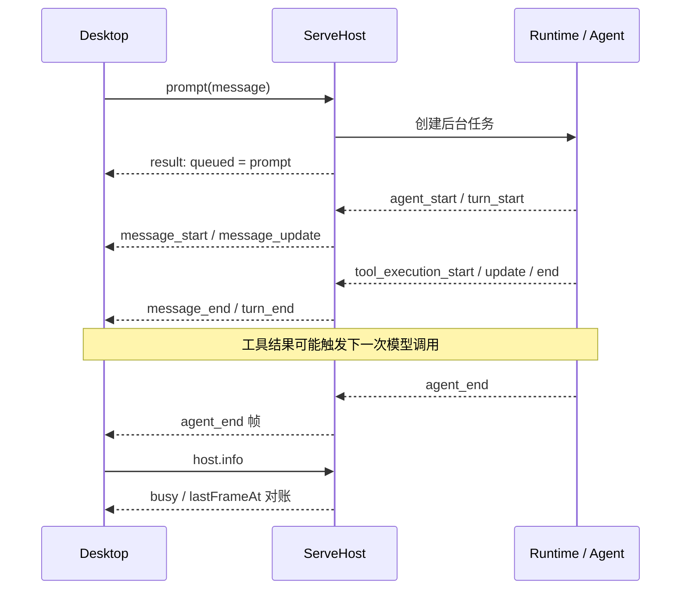
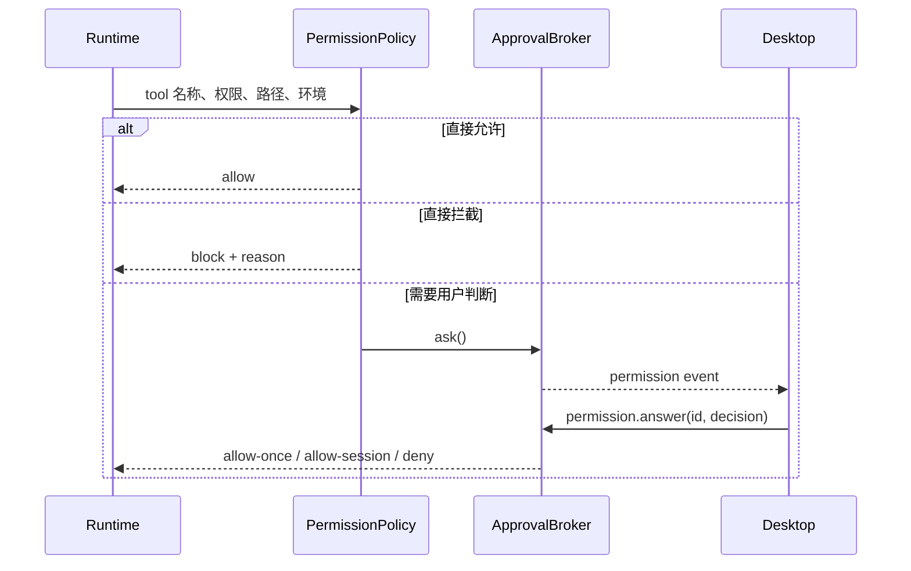
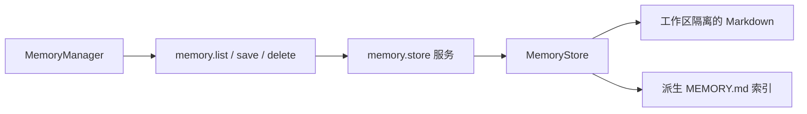

# fox_serve 学习指南

`fox_serve` 是桌面端与 Python Coding Runtime 之间的 **sidecar（伴随子进程）**。
Electron 启动它，通过标准输入发送请求，通过标准输出接收响应与事件；它负责把桌面操作翻译成运行时调用。

阅读完本文，你应能独立追踪一条命令、理解流式回复和审批往返，并为已有能力增加桌面接口。
本文命令默认在**仓库根目录**执行。

> 阅读路线：[运行体验](#1-先跑通连接) → [进程架构](#2-理解职责和生命周期) →
> [NDJSON 协议](#3-掌握双向协议) → [任务与审批](#4-追踪一轮-agent-任务) →
> [业务接口](#5-理解配置记忆会话与文件接口) → [源码与练习](#6-源码阅读与开发练习)。



## 1. 先跑通连接

### 1.1 准备环境

Python 版本与依赖以根目录 [pyproject.toml](../pyproject.toml) 为准，目前要求 Python 3.14+。

```bash
uv sync
uv run python -m fox_serve --help
uv run python -m fox_serve --version
```

直接启动时，进程会等待 stdin 输入，每次输入一行 JSON 后按回车发送：

```bash
uv run python -m fox_serve --cwd . --new-session
```

```json
{"id":"learn-1","method":"host.info","params":{}}
```

返回的 `result` 会包含 `transport: "sidecar"`、当前 `cwd`、模型、扩展与权限状态。
进程还可能先输出 `transport` 事件和会话帧；客户端必须按消息形状分类，不能把第一行当作请求响应。
关闭 stdin 或按 Ctrl+C 结束进程。调试时保留 stderr 日志；`--quiet` 用于减少宿主日志。

### 1.2 使用现成客户端

```bash
uv run python fox_serve/scripts/ndjson_client.py
uv run python fox_serve/scripts/ndjson_client.py --cwd /absolute/path/to/workspace
```

客户端会调用 `host.info` 和 `sessions.list`，打印事件，并在退出时关闭子进程。
这里不主动发送模型请求，但使用默认用户目录，会读取已有配置并打开或创建会话。

**隔离学习环境**可以直接使用客户端的 `Sidecar` 类。下面的完整示例只读取临时工作区：

```bash
uv run python - <<'PY'
import sys
from pathlib import Path
from tempfile import TemporaryDirectory
from fox_serve.scripts.ndjson_client import Sidecar

with TemporaryDirectory(prefix="foxcode-serve-learn-") as temp:
    root = Path(temp)
    workspace = root / "workspace"
    workspace.mkdir()
    (workspace / "hello.txt").write_text("Hello FoxCode\n", encoding="utf-8")
    client = Sidecar([
        sys.executable, "-m", "fox_serve", "--quiet",
        "--cwd", str(workspace), "--user-dir", str(root / "user"),
        "--new-session", "--no-trust-project",
    ], cwd=str(workspace))
    try:
        info = client.request("host.info")
        print(info["transport"], info["projectTrusted"])
        content = client.request("files.read", {"path": "hello.txt"})
        print(content["text"].strip())
    finally:
        client.close()
PY
```

预期看到 `sidecar False` 和 `Hello FoxCode`。宿主没有模型配置时也能启动设置控制面；
构造首次配置模型不会发送请求。文件预览属于管理接口，和 Agent 工具执行的信任判定分别处理。

### 1.3 常用启动参数

| 参数 | 用途与学习注意点 |
| --- | --- |
| `--cwd DIR` | 当前工作区，决定工具相对路径和数据隔离 |
| `--user-dir DIR` | 配置、凭据与会话数据根目录；学习时使用临时目录 |
| `--model REF` | 指定模型 reference 或 id |
| `--session FILE` | 打开指定会话 JSONL |
| `--resume [FILE]` | 继续指定会话；不传文件时继续最近会话 |
| `--new-session` | 强制新建；默认启动会尝试恢复当前工作区最近会话 |
| `--thinking LEVEL` | `off / minimal / low / medium / high / xhigh` |
| `--permission MODE` | `read-only / workspace-modify / full-access` |
| `--trust-project` / `--no-trust-project` | 显式选择项目信任；不要从参数名推断默认行为，参见 [cli.py](cli.py) |
| `--ask-timeout SECONDS` | 审批等待超时，默认 600 秒 |
| `--prompt` / `--compact` / `--command` | 就绪后发起相应动作；可能调用模型 |
| `--quiet` | 关闭宿主常规日志，stdout 始终只用于协议 |

当前 CLI 未指定信任参数时向 `ServeHost` 传入 `True`；学习不可信目录时显式使用 `--no-trust-project`。
桌面端的信任切换使用 `trust.set`。

## 2. 理解职责和生命周期

### 2.1 各层分别做什么

| 层 | 负责 | 典型入口 |
| --- | --- | --- |
| Electron sidecar 客户端 | 启动 Python、拆分行、匹配请求 id、处理超时 | [sidecar.js](../desktop/electron/sidecar.js) |
| NDJSON Server | 收行、并发分发、串行输出与退出清理 | [server.py](server.py) |
| ServeHost | 桌面命令、当前运行时、会话切换、审批和帧推送 | [host.py](host.py) |
| Coding Runtime | 工作区、Agent 会话、工具、配置资源与扩展 | [运行时指南](../packages/fox_coding_agent/README.md) |
| Agent Core / AI | 模型与工具循环、供应商协议 | [Core](../packages/fox_agent_core/README.md) · [AI](../packages/fox_ai/README.md) |

Sidecar 的“接口”是 stdio 上的命令协议，没有 HTTP 端口。MCP 扩展的 JSON-RPC 连接是另一条通道，
它连接外部工具服务器，不能与桌面 NDJSON 协议混用。

### 2.2 启动与停止



`ServeHost` 可以保留仍在运行的旧会话 runtime，同时激活另一会话。
阅读 `_runtimes`、`_running_runtimes` 和 `_on_runtime_event` 时，要区分**当前可见会话**与**后台运行会话**。
工作区切换有额外限制，避免仍在运行的任务被悄悄换到另一目录。

## 3. 掌握双向协议

### 3.1 五类消息

每行是一个完整 JSON 对象，使用 UTF-8，并以换行符结束。
文本中的换行由 JSON 转义，不会成为传输层分隔符。
以下对象是消息形状示例，`result` 字段只列出部分内容：

```jsonc
// 请求：Electron → Python
{"id":"r1","method":"host.info","params":{}}
// 成功响应：通过同一个 id 匹配 Promise
{"id":"r1","result":{"transport":"sidecar","protocolVersion":3}}
// 失败响应：error 是字符串
{"id":"r2","error":"未知方法：example.missing"}
// Agent 帧：Python 主动推送，不属于某个请求响应
{"frame":{"type":"agent_start","seq":12,"ts":1730000000000,"v":3}}
// 传输事件
{"event":"transport","status":{"state":"ready","since":1730000000000}}
// 审批事件：实际 request 还包含参数、权限、原因和预览
{"event":"permission","request":{"id":"perm-1","tool_name":"bash","summary":"执行命令"}}
```

| 标识 | 含义 | 客户端应该做什么 |
| --- | --- | --- |
| 请求 `id` | 一次请求的关联标识 | resolve/reject 对应 Promise |
| `frame.seq` | 宿主帧序号 | 排查帧顺序，不等于请求 id |
| `frame.ts` | epoch 毫秒时间戳 | 记录最近进度、显示时间 |
| `frame.v` | 帧协议版本，当前为 3 | 与前端 `PROTOCOL_VERSION` 对齐 |
| `event` | 非请求型通知 | 交给独立事件订阅者 |

这不是完整的 JSON-RPC 2.0：没有 `jsonrpc` 字段，错误也不是 JSON-RPC 的 error object。

### 3.2 字段与结果序列化

[protocol.py](protocol.py) 将 Python 对象转为 JSON：消息对象使用 `camelCase` 别名，
模型流事件保留 `snake_case`；不同 DTO 有各自约定，不能机械地转换整棵对象。

- `AssistantMessage.stop_reason` 在线上消息中是 `stopReason`。
- `message_update.assistant_message_event.content_index` 保持蛇形命名。
- Memory 管理 DTO 使用 `updated_at`、`expires_at`，不要套用 Markdown 元数据的 `updatedAt`、`expiresAt`。
- 工具结果被转换成可显示文本，结构化补充信息通过 `details` 传递。
- 流式帧只转发增量，避免每个 token 都重新发送不断增长的 `partial` 消息。
- `agent_end` 不携带完整历史；前端时间线已经从事件逐步构建。

接口类型以 [protocol.ts](../desktop/src/types/protocol.ts) 为前端契约，具体校验与返回值以对应 `_cmd_*` 为准。

### 3.3 并发、背压与超时

`NdjsonServer` 为每条输入请求创建 task，所有输出进入单一 `PriorityQueue`：
有 `id` 的控制响应优先于流式帧，同类输出保持 FIFO。
stdout 写入交给 `asyncio.to_thread`，避免管道拥塞阻塞事件循环和后续 `abort` 请求。

Electron 客户端先累积 chunk，再按 `\n` 分行解析。一次 chunk 可能只有半行，也可能包含多行。
它按请求 id 管理 pending Promise：普通请求默认 30 秒，慢命令 300 秒，`abort` 5 秒。
**客户端超时表示没有及时收到回执，并不能证明后端操作没有执行。** 查询实际状态后再决定是否重试写入。

## 4. 追踪一轮 Agent 任务

### 4.1 命令完成与任务完成



`prompt` 的回执只表示任务已提交。正文、思考、工具进度和结束全部由帧驱动。
`turn_end` 表示一个模型/工具回合结束，整个 Agent 仍可能继续；`agent_end` 才表示本轮 Agent 结束。
后台任务的 `finally` 也会清理 busy 标记，便于 UI 在漏帧后恢复状态。

执行中追加信息使用 `steer`（插话）或 `follow_up`（后续消息）；`abort` 请求取消，
`compact` 压缩上下文。压缩可能请求模型，不能当作纯本地整理命令。

### 4.2 审批如何往返



Sidecar 内部 runtime 使用 `full-access` 静态档位，使每次工具调用都能到达宿主审批 hook；
**用户可见权限由 `PermissionPolicy` 执行**。此前的项目信任、Plan 与沙盒检查仍然生效，
审批之后扩展 hook 也仍可阻止调用。

| UI 档位 | Sidecar 策略 |
| --- | --- |
| `read-only` | 放行只读工具，直接拒绝写入与执行，不用审批提升权限 |
| `workspace-modify` | 放行工作区内可确定的文件写入；越界、未知写入范围、本机 Shell 要审批 |
| `full-access` | Sidecar 静态策略放行；其他运行时边界与扩展 hook 仍生效 |

原生沙盒已约束的 Shell 可在工作区档位直接放行。审批 `allow-session` 按工具名记录允许；
broker 负责等待、超时和取消。**Plan 确认**使用独立的 `plan.answer`，和工具审批不是同一种事件。

## 5. 理解配置、记忆、会话与文件接口

### 5.1 配置控制面


前端读取 `config.get`，编辑后发送 `config.*` 命令。统一写入口
[configuration.py](configuration.py) 复用 runtime schema 和
[原子写入工具](../packages/fox_coding_agent/src/core/_io.py)，执行 `fsync` 和 `os.replace`。
供应商保存与运行时加载共用 `ModelConfig.parse`；完整候选在内存中校验通过后才落盘，
校验失败时保留最后有效文件，凭据与敏感配置在发布前设置文件权限。


API Key 只写用户级 `auth.json`，返回值只包含 `credentialConfigured`。
MCP env 快照只包含变量名；修改其他字段不会清空未回显的环境变量值。
未信任项目拒绝项目级配置写入，当前 Agent 运行时拒绝产品配置修改。
MCP / Subagent 保存会启用对应扩展并重载。

### 5.2 记忆管理的完整调用链




访问复用已加载 Memory 扩展的 `memory.store`。扩展生命周期 hook 通常在首条 prompt 才启动，
因此管理接口在必要时单独 `bind` Memory 服务，保证不发送第一条消息也能管理记忆，
同时不为此启动其他扩展的外部进程。

| 方法 | 必要参数 | 返回与限制 |
| --- | --- | --- |
| `memory.list` | 可选 `query` | `{entries, directory}`；包含历史记录，文本搜索名称、描述、正文、主题、标签 |
| `memory.save` 新增 | `name, description, type, content`，可选 `pinned` | `{entry}`；走受控写入、去重与冲突处理 |
| `memory.save` 编辑 | `filename`，可选 `description, content, pinned` | `{entry}`；名称、类型、身份、来源与生命周期保持不变 |
| `memory.delete` | `filename` | `{deleted}`；Agent 正在运行时拒绝修改或删除 |

```json
{"id":"m1","method":"memory.list","params":{"query":"验证"}}
{"id":"m2","method":"memory.save","params":{"name":"验证流程","description":"项目的测试约定","type":"project","content":"修改后运行相关回归测试。","pinned":true}}
```

编辑与删除使用列表返回的真实 `filename`。后端要求扩展启用、项目可信，校验字段和路径，
拒绝疑似凭据。文本管理搜索不等于 Agent 的 `memory_recall` 混合检索。
元数据、注入预算与生命周期详见 [Memory 指南](../packages/fox_coding_agent/src/extensions/memory/README.md)。

### 5.3 命令导航

以下表格用于找源码，不替代完整 DTO。所有 `method` 都由
`ServeHost.handle()` 映射到 `_cmd_<method 中的点替换为下划线>`。

| 分组 | 方法 | 参数要点 |
| --- | --- | --- |
| 状态 | `host.info`, `reload` | 无；查询或重载 |
| 会话列表 | `sessions.list`, `sessions.new` | 无 |
| 会话操作 | `sessions.open/delete/rename/fork` | `id`；rename 加 `title`；fork 可传 `fromId` |
| 导出 | `session.export` | `format: json/markdown`, `path` |
| 任务 | `prompt`, `steer`, `follow_up`, `abort`, `compact` | 消息与附件见 `PromptOptions`；abort/compact 无参数 |
| 资源调用 | `run_command`, `invoke_skill` | `name`，可选 `arguments` 或 `instructions` |
| 模型 | `model.select`, `thinking.set` | `reference` 或 `level` |
| 策略 | `permission.set`, `interaction.set`, `execution.set` | `mode` |
| 确认 | `permission.answer`, `plan.answer` | 审批/计划 `id` 和相应 `decision` |
| 工作区 | `cwd.change`, `trust.set` | `cwd` 或 `trusted` |
| 扩展 | `extensions.set` | `id`, `enabled`，可选 `scope` |
| 配置 | `config.get`, `config.runtime.update` | 更新传 `values`，可选 `scope` |
| 供应商 | `config.provider.save/delete` | `provider` 或 `id` |
| 凭据 | `config.credential.set/delete` | `providerId`；set 加 `apiKey` |
| MCP | `config.mcp.save/delete` | `server` 或 `name`，可选 `scope` |
| 子角色 | `config.subagent.save/delete` | `subagent` 或 `name`，可选 `scope` |
| 记忆 | `memory.list/save/delete` | 见上一节 |
| 文件 | `files.list/changes/diff/read` | list 可传目录 `path`；diff/read 必须传文件 `path` |

文件接口由 [workspace_files.py](workspace_files.py) 限定在当前工作区并处理预览、截断和二进制文件。
`files.changes` 使用 Git 状态，还可通过工作区快照报告本次会话修改；非 Git 目录也能显示会话改动。
会话索引、标题和删除边界由 [sessions.py](sessions.py) 管理，前端不要自行拼接会话文件路径。
当前工作区和全部工作区的列表共用摘要解析、排序与过滤流程。

扩展查询使用 `ExtensionSettings.read` 一次读取两个作用域，在同一个快照上判断生效列表、覆盖关系和默认写入位置。
空 `extensions` 列表会覆盖用户级列表，缺少该键则继续继承；探测缓存每个 spec 只保留最新文件版本。
`extensions.set` 的多作用域写入或重载失败时恢复原始配置内容；原来不存在的配置文件会删除，
原来缺少的 `extensions` 键也不会因回滚而变成空列表。
扩展工具属于当前运行时能力，不写进会话的固定工具依赖；关闭扩展后重载不会因缺少该扩展的工具而失败。
关闭 Memory 只停用服务与工具，已保存的记忆仍保留，再次启用后可继续管理。

## 6. 源码阅读与开发练习

### 6.1 建议阅读顺序

| 顺序 | 文件与函数 | 要回答的问题 |
| --- | --- | --- |
| 1 | [cli.py](cli.py)：`main`, `_resolve_session` | Python 怎么启动、会话怎么选？ |
| 2 | [server.py](server.py)：`run`, `_spawn`, `_dispatch`, `_write_loop` | 请求怎么并发，输出为何不交错？ |
| 3 | [host.py](host.py)：`start`, `handle`, `_cmd_host_info` | 命令如何找到 handler？ |
| 4 | [host.py](host.py)：`_cmd_prompt`, `_queue_operation`, `_run_operation`, `_on_runtime_event` | result 和 frame 怎么分工？ |
| 5 | [protocol.py](protocol.py)：`event_payload`, `stream_event_payload` | Python 事件如何成为前端帧？ |
| 6 | [approvals.py](approvals.py)：`PermissionPolicy`, `ApprovalBroker` | 什么情况需要审批？ |
| 7 | [configuration.py](configuration.py)、Memory handlers | 如何校验并持久化管理操作？ |
| 8 | [extension_catalog.py](extension_catalog.py) | 如何发现扩展而不启动外部服务？ |

### 6.2 为能力增加桌面接口

以已有 Memory 接口为模板：

1. 确定返回 DTO、错误提示、信任条件与运行中限制，优先复用 runtime 服务。
2. 在 `host.py` 添加 `_cmd_*`，校验输入后调用服务；预期失败转成 `HostError`。
3. 在 `desktop/src/types/protocol.ts` 添加 DTO 与 `HostCommand` 分支。
4. 在 MockHost 实现同样的协议形状，让浏览器演示与测试可运行。
5. 在前端调用 `useSession.send()`，呈现 pending、空状态、失败和刷新结果。
6. 写服务边界与 UI 行为测试；需要长操作时检查 Electron 的 `SLOW_METHODS`。

大多数新增 host 命令沿用 `host:command` 通道，不需要新增 IPC 通道。
业务持久化放在服务层，不在 React 组件或 NDJSON parser 中操作文件。

### 6.3 离线练习与验收

| 练习 | 操作 | 验收 |
| --- | --- | --- |
| 请求关联 | 用 `Sidecar.request` 连续查询 host 和文件 | 响应匹配 id，事件不会被误当 result |
| 输入校验 | 请求不存在的方法，或给 `memory.list` 非字符串 query | 有明确 error；宿主继续处理下一条请求 |
| 记忆闭环 | 在隔离可信工作区启用 Memory，新增→列表→编辑→删除 | 返回身份稳定；重新启动仍可读取未删除数据 |
| 运行状态 | 阅读 `_run_operation` 与 `_finish_operation` 与 UI reconcile 测试 | 能解释异常结束后如何解除生成状态 |
| 审批 | 阅读 policy/server 测试 | 能解释为何不能串行等待模型任务和审批答复 |

```bash
uv run --with pytest python -m pytest fox_serve/tests -q
uv run --with pytest python -m pytest fox_serve/tests/test_server.py fox_serve/tests/test_protocol.py -q
uv run --with pytest python -m pytest fox_serve/tests/test_memory.py fox_serve/tests/test_configuration.py -q
```

| 测试文件 | 关注点 |
| --- | --- |
| [test_server.py](tests/test_server.py) | 并发、输入输出与控制响应 |
| [test_protocol.py](tests/test_protocol.py) | DTO、增量帧与结果文本 |
| [test_policy.py](tests/test_policy.py) | 权限边界与审批 |
| [test_replay.py](tests/test_replay.py)、[test_agent_state.py](tests/test_agent_state.py) | 历史重放、运行状态与恢复 |
| [test_memory.py](tests/test_memory.py) | 首次 prompt 前管理、CRUD、工作区隔离 |
| [test_configuration.py](tests/test_configuration.py) | 配置验证、脱敏、回滚与重载 |

真实模型连通性检查需要已配置供应商，会产生模型用量；`--approve` 会自动答复工具审批：

```bash
uv run python fox_serve/scripts/ndjson_client.py --prompt "只回复：ready" --approve
```

## 7. 排查常见问题

| 现象 | 优先检查 | 源码位置 |
| --- | --- | --- |
| `No module named fox_serve` | Python 环境、仓库根目录是否在 `PYTHONPATH` | Electron `createSidecar` / 客户端构造函数 |
| stdout 解析失败 | 是否把调试 print 写到 stdout，是否按 UTF-8 和换行解码 | `server.py`, `sidecar.js` |
| prompt 已返回但没有正文 | 检查 error 帧、凭据、模型配置和 `host.info.busy` | `_run_operation`, `protocol.py` |
| 点击审批无反应 | request id 是否一致，stdin dispatch 是否继续工作 | `ApprovalBroker`, `_cmd_permission_answer` |
| 保存配置被拒绝 | 当前 Agent 是否运行，scope 与 trust 是否匹配 | `_apply_configuration` |
| 记忆不可见 | 当前 cwd、扩展启用、项目信任和 `directory` | `_memory_service`, `_cmd_memory_list` |
| UI 永远生成中 | `agent_end`、`busy`、`lastFrameAt` 是否一致 | 后端任务 finally 与前端 reconcile |

调试日志保存在本地 `.foxcode/artifacts/`。协议 debug 会打印请求内容，排查后关闭；
包含凭据的配置请求不应作为公开日志或学习截图。

继续阅读：[Desktop](../desktop/README.md) · [Coding Runtime](../packages/fox_coding_agent/README.md) ·
[文件系统与沙盒](../docs/FILESYSTEM_AND_SANDBOX.md)。
