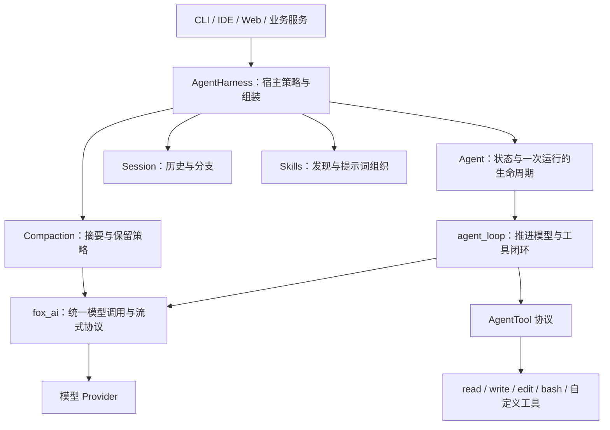
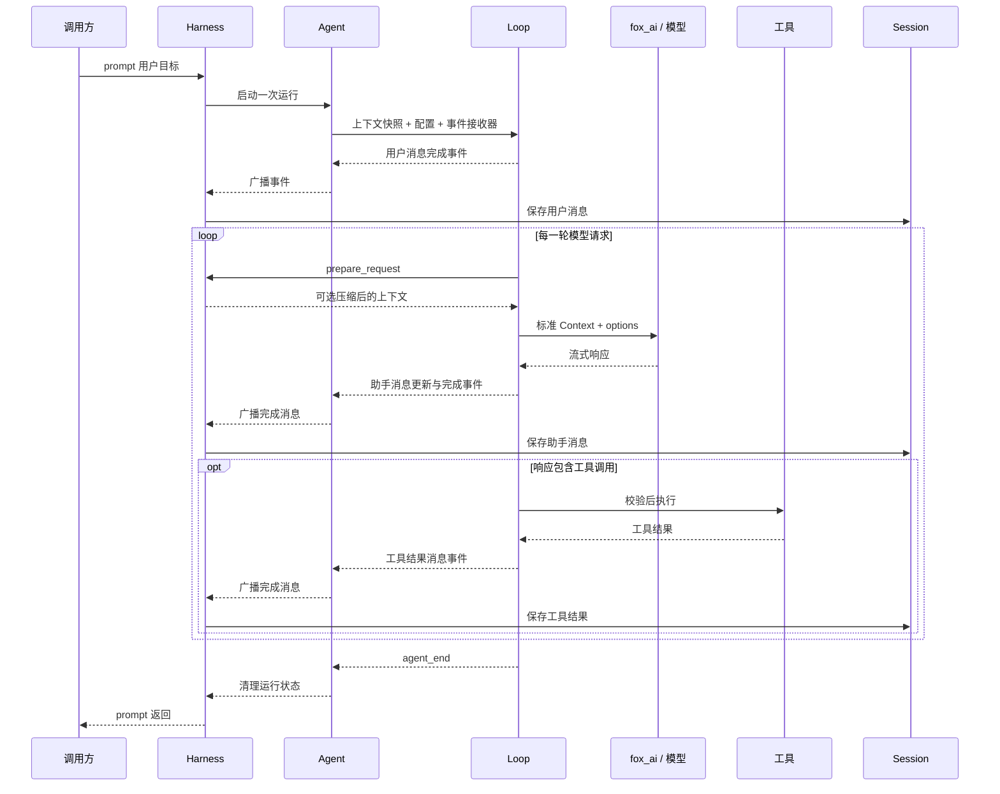

# fox_agent_core：通用内核架构与面试指南

本篇只讲 `fox_agent_core/src` 的职责：Agent 状态、模型与工具循环、排队消息、事件、取消和工具协议。Session、压缩、Skill、项目配置及 CLI 属于 [coding-agent 指南](../fox_coding_agent/ARCHITECTURE_GUIDE.md)，在本篇中只作为边界背景出现。

配套 [AGENT_CORE_LAB.ipynb](AGENT_CORE_LAB.ipynb) 只导入 fox_ai 与 agent-core，独立进行真实回答、自定义工具、事件和 follow-up 实验，不需要先运行宿主实验。

阅读路线：第一至三章建立概念，第四至九章解释执行与异常路径，第十章讲扩展边界，第十一章讲验证与面试。源码从 `types.py → agent_loop.py → agent.py` 阅读。

## 第一章：Agent 内核到底在解决什么问题

### 1.1 一次模型调用只能提供一次响应

假设用户说：“把配置里的端口改成 8080，并确认修改成功。”

单次模型请求可以返回修改建议，也可以返回一个结构化的工具调用。但模型 API 本身并不会替宿主完成本地文件修改、保存应用状态、等待用户追加要求，也不会自动决定工具执行完以后该怎样组织下一次请求。

一个能行动的 Agent 需要建立这样的闭环：

```text
接收目标 → 提供上下文 → 模型提出行动 → 执行工具
                                    ↓
继续决策 ← 把工具结果作为新信息加入上下文
```

这里模型负责根据当前信息生成响应，运行时负责把响应放进一套可执行的协议。两者协作，才形成持续处理任务的能力。

### 1.2 从“能调用”到“能持续运行”，会出现哪些工程问题

| 问题 | 直接写一个 while 循环时容易出现的情况 | 内核需要提供的能力 |
| --- | --- | --- |
| 工具参数不可靠 | 模型给出错误类型、缺少字段或不存在的工具 | 参数校验、失败结果、再次决策 |
| 用户持续输入 | 新输入覆盖旧输入，或者两个循环同时修改历史 | 单次运行约束、消息队列 |
| 操作耗时 | UI 长时间看不到过程 | 流式消息与工具进度事件 |
| 用户要求停止 | 前端停了，后台命令还在执行 | 取消信号、任务清理、状态收尾 |
| 历史持续增长 | 上下文超过模型窗口 | 历史与当前上下文分离、压缩 |
| 进程退出 | 对话丢失，无法判断工具是否执行过 | 会话持久化、保守恢复 |
| 业务不断变化 | 修改核心循环才能添加权限、模型策略 | 明确扩展点和宿主层 |

因此，面试时可以把项目定位为：

> 我实现的是一个围绕模型调用构建的任务运行时。它将模型输出、工具执行、状态变化和会话记录组织成闭环，并处理这个闭环中的取消、错误和上下文限制。

### 1.3 架构首先要确定责任边界

对于“修改端口”这个任务，各方的责任如下：

- **模型**提出读取哪个文件、修改哪段内容，以及何时生成回复。
- **工具**实现真实的文件读取、写入和命令执行。
- **内核**检查协议、安排调用、组织结果并判断是否继续。
- **宿主**决定可用能力、如何保存会话、何时压缩上下文。
- **用户界面**展示过程并把用户的新指令传入宿主。

这样划分后，更换模型、增加工具、换一种 UI、换一种存储后端，都有各自明确的修改位置。

<a id="ch02"></a>

## 第二章：先分清 message、turn、run、session

### 2.1 四个概念对应四种不同的时间尺度

| 概念 | 当前项目中的含义 | 例子 |
| --- | --- | --- |
| Message，消息 | 参与对话的一条信息 | 用户要求、助手响应、某个工具结果 |
| Turn，轮次 | 通常包含一次模型响应，以及该响应产生的一批工具调用 | 模型要求读取文件，工具返回内容 |
| Run，一次运行 | 一次 `prompt()` 或 `continue_()` 驱动的完整过程，可以包含多个 turn | 完成“修改配置并确认” |
| Session，会话 | 跨越多次运行的历史及当前分支 | 今天修改配置，明天继续讨论这个项目 |

`run` 在这里是说明生命周期的术语，当前实现并没有单独的 `Run` 数据库实体。运行中追加的 steering、follow-up 还可能被当前 run 消费，所以一个 run 也不一定只处理最初那一条用户消息。

正常工具任务可以这样展开：

```text
Session
  ├─ Run 1：修改配置
  │    ├─ Turn 1：assistant 调用 read → toolResult
  │    ├─ Turn 2：assistant 调用 edit → toolResult
  │    ├─ Turn 3：assistant 调用 read → toolResult
  │    └─ Turn 4：assistant 生成最终说明
  └─ Run 2：用户继续要求运行测试
       ├─ Turn 1：assistant 调用 bash → toolResult
       └─ Turn 2：assistant 解释测试结果
```

少数控制路径会额外生成错误轮次，例如达到模型请求上限后产生错误消息。因此，“一个 turn 对应一次真实网络请求”更适合作为正常流程的理解方式，而不是对所有事件的绝对计数规则。

### 2.2 ToolCall 和 ToolResult 是什么关系

`ToolCall` 是 assistant 消息里的内容块，表示模型希望执行的操作。`ToolResultMessage` 是一条独立消息，表示运行时对这次操作的观察结果。

例如：

```text
assistant：调用 read，参数为 path=config.json，调用 ID 为 call-1
toolResult：对应 call-1，内容为文件文本，或者“文件不存在”
assistant：依据结果决定下一步
```

调用 ID 用于关联某一次调用与它的结果。同一个 `read` 工具可以在一个任务中被调用很多次，工具名称无法替代调用 ID。

一次 assistant 响应还可以包含多个 ToolCall；这是一轮中的一批操作，不代表启动多个独立 Agent。

### 2.3 消息、事件和会话条目也要区分

这三个概念经常被混为一谈：

| 对象 | 回答的问题 | 是否通常发给模型 |
| --- | --- | --- |
| 消息 | 对话里已经说了什么、观察到了什么？ | 是，经过请求边界转换后发送 |
| 事件 | 执行过程当前发生了什么？ | 通常不发送 |
| SessionEntry | 历史上记录了什么，以及它接在哪个节点后面？ | 需要先重建成上下文 |

例如，工具的 `tool_execution_update` 是进度事件，不等于新增一条工具结果消息；模型切换是会话配置条目，也不等于用户说了一句话。

**面试时先把这些概念讲清楚，后面的状态、持久化和事件设计才不会混乱。**

<a id="ch03"></a>

## 第三章：为什么分成 fox_ai、agent_loop、Agent 和 Harness

### 3.1 总体结构



图中箭头表示主要调用或使用关系。核心循环使用工具协议，不要求工具必须来自内置编码工具集合。压缩也会调用模型，但它是一种宿主安排的辅助请求，不是在工具循环里硬编码的一种特殊工具。

### 3.2 fox_ai：消化模型供应商差异

不同模型接口的消息格式、流式事件和工具参数格式不同。让循环分别判断这些差异，会导致每增加一个 provider，就修改一次 Agent 的控制流程。

`fox_ai` 为上层提供统一的 `Model`、`Context`、消息类型和流式接口。Agent 依赖这个统一边界，可以通过 `stream_fn` 替换模型调用。

这里的收益包括：

- 循环只关心标准化后的文本、工具调用和停止原因。
- 测试可以注入 Faux 或自定义流函数，不必依赖外部模型。
- provider 的请求重试和网络连接清理可以在模型调用层处理。

它不负责会话分支，也不决定某个文件工具是否应该对当前用户开放。

### 3.3 agent_loop：负责推进流程

循环层拥有“下一步做什么”的执行顺序：准备请求、调用模型、处理工具、注入排队消息，以及停止。

这里说它“无状态”，含义是：**调用者显式提供上下文、配置和事件接收器；循环不自行长期持有一个会话对象。** 函数执行过程中仍然有局部状态，例如当前上下文、轮次计数和待处理消息，所以它不是数学意义上的纯函数。

如果循环直接读取 JSONL、扫描技能目录、显示 UI，它就会依赖具体产品环境，难以被其他宿主复用。

### 3.4 Agent：把执行引擎变成有状态的对象

业务通常希望持有一个对象，反复执行 `prompt()`，随时查看状态或调用 `abort()`。因此需要 Agent 层保存：

- 当前模型、工具和消息历史。
- 当前是否正在处理、流式消息和未完成的工具调用 ID。
- steering、follow-up 两个队列。
- 订阅者和当前运行的取消信号。

Agent 将状态快照交给循环，再通过循环发出的事件更新自身状态。它提供日常使用所需的对象接口，但不直接承担文件会话和技能发现的产品策略。

### 3.5 Harness：把通用能力组装成可用产品

Harness 可以理解为“运行宿主”或“组装与策略层”。当前 `AgentHarness` 组合 Agent、Session、Compaction、Skills 和工具集合，负责：

- 启动时从 Session 恢复上下文与配置。
- 监听完成消息并持久化。
- 每次请求前评估是否压缩。
- 组织 system prompt、工作目录和技能目录。
- 提供切换模型、切换分支、手动压缩等操作。

同一个底层循环可以由不同 Harness 承载。例如编码宿主提供文件工具，客服宿主提供订单查询工具，数据分析宿主提供数据库工具。这里后两者是可扩展方向，并非本项目已经提供的功能。

### 3.6 设计理由：分开稳定机制与可变策略

| 决策 | 通常放在哪里 | 理由 |
| --- | --- | --- |
| 收到工具调用后执行并回传结果 | 循环层 | 是 Agent 闭环的基本机制 |
| 当前是否允许再次启动运行 | Agent / Harness | 依赖对象的生命周期 |
| 工具怎么读写文件 | 工具实现 | 与具体能力有关 |
| 历史保存到哪里 | SessionStorage | 与存储部署方式有关 |
| 什么时候压缩、保留多少内容 | Harness + Compaction | 与上下文预算和产品策略有关 |
| 怎么显示工具进度 | UI 或订阅者 | 与交互形式有关 |

**面试表达：**我希望模型调用机制、Agent 控制流程和宿主策略能够独立变化，所以按职责和变化原因划分层次，而不是把所有功能都塞进一个 Agent 类。

<a id="ch04"></a>

## 第四章：一次任务怎样穿过这些层

### 4.1 先看正常路径



为便于阅读，图中省略了部分 turn 和工具进度事件。`prepare_request` 是通过配置回调到 Harness 的，循环没有直接导入 Harness。

### 4.2 为什么先保存助手工具调用，再执行工具

模型提出工具调用后，这条 assistant 消息先成为完成消息，随后才执行工具。因此，正常的消息历史会先记录“准备执行什么”，再记录“执行后观察到了什么”。

这种顺序有利于理解和恢复。若进程中途退出，可能留下“有调用、无结果”的历史，恢复逻辑能发现这个缺口。但它仍不能证明操作到底有没有发生，这个问题会在会话恢复章节展开。

### 4.3 为什么工具结果需要再交给模型

内核通常不知道“文件内容是否满足用户要求”。它能判断工具执行有没有报错，却不能只凭 `write` 成功就认定业务目标完成。

工具结果为下一次模型决策提供新信息。模型可能发现路径错误、文件内容与预期不同，或者还需要读取确认。因此，一次工具执行成功通常意味着进入下一轮判断。

### 4.4 这个场景对应的职责检查

当你能回答下面四句话，说明已经建立基本架构认识：

- 读取和修改哪个文件，由模型结合上下文提出。
- 是否允许执行、参数是否有效，由宿主策略与工具执行边界检查。
- 工具完成后是否继续调用模型，由循环协议决定。
- 这个过程怎样被保留下来，由 Harness 和 Session 协作完成。

<a id="ch05"></a>

## 第五章：循环与调度——为什么不能只判断 tool_use

### 5.1 最小循环与交互式循环的区别

最小工具 Agent 可以使用一个简单规则：模型输出工具调用，就执行并继续；没有工具调用，就结束。

交互式 Agent 还会遇到另一种工作来源：运行过程中，用户补充了新的要求。例如模型正在读取配置，用户又输入：“只修改开发环境，不要修改生产环境。”即使模型刚刚生成了一段普通文本，这条新要求仍需要处理。

所以，本项目的循环同时处理两类继续条件：**工具结果需要下一轮解释，以及新的用户消息需要下一轮处理。**

### 5.2 双层循环表达的是两个消费时机

下面是帮助理解的伪代码，省略了事件、错误和取消处理：

```python
while True:
    while needs_model_response or pending_messages:
        inject(pending_messages)
        response = await ask_model()
        results = await execute_tool_calls(response)
        needs_model_response = should_continue_after_tools(response, results)
        pending_messages = drain_steering()
    pending_messages = drain_follow_up()
    if not pending_messages:
        break
```

内层负责当前任务的连续推进，外层负责本来可以结束时的追加任务。两个循环并不表示有两个 Agent，也不表示两条后台线程。

实际代码每次进入外层时把 `has_more_tool_calls` 初始化为 `True`，是为了启动第一轮模型调用。这个初始值不代表已经存在一个尚未执行的工具。

### 5.3 steering、follow-up、pending_messages 的区别

| 名称 | 所在位置 | 消费时机 | 适合的输入 |
| --- | --- | --- | --- |
| steering queue | Agent 对象 | 下一次模型请求前的循环边界 | “先考虑这个限制”“调整当前任务方向” |
| follow-up queue | Agent 对象 | 没有当前工具工作、也没有已取出的 steering 时 | “完成后再做下一件事” |
| pending_messages | 当前循环的局部变量 | 即将注入上下文 | 从上述队列取出的本次待处理消息 |

`pending_messages` 不是第三个持久队列，也不专指 follow-up。它只是循环统一处理排队输入的暂存位置。

例如：

```text
当前工作：修改配置
steering：只修改开发环境
follow-up：完成后运行一次测试

下一轮请求前加入开发环境限制
→ 当前配置任务继续推进
→ 本来可以停止时取出 follow-up
→ 开始处理运行测试的要求
```

steering 改变的是下一次模型决策时可见的信息，不会让正在执行的文件写入“自动回到过去”。需要停止当前工作时应使用取消机制。

### 5.4 当前实现怎样识别工具调用

循环从 assistant 响应的内容块中提取 `ToolCall`，随后执行这批调用。它不是只比较某个名为 `tool_use` 的字符串。

统一协议中的 `stop_reason` 用来补充判断。例如输出长度限制可能造成参数不完整，此时即使看到了 ToolCall，也不能照常执行，应生成对应的失败结果。具体 provider 怎样命名结束原因，由 `fox_ai` 转成上层协议。

### 5.5 正常停止与控制性停止

| 条件 | 当前行为 |
| --- | --- |
| 有可执行工具调用，批次未共同要求终止 | 继续下一轮处理工具结果 |
| 有待注入的 steering | 继续下一轮处理新要求 |
| 当前工作已尽，存在 follow-up | 开始下一段工作 |
| 上述工作都不存在 | 正常结束本次运行 |
| 模型错误、取消 | 结束本次运行并收尾 |
| 达到 `max_turns` | 生成上限错误并停止继续请求模型 |
| `should_stop_after_turn` 返回真 | 宿主要求提前停止 |

工具结果里的 `terminate=True` 还要单独理解：当前规则要求同批所有结果都为真，才不因这一批工具再自动进入下一轮。它不会清除已排队的用户消息，因此不能把它理解为无条件关闭整个运行时。

**循环停止只说明协议没有继续推进，不能单独证明业务目标正确完成。** 判断修改是否正确，还需要测试、工具观察或业务验收。

### 5.6 队列的设计取舍

`one-at-a-time` 可以使输入逐条进入决策过程；`all` 可以一次把当前排队输入都交给模型。前者可能增加模型轮次，后者可能一次引入较多上下文。

当前队列是进程内的轻量队列，没有持久化和公平调度。如果 steering 持续进入，follow-up 可能等待较久。生产化时可以考虑排队上限、调度公平性和队列落盘，但这些是进一步的调度能力。

<a id="ch06"></a>

## 第六章：状态与所有权——同一份信息为什么出现在多个地方

### 6.1 四种“状态”各有不同用途

| 对象 | 主要内容 | 生命周期 | 负责回答的问题 |
| --- | --- | --- | --- |
| `AgentState` | 当前消息、模型、工具、运行标记、流式消息 | Agent 对象存活期间 | 当前运行到哪里了？ |
| `AgentContext` | 这次循环使用的 system prompt、messages、tools | 当前运行及后续准备过程 | 下一步决策基于什么？ |
| `fox_ai.Context` | 发给模型层的消息和工具声明 | 一次模型请求 | 这次请求的实际输入是什么？ |
| `Session` | 历史条目、配置变化、分支和压缩记录 | 内存会话或文件会话存续期间 | 已保存的历史是什么？ |

这些对象存在内容重叠，但不应把它们看成四个各自独立、可以任意修改的数据库。系统需要明确谁负责产生变化、谁负责投影和保存。

### 6.2 AgentState 是运行视图

Agent 根据事件更新状态。例如收到消息更新事件，就更新 `streaming_message`；收到消息结束事件，就把定稿消息加入 `messages`；收到工具开始和结束事件，就修改 `pending_tool_calls`。

当前 `is_streaming` 在一次运行期间保持为真，范围包括工具执行阶段。因此使用它时应按实现理解为运行中的状态标记，不能只理解成“此刻网络正在输出 token”。

`error_message` 也不是整个业务任务的统一成功判定。工具失败可能已经被模型处理并修正，不能仅凭某次失败结果认定整个任务失败。

### 6.3 为什么流式草稿和完成消息要分开

模型可能先输出半段文本，然后继续补全，甚至最后失败。如果每个 token 都作为正式消息追加，历史中会出现大量残片，工具调用参数也可能处于不可执行状态。

因此需要两种视图：

```text
streaming_message：正在变化的当前消息，供 UI 展示
messages：已经定稿的对话消息，供后续上下文使用
```

循环内部会维护并替换 partial 消息，直到得到最终结果；Agent 通过事件区分更新和完成。即使响应最终标记为 error 或 aborted，也可以有一条定稿的错误消息，“定稿”不等于“成功完成目标”。

### 6.4 为什么要传上下文快照

运行开始时复制消息列表和工具列表，可以避免循环直接对 Agent 原来的列表做 append，从而减少跨层共享列表导致的重复追加和意外覆盖。

这里要准确描述实现：**列表复制不等于所有消息、模型和工具对象都被深拷贝。** 当前架构也不是严格的不可变状态系统。它主要依赖单次运行约束、受控更新入口和事件约定来保持一致。

如果后续允许后台任意修改工具集合、跨线程写状态，就需要更强的所有权约束或同步机制。

### 6.5 为什么禁止同时运行两个 prompt

假设同一个 Agent 同时启动两个循环：它们可能都读取同一段历史，然后交错写入不同的 assistant 和 toolResult。最终既无法解释哪个工具结果属于哪个目标，也很难正确执行取消和压缩。

当前方案是一个 Agent 同时只处理一次运行，新要求使用消息队列进入。Harness 的忙碌约束还覆盖手动压缩、切换分支等操作，避免修改上下文时发生竞争。

这能简化同一对象内的并发语义，但不会自动保护两个不同 Harness 写同一个 JSONL 文件。

### 6.6 事件先更新运行状态，持久化再确定历史

在 Harness 路径中，Agent 先处理事件更新状态，Harness 的订阅器再将完成消息保存到 Session。操作结束时，Harness 从 Session 重建消息列表，使保存下来的历史成为恢复消息的依据。

这意味着内存状态和磁盘文件之间有一个短暂的处理窗口。当前设计通过失败传播和结束时重新同步来处理普通存储失败，并没有实现跨内存、文件和外部工具的统一事务。

**面试表达：**我区分了运行视图与持久历史，避免把 UI 的实时状态直接当成恢复依据。真正涉及多进程和外部副作用时，还需要额外的一致性机制。

<a id="ch07"></a>

## 第七章：工具执行——把生成式输出接到确定性程序

### 7.1 工具是一个明确的执行边界

工具至少需要提供三类信息：

- 名称和描述，使模型能够选择能力。
- 参数 Schema，使模型和运行时知道参数结构。
- 执行函数，使宿主能够真正执行操作。

模型看到的是可调用能力的声明，Python 执行函数保留在宿主进程中。模型生成 ToolCall 后，运行时按名称查找已注册的工具并执行，不会把任意模型文本直接当成 Python 程序运行。

`bash` 的能力本身是执行 shell 命令，权限范围更广。因此，“只调用注册工具”并不自动意味着这些工具具备足够的隔离能力。

### 7.2 一次工具调用的处理流程

```text
收到 ToolCall
  → 发送工具开始事件
  → 检查取消、查找工具
  → 校验并准备参数
  → before_tool_call 策略检查
  → 执行并接收进度
  → 适用时执行 after_tool_call
  → 发送工具结束事件
  → 形成 ToolResultMessage
```

工具开始事件表示运行时开始处理这次调用，不足以证明真实操作已经发生。比如参数不合法，仍然可以出现开始与失败结束事件，但执行函数并没有被调用。

### 7.3 Schema 校验解决什么，不能解决什么

Schema 可以检查必填字段、数据类型、取值范围和多余字段。例如 `offset` 必须为正整数，模型传入字符串时，应在文件读取之前返回错误。

但参数结构正确，只表示它符合接口格式。目标路径是否允许访问、某条命令是否应该执行、业务对象是否属于当前用户，属于权限或业务校验。

| 检查层 | 典型问题 | 合适位置 |
| --- | --- | --- |
| 结构校验 | `path` 缺失，`offset` 类型错误 | JSON Schema |
| 工具语义校验 | 替换文本没有匹配，或匹配了两次 | 工具内部 |
| 宿主权限策略 | 当前操作是否允许，是否需要用户审批 | `before_tool_call` 或更完整的权限层 |

### 7.4 为什么工具错误要回传给模型

“文件不存在”有可能是模型选错了路径。这种错误是下一步决策有用的信息，模型可以依据它重新查找文件。

所以，常见工具错误会转换成 `is_error=True` 的工具结果。这样运行仍保留完整的调用与观察关系，不需要让模型从一段缺失历史中猜测发生了什么。

但错误反馈需要配合轮次限制。否则模型可能持续重复同一个无效调用。当前 `max_turns` 是防止无限推进的基础限制，还没有重复动作检测或完整费用预算。

### 7.5 为什么结果拆成 content、details 和控制信息

| 字段 | 用途 |
| --- | --- |
| `content` | 提供给模型的观察结果，如文本或图片 |
| `details` | 给宿主、日志或 UI 的结构化信息 |
| `terminate` | 对后续循环推进的控制提示 |
| `added_tool_names` | 传递新增工具名称的元数据，不会自动注册工具实现 |

这种分离减少了模型上下文与展示信息之间的耦合。`details` 不按当前 provider 消息转换方式发送给模型，但仍可能进入本地会话文件，不能把“不发给模型”误认为“完全不保存”。

### 7.6 并行执行的收益与约束

读取两个独立文件可以并发，等待时间接近较慢的那个读取过程。两个操作如果存在依赖，例如先写文件再读新内容，就需要顺序执行。

当前实现采用容易解释的批次策略：配置要求串行，或批次包含任何 `sequential` 工具，就整批串行；否则使用 TaskGroup 并行执行。内置 `write`、`edit`、`bash` 选择串行，`read` 允许并行。

这是一种保守策略，并不会分析具体路径之间是否有冲突。即使两个 write 操作写不同文件，也会被串行化。更精细的方案可以建立资源锁或依赖图，但复杂度会提高。

并行时还要区分两种顺序：

- 工具进度和结束事件可以按实际完成时间出现。
- 这一批 ToolResultMessage 会在批次收集完成后按原始调用顺序写入。

因此，较快的工具可以先显示“完成”，但下一轮模型通常仍要等整批结果。它降低了上下文排列的不确定性，也保留了批次屏障带来的等待成本。

### 7.7 直接实现 AgentTool，不需要额外包装器

`types.py` 定义的是结构协议：工具提供名称、描述、JSON Schema 和 `execute` 方法，循环就能使用它。工具类不需要继承框架基类。内核不内置 read/write，也不负责文件路径和 Shell 选择。

原来的 `tool.py` 函数适配器已删除。学习实验直接定义 `CapacityBudgetTool`，扩展示例直接定义 `WordCountTool`；它们与编码宿主的 `ReadTool` 遵循同一执行契约。

核心调用链是 `工具实例 → Schema 校验 → execute → AgentToolResult → ToolResultMessage`。其中 `content` 给模型阅读，`details` 留给宿主和界面。工具的实际副作用由工具实现承担。

参考 [工具实验](AGENT_CORE_LAB.ipynb) 和 [编码工具架构](../fox_coding_agent/ARCHITECTURE_GUIDE.md#ch02)。

<a id="ch08"></a>

## 第八章：事件与流式输出——怎样让不同使用者共享执行过程

### 8.1 只返回最终字符串为什么不够

长任务中，调用方可能需要知道模型是否正在输出、哪个工具正在执行、工具有没有失败、当前是否可以接受下一次操作。

如果每个工具都直接调用 UI，工具就和交互方式耦合；如果循环直接写日志、保存磁盘、刷新终端，循环就会变成产品代码集合。

当前设计让执行层发出统一事件，Agent、Harness 和外部订阅者各自处理需要的部分。

### 8.2 四层生命周期事件

| 层次 | 事件 | 表达的含义 |
| --- | --- | --- |
| 运行 | `agent_start` / `agent_end` | 一次运行开始与结束 |
| 轮次 | `turn_start` / `turn_end` | 一轮处理开始与结束 |
| 消息 | `message_start` / `message_update` / `message_end` | 消息从开始、变化到定稿 |
| 工具 | `tool_execution_start` / `update` / `end` | 一次工具调用的处理过程 |

Harness 另外提供压缩相关事件，用于展示正在整理历史等宿主操作。压缩事件没有被混进工具调用类型里，职责更容易区分。

### 8.3 模型事件与 Agent 事件解决不同层级的问题

`fox_ai` 的 `text_delta`、`thinking_delta`、`toolcall_delta` 描述模型响应如何增长。Agent 的 `message_update` 可以携带这些底层事件，外层仍然使用统一的消息生命周期。

这使 UI 可以细粒度展示 token，同时不需要自己猜测“某个 provider 的最后一块数据是否意味着整个 Agent 已经完成”。

### 8.4 EventStream 为什么同时有事件迭代和 result

事件迭代适合消费过程，`result()` 适合等待最终结果。有些调用方只需要最终消息，不关心每个 delta；有些调用方需要持续渲染，但仍要在最后得到完整结果。

底层 EventStream 用异步队列传递事件，用 Future 表达终止结果，并绑定生产者任务以支持关闭和清理。

当前有两种入口需要分清：

- 公共 `agent_loop(...)` 把循环事件推入 EventStream。
- 有状态 Agent 直接使用内部循环的事件接收器接口，将事件交给自身的状态归约和订阅逻辑。

因此，不应把所有事件路径都想象成必须经过一个消息中间件。这里是进程内异步协作，不是 Kafka 或持久事件总线。

### 8.5 持久化为什么监听 message_end

当前 Harness 的关键连接点很短：

```python
if isinstance(event, MessageEndEvent):
    self.session.append_message(event.message)
```

这段代码表达的是一个架构选择：保存定稿消息，让运行时保持流式表达能力，也让会话历史保持可读。

逐 token 写入会话会显著增加写入次数，并让恢复逻辑需要重新组装残片。代价是进程突然退出时，尚未定稿的模型输出不会完整恢复。当前 Session 也不会保存每一条工具进度事件。

### 8.6 事件顺序与可靠性的实际边界

同一次 Agent 广播会按订阅顺序等待监听器。一个慢监听器会拖慢对应事件路径；并发工具之间仍可能交错地产生事件。它不是一个对所有并发事件加全局互斥锁的总线。

正常处理和受支持的取消路径会维护消息、工具事件的收尾关系。但监听器或持久化本身失败时，不能承诺所有结束事件仍一定成功发送。

当前 EventStream 使用无界队列，并保留已推送事件列表，没有完整的背压或磁盘事件日志。若要用于长时间、高吞吐任务，需要进一步控制事件积压；不能把内存中的事件列表称为可靠的持久重放系统。

<a id="ch09"></a>

## 第九章：取消、错误与重试——怎样结束一次不顺利的运行

### 9.1 取消需要跨越整条执行链

用户点击停止时，系统可能正在等模型、执行工具、等待工具输出或生成压缩摘要。只把 UI 改成“已停止”，无法解决后台仍然运行的问题。

当前设计使用同一次运行的取消事件，并在异步操作边界处理中止：

```text
用户 abort
  → 运行的 asyncio.Event 被设置
  → 等待中的模型/工具操作观察到取消
  → 取消并等待相关异步子任务清理
  → 关闭模型流或清理工具资源
  → 在可收尾路径上记录中止/工具失败结果
  → 清空运行标记，让下一次操作可以开始
```

`abort()` 发出停止意图；`wait_for_idle()` 等待停止过程完成。这两个动作分开，是因为释放连接和结束子进程需要时间。

### 9.2 为什么要把任务和取消信号一起等待

如果只在调用模型前检查一次取消标记，那么模型请求阻塞之后，取消就无法及时生效。

`cancellable()` 的思路是同时等待操作完成与取消事件，先观察哪一个发生；需要取消时，再停止操作任务并等待其退出。它还会清理自己创建的等待任务，避免每次调用都留下一个后台协程。

如果操作已经完成，当前实现优先取完成结果。这个选择与副作用有关：文件已经成功写入，就不应仅因几乎同时收到取消信号而把它描述为从未执行。

### 9.3 为什么 asyncio.shield 会出现在取消设计里

外部调用者可以取消等待 `prompt()` 的 task。若这个取消直接、不受控制地传入正在执行的循环，工具和消息收尾可能被一起打断。

Agent 使用 `shield` 保护内部运行的等待关系；检测到调用者取消后，转而设置内部取消事件，等待循环清理，再向调用者传播 `CancelledError`。

这里保护的是**清理流程有机会完成**，不是让 Agent 拒绝取消。Future 的等待也使用 shield，以免某个等待者取消自己时破坏其他等待者共用的完成信号。

### 9.4 取消不等于撤销副作用

设想工具已经完成文件写入，但还没来得及发出结果，用户就取消了任务。停止协程不能自动恢复旧文件。

因此，需要分别回答：

| 问题 | 取消机制能否独立解决 |
| --- | --- |
| 后续是否继续调用模型 | 可以控制 |
| 是否继续等待可取消的异步操作 | 可以控制 |
| 正在运行的受管理子进程是否被清理 | 工具需要显式实现 |
| 已经写出的文件是否恢复 | 需要备份、事务或补偿逻辑 |
| 外部系统是否已经执行操作 | 需要查询结果、幂等键或操作记录 |

当前内置 bash 会在退出路径清理所管理的进程；自定义工具也必须正确释放资源。同步阻塞函数、忽略取消的协程、脱离管理的外部任务，都不能仅靠一个 asyncio.Event 得到可靠停止保证。

### 9.5 错误需要按“谁有能力处理”分类

| 情况 | 适合的反馈形式 | 原因 |
| --- | --- | --- |
| 模型选错工具或参数 | 失败 ToolResult | 模型可以据此修正下一步行动 |
| 文件不存在、替换文本不匹配 | 失败 ToolResult | 是对环境的有效观察 |
| 模型请求失败 | 标记 error 的 assistant 消息，停止本次推进 | 当前没有可靠的下一步响应 |
| 输出被截断 | 对已有调用补失败结果，不执行不完整参数 | 防止执行错误动作 |
| 主动取消 | 中止消息或工具结果及生命周期清理 | 用户要求停止 |
| 配置错误、事件接收器失败 | 在相应边界向宿主暴露异常 | 不能指望模型修复运行基础设施 |

尤其是消息持久化失败，不能悄悄当成“工具还在正常执行”。继续产生副作用而不保存历史，会扩大恢复时无法判断的范围。

具体异常如何呈现仍取决于它出现在哪个边界，例如准备请求失败可以被转换为错误助手消息，手动压缩失败则直接返回异常。面试时应描述错误分类原则，再结合路径说明行为，避免说“所有错误都不抛异常”。

### 9.6 为什么重试不应该无脑包住整个 Agent

网络请求在建立阶段遇到短暂失败，有一定重试价值。但整段 Agent 运行可能已经写文件或执行命令，直接重跑会重复副作用。

可以把重试分成三个层次理解：

1. **模型请求重试**：当前 `max_retries` 透传到 `fox_ai`，用于其请求建立阶段的重试策略。
2. **重新生成一轮响应**：需要考虑此前是否已经展示或保存部分输出，当前不做完整的自动重放。
3. **工具或整段运行重试**：需要考虑副作用和幂等性，当前不会自动保证安全。

对于有副作用的工具，更合理的生产化思路是记录操作 ID、使用业务幂等键，或先检查目标状态是否已经达到预期。单纯增加重试次数并不能解决“执行过但没收到结果”的问题。

<a id="ch10"></a>

## 第十章：宿主如何扩展循环

内核暴露时机明确的 Hook；业务策略由外部传入，不由循环扫描配置或文件。

### 10.1 关键 Hook 的时机

| 扩展点 | 时机 | 可以解决的问题 |
| --- | --- | --- |
| `prepare_request` | 消息注入后、每次模型请求前 | 上下文预算、压缩、请求准备 |
| `prepare_next_turn` | 已有一轮完成且确实继续时 | 调整后续上下文、模型或思考级别 |
| `transform_context` | 形成模型输入之前 | 请求侧筛选、上下文变换 |
| `convert_to_llm` | 转成模型层消息的边界 | 自定义消息映射 |
| `get_api_key` | 模型请求边界 | 动态解析凭据 |
| `before_tool_call` | 参数准备后、实际执行前 | 权限检查、阻止执行 |
| `after_tool_call` | 适用的结果处理阶段 | 修改内容、详情、错误标记或终止提示 |
| `should_stop_after_turn` | 当前轮次完成后 | 宿主要求提前停止 |

这张表描述内核与 Agent 的扩展面。当前 `AgentHarnessOptions` 只直接暴露其中一部分，其余能力可以使用较低层的 Agent 接口或扩展 Harness，不能假设每个选项都能原样传给所有层。

`after_tool_call` 也不是无论发生什么都执行的 finally 钩子，例如取消或参数校验未完成时，不一定进入它。资源释放仍应放在工具自身的清理路径中。

### 10.2 上下文变换与历史修改不能混为一谈

某次请求不发送一条消息，不代表应该从会话历史删除它。请求侧变换解决“模型这一轮看到什么”，Session 修改解决“历史保存什么”，两个动作的后果不同。

当前消息对象也不是完全不可变的。编写变换 Hook 时，最好返回需要的新列表或新对象，避免意外原地修改多个层共享的数据。

<a id="ch11"></a>

## 第十一章：验证、源码地图与面试表达

### 11.1 先验证确定性协议，再验证真实模型行为

离线测试通过注入 `stream_fn` 控制响应序列，覆盖工具结果配对、Schema 错误、取消收尾、事件顺序、队列优先级和轮次限制。真实模型 Notebook 检查实际 provider 是否能返回工具调用、消费结果并继续回答；不能用离线成功推断所有模型都会遵循提示。

工具调用应先产生助手消息，再产生一一对应的结果。取消必须清理子任务；工具执行失败通常作为错误结果交回模型，宿主订阅失败则需暴露。达到 `max_turns` 是明确的执行边界，不能无声丢弃已消费的排队输入。

### 11.2 源码地图

| 文件 | 阅读问题 |
| --- | --- |
| [types.py](src/types.py) | 状态、消息、事件和 AgentTool 的契约是什么？ |
| [agent_loop.py](src/agent_loop.py) | 工具与排队消息分别如何推动下一轮？ |
| [agent.py](src/agent.py) | 谁拥有当前任务、队列、订阅者和取消信号？ |
| [event_stream.py](src/event_stream.py) | 怎样提供增量事件和最终结果？ |
| [_async.py](src/_async.py) | 子任务如何响应取消并完成清理？ |

### 11.3 面试表达

“我把通用 Agent 建模为有状态对象加执行循环：Agent 管理任务与队列，loop 管理模型和工具的闭环，事件把运行过程暴露给宿主。内核依赖统一模型接口和工具协议，因此具体文件工具、历史保存和上下文压缩都可以在外层组合。”

追问没有 tool_use 是否结束时，要同时考虑工具调用与 steering 等待输入，以及外层 follow-up 队列。追问为什么不用一个大 Agent 类时，要解释稳定的调度机制与变化的产品策略分别由谁拥有。

本层不保证工具副作用 exactly-once，不提供进程级权限隔离，不决定 Session 的持久化路径。下一篇 [fox_coding_agent](../fox_coding_agent/ARCHITECTURE_GUIDE.md) 解释这些宿主问题如何组装。
