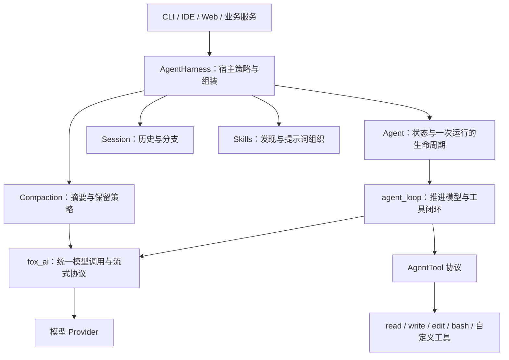
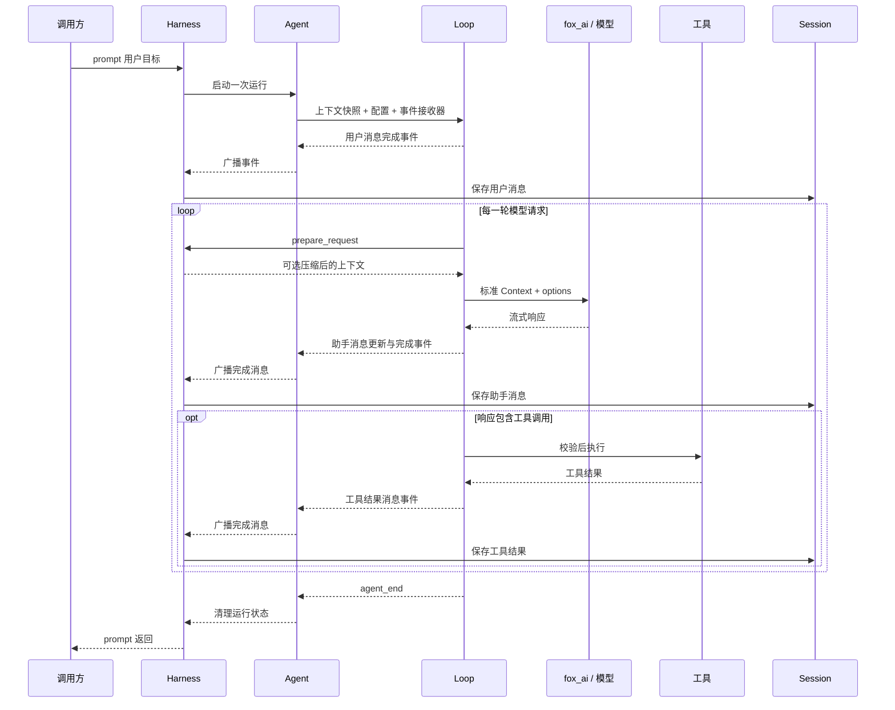

# fox_agent_core 架构学习与面试指南

> 阅读目标：能够解释这个 Agent 内核解决了什么问题、模块为什么这样划分、一次任务如何推进，以及失败时怎样保持系统可理解、可恢复。
>
> 本文以当前仓库实现为依据。实际包目录是 `packages/fox_agent_core`。文中的“可以扩展”“生产化方向”表示设计建议，不表示当前代码已经实现。涉及 pi 时，只讨论本项目借鉴的设计思路。

建议贯穿全文记住一个场景：**用户让 Agent 修改一个配置文件，读取确认，最后说明修改结果。** 模型需要判断下一步行动，工具负责实际读写，运行时负责推进流程，Session 负责保存历史。这四件事有不同的责任边界。

配套动手实验：[真实模型 Notebook](AGENT_CORE_LAB.ipynb)。它用实际模型请求演示工具闭环、会话恢复、Skill 和压缩，适合阅读主线章节后逐步运行。

## 阅读路线与目录

| 章节 | 要回答的问题 |
| --- | --- |
| [第一章：定位](#ch01) | Agent 内核比一次模型调用多了什么？ |
| [第二章：核心概念](#ch02) | message、turn、run、session 分别是什么？ |
| [第三章：分层架构](#ch03) | 为什么需要 fox_ai、agent_loop、Agent、Harness？ |
| [第四章：完整执行过程](#ch04) | 一条用户输入如何变成多轮行动？ |
| [第五章：循环与调度](#ch05) | 什么条件继续，什么条件停止？两个消息队列解决什么问题？ |
| [第六章：状态与所有权](#ch06) | 状态放在哪里，由谁更新，怎样避免相互覆盖？ |
| [第七章：工具执行](#ch07) | 如何把模型的行动建议转成可控的真实操作？ |
| [第八章：事件与流式输出](#ch08) | 怎样让 UI、持久化和运行时协作？ |
| [第九章：取消、错误与重试](#ch09) | 如何停止工作，又不留下混乱的状态？ |
| [第十章：会话与恢复](#ch10) | 为什么保存树形历史？恢复时为什么不直接重跑工具？ |
| [第十一章：上下文压缩](#ch11) | 如何在有限窗口内保留继续工作的必要信息？ |
| [第十二章：技能与扩展点](#ch12) | Skill、Tool、Hook 各自解决什么问题？ |
| [第十三章：设计取舍](#ch13) | 这个 mini 版本省略了什么，代价是什么？ |
| [第十四章：测试与演进](#ch14) | 如何证明内核可靠，下一步优先补什么？ |
| [第十五章：面试表达](#ch15) | 如何介绍项目，怎样回答高频追问？ |
| [第十六章：复习与源码地图](#ch16) | 如何把知识整理成自己的设计能力？ |

第一次阅读建议按第一至第十一章建立主线，再读设计取舍和面试表达。第二次阅读可以沿着“工具失败”“用户取消”“会话恢复”三条异常路径重新理解架构。

<a id="ch01"></a>

## 第一章：Agent 内核到底在解决什么问题

### 1.1 一次模型调用只能提供一次响应

假设用户说：“把配置里的端口改成 8080，并确认修改成功。”

单次模型请求可以返回修改建议，也可以返回一个结构化的工具调用。但模型 API 本身并不会替宿主完成本地文件修改、保存应用状态、等待用户追加要求，也不会自动决定工具执行完以后该怎样组织下一次请求。

一个能行动的 Agent 需要建立这样的闭环：

```text
接收目标 → 提供上下文 → 模型提出行动 → 执行工具
                                    ↓
继续决策 ← 把工具结果作为新信息加入上下文
```

这里模型负责根据当前信息生成响应，运行时负责把响应放进一套可执行的协议。两者协作，才形成持续处理任务的能力。

### 1.2 从“能调用”到“能持续运行”，会出现哪些工程问题

| 问题 | 直接写一个 while 循环时容易出现的情况 | 内核需要提供的能力 |
| --- | --- | --- |
| 工具参数不可靠 | 模型给出错误类型、缺少字段或不存在的工具 | 参数校验、失败结果、再次决策 |
| 用户持续输入 | 新输入覆盖旧输入，或者两个循环同时修改历史 | 单次运行约束、消息队列 |
| 操作耗时 | UI 长时间看不到过程 | 流式消息与工具进度事件 |
| 用户要求停止 | 前端停了，后台命令还在执行 | 取消信号、任务清理、状态收尾 |
| 历史持续增长 | 上下文超过模型窗口 | 历史与当前上下文分离、压缩 |
| 进程退出 | 对话丢失，无法判断工具是否执行过 | 会话持久化、保守恢复 |
| 业务不断变化 | 修改核心循环才能添加权限、模型策略 | 明确扩展点和宿主层 |

因此，面试时可以把项目定位为：

> 我实现的是一个围绕模型调用构建的任务运行时。它将模型输出、工具执行、状态变化和会话记录组织成闭环，并处理这个闭环中的取消、错误和上下文限制。

### 1.3 架构首先要确定责任边界

对于“修改端口”这个任务，各方的责任如下：

- **模型**提出读取哪个文件、修改哪段内容，以及何时生成回复。
- **工具**实现真实的文件读取、写入和命令执行。
- **内核**检查协议、安排调用、组织结果并判断是否继续。
- **宿主**决定可用能力、如何保存会话、何时压缩上下文。
- **用户界面**展示过程并把用户的新指令传入宿主。

这样划分后，更换模型、增加工具、换一种 UI、换一种存储后端，都有各自明确的修改位置。

<a id="ch02"></a>

## 第二章：先分清 message、turn、run、session

### 2.1 四个概念对应四种不同的时间尺度

| 概念 | 当前项目中的含义 | 例子 |
| --- | --- | --- |
| Message，消息 | 参与对话的一条信息 | 用户要求、助手响应、某个工具结果 |
| Turn，轮次 | 通常包含一次模型响应，以及该响应产生的一批工具调用 | 模型要求读取文件，工具返回内容 |
| Run，一次运行 | 一次 `prompt()` 或 `continue_()` 驱动的完整过程，可以包含多个 turn | 完成“修改配置并确认” |
| Session，会话 | 跨越多次运行的历史及当前分支 | 今天修改配置，明天继续讨论这个项目 |

`run` 在这里是说明生命周期的术语，当前实现并没有单独的 `Run` 数据库实体。运行中追加的 steering、follow-up 还可能被当前 run 消费，所以一个 run 也不一定只处理最初那一条用户消息。

正常工具任务可以这样展开：

```text
Session
  ├─ Run 1：修改配置
  │    ├─ Turn 1：assistant 调用 read → toolResult
  │    ├─ Turn 2：assistant 调用 edit → toolResult
  │    ├─ Turn 3：assistant 调用 read → toolResult
  │    └─ Turn 4：assistant 生成最终说明
  └─ Run 2：用户继续要求运行测试
       ├─ Turn 1：assistant 调用 bash → toolResult
       └─ Turn 2：assistant 解释测试结果
```

少数控制路径会额外生成错误轮次，例如达到模型请求上限后产生错误消息。因此，“一个 turn 对应一次真实网络请求”更适合作为正常流程的理解方式，而不是对所有事件的绝对计数规则。

### 2.2 ToolCall 和 ToolResult 是什么关系

`ToolCall` 是 assistant 消息里的内容块，表示模型希望执行的操作。`ToolResultMessage` 是一条独立消息，表示运行时对这次操作的观察结果。

例如：

```text
assistant：调用 read，参数为 path=config.json，调用 ID 为 call-1
toolResult：对应 call-1，内容为文件文本，或者“文件不存在”
assistant：依据结果决定下一步
```

调用 ID 用于关联某一次调用与它的结果。同一个 `read` 工具可以在一个任务中被调用很多次，工具名称无法替代调用 ID。

一次 assistant 响应还可以包含多个 ToolCall；这是一轮中的一批操作，不代表启动多个独立 Agent。

### 2.3 消息、事件和会话条目也要区分

这三个概念经常被混为一谈：

| 对象 | 回答的问题 | 是否通常发给模型 |
| --- | --- | --- |
| 消息 | 对话里已经说了什么、观察到了什么？ | 是，经过请求边界转换后发送 |
| 事件 | 执行过程当前发生了什么？ | 通常不发送 |
| SessionEntry | 历史上记录了什么，以及它接在哪个节点后面？ | 需要先重建成上下文 |

例如，工具的 `tool_execution_update` 是进度事件，不等于新增一条工具结果消息；模型切换是会话配置条目，也不等于用户说了一句话。

**面试时先把这些概念讲清楚，后面的状态、持久化和事件设计才不会混乱。**

<a id="ch03"></a>

## 第三章：为什么分成 fox_ai、agent_loop、Agent 和 Harness

### 3.1 总体结构



图中箭头表示主要调用或使用关系。核心循环使用工具协议，不要求工具必须来自内置编码工具集合。压缩也会调用模型，但它是一种宿主安排的辅助请求，不是在工具循环里硬编码的一种特殊工具。

### 3.2 fox_ai：消化模型供应商差异

不同模型接口的消息格式、流式事件和工具参数格式不同。让循环分别判断这些差异，会导致每增加一个 provider，就修改一次 Agent 的控制流程。

`fox_ai` 为上层提供统一的 `Model`、`Context`、消息类型和流式接口。Agent 依赖这个统一边界，可以通过 `stream_fn` 替换模型调用。

这里的收益包括：

- 循环只关心标准化后的文本、工具调用和停止原因。
- 测试可以注入 Faux 或自定义流函数，不必依赖外部模型。
- provider 的请求重试和网络连接清理可以在模型调用层处理。

它不负责会话分支，也不决定某个文件工具是否应该对当前用户开放。

### 3.3 agent_loop：负责推进流程

循环层拥有“下一步做什么”的执行顺序：准备请求、调用模型、处理工具、注入排队消息，以及停止。

这里说它“无状态”，含义是：**调用者显式提供上下文、配置和事件接收器；循环不自行长期持有一个会话对象。** 函数执行过程中仍然有局部状态，例如当前上下文、轮次计数和待处理消息，所以它不是数学意义上的纯函数。

如果循环直接读取 JSONL、扫描技能目录、显示 UI，它就会依赖具体产品环境，难以被其他宿主复用。

### 3.4 Agent：把执行引擎变成有状态的对象

业务通常希望持有一个对象，反复执行 `prompt()`，随时查看状态或调用 `abort()`。因此需要 Agent 层保存：

- 当前模型、工具和消息历史。
- 当前是否正在处理、流式消息和未完成的工具调用 ID。
- steering、follow-up 两个队列。
- 订阅者和当前运行的取消信号。

Agent 将状态快照交给循环，再通过循环发出的事件更新自身状态。它提供日常使用所需的对象接口，但不直接承担文件会话和技能发现的产品策略。

### 3.5 Harness：把通用能力组装成可用产品

Harness 可以理解为“运行宿主”或“组装与策略层”。当前 `AgentHarness` 组合 Agent、Session、Compaction、Skills 和工具集合，负责：

- 启动时从 Session 恢复上下文与配置。
- 监听完成消息并持久化。
- 每次请求前评估是否压缩。
- 组织 system prompt、工作目录和技能目录。
- 提供切换模型、切换分支、手动压缩等操作。

同一个底层循环可以由不同 Harness 承载。例如编码宿主提供文件工具，客服宿主提供订单查询工具，数据分析宿主提供数据库工具。这里后两者是可扩展方向，并非本项目已经提供的功能。

### 3.6 设计理由：分开稳定机制与可变策略

| 决策 | 通常放在哪里 | 理由 |
| --- | --- | --- |
| 收到工具调用后执行并回传结果 | 循环层 | 是 Agent 闭环的基本机制 |
| 当前是否允许再次启动运行 | Agent / Harness | 依赖对象的生命周期 |
| 工具怎么读写文件 | 工具实现 | 与具体能力有关 |
| 历史保存到哪里 | SessionStorage | 与存储部署方式有关 |
| 什么时候压缩、保留多少内容 | Harness + Compaction | 与上下文预算和产品策略有关 |
| 怎么显示工具进度 | UI 或订阅者 | 与交互形式有关 |

**面试表达：**我希望模型调用机制、Agent 控制流程和宿主策略能够独立变化，所以按职责和变化原因划分层次，而不是把所有功能都塞进一个 Agent 类。

<a id="ch04"></a>

## 第四章：一次任务怎样穿过这些层

### 4.1 先看正常路径



为便于阅读，图中省略了部分 turn 和工具进度事件。`prepare_request` 是通过配置回调到 Harness 的，循环没有直接导入 Harness。

### 4.2 为什么先保存助手工具调用，再执行工具

模型提出工具调用后，这条 assistant 消息先成为完成消息，随后才执行工具。因此，正常的消息历史会先记录“准备执行什么”，再记录“执行后观察到了什么”。

这种顺序有利于理解和恢复。若进程中途退出，可能留下“有调用、无结果”的历史，恢复逻辑能发现这个缺口。但它仍不能证明操作到底有没有发生，这个问题会在会话恢复章节展开。

### 4.3 为什么工具结果需要再交给模型

内核通常不知道“文件内容是否满足用户要求”。它能判断工具执行有没有报错，却不能只凭 `write` 成功就认定业务目标完成。

工具结果为下一次模型决策提供新信息。模型可能发现路径错误、文件内容与预期不同，或者还需要读取确认。因此，一次工具执行成功通常意味着进入下一轮判断。

### 4.4 这个场景对应的职责检查

当你能回答下面四句话，说明已经建立基本架构认识：

- 读取和修改哪个文件，由模型结合上下文提出。
- 是否允许执行、参数是否有效，由宿主策略与工具执行边界检查。
- 工具完成后是否继续调用模型，由循环协议决定。
- 这个过程怎样被保留下来，由 Harness 和 Session 协作完成。

<a id="ch05"></a>

## 第五章：循环与调度——为什么不能只判断 tool_use

### 5.1 最小循环与交互式循环的区别

最小工具 Agent 可以使用一个简单规则：模型输出工具调用，就执行并继续；没有工具调用，就结束。

交互式 Agent 还会遇到另一种工作来源：运行过程中，用户补充了新的要求。例如模型正在读取配置，用户又输入：“只修改开发环境，不要修改生产环境。”即使模型刚刚生成了一段普通文本，这条新要求仍需要处理。

所以，本项目的循环同时处理两类继续条件：**工具结果需要下一轮解释，以及新的用户消息需要下一轮处理。**

### 5.2 双层循环表达的是两个消费时机

下面是帮助理解的伪代码，省略了事件、错误和取消处理：

```python
while True:
    while needs_model_response or pending_messages:
        inject(pending_messages)
        response = await ask_model()
        results = await execute_tool_calls(response)
        needs_model_response = should_continue_after_tools(response, results)
        pending_messages = drain_steering()
    pending_messages = drain_follow_up()
    if not pending_messages:
        break
```

内层负责当前任务的连续推进，外层负责本来可以结束时的追加任务。两个循环并不表示有两个 Agent，也不表示两条后台线程。

实际代码每次进入外层时把 `has_more_tool_calls` 初始化为 `True`，是为了启动第一轮模型调用。这个初始值不代表已经存在一个尚未执行的工具。

### 5.3 steering、follow-up、pending_messages 的区别

| 名称 | 所在位置 | 消费时机 | 适合的输入 |
| --- | --- | --- | --- |
| steering queue | Agent 对象 | 下一次模型请求前的循环边界 | “先考虑这个限制”“调整当前任务方向” |
| follow-up queue | Agent 对象 | 没有当前工具工作、也没有已取出的 steering 时 | “完成后再做下一件事” |
| pending_messages | 当前循环的局部变量 | 即将注入上下文 | 从上述队列取出的本次待处理消息 |

`pending_messages` 不是第三个持久队列，也不专指 follow-up。它只是循环统一处理排队输入的暂存位置。

例如：

```text
当前工作：修改配置
steering：只修改开发环境
follow-up：完成后运行一次测试

下一轮请求前加入开发环境限制
→ 当前配置任务继续推进
→ 本来可以停止时取出 follow-up
→ 开始处理运行测试的要求
```

steering 改变的是下一次模型决策时可见的信息，不会让正在执行的文件写入“自动回到过去”。需要停止当前工作时应使用取消机制。

### 5.4 当前实现怎样识别工具调用

循环从 assistant 响应的内容块中提取 `ToolCall`，随后执行这批调用。它不是只比较某个名为 `tool_use` 的字符串。

统一协议中的 `stop_reason` 用来补充判断。例如输出长度限制可能造成参数不完整，此时即使看到了 ToolCall，也不能照常执行，应生成对应的失败结果。具体 provider 怎样命名结束原因，由 `fox_ai` 转成上层协议。

### 5.5 正常停止与控制性停止

| 条件 | 当前行为 |
| --- | --- |
| 有可执行工具调用，批次未共同要求终止 | 继续下一轮处理工具结果 |
| 有待注入的 steering | 继续下一轮处理新要求 |
| 当前工作已尽，存在 follow-up | 开始下一段工作 |
| 上述工作都不存在 | 正常结束本次运行 |
| 模型错误、取消 | 结束本次运行并收尾 |
| 达到 `max_turns` | 生成上限错误并停止继续请求模型 |
| `should_stop_after_turn` 返回真 | 宿主要求提前停止 |

工具结果里的 `terminate=True` 还要单独理解：当前规则要求同批所有结果都为真，才不因这一批工具再自动进入下一轮。它不会清除已排队的用户消息，因此不能把它理解为无条件关闭整个运行时。

**循环停止只说明协议没有继续推进，不能单独证明业务目标正确完成。** 判断修改是否正确，还需要测试、工具观察或业务验收。

### 5.6 队列的设计取舍

`one-at-a-time` 可以使输入逐条进入决策过程；`all` 可以一次把当前排队输入都交给模型。前者可能增加模型轮次，后者可能一次引入较多上下文。

当前队列是进程内的轻量队列，没有持久化和公平调度。如果 steering 持续进入，follow-up 可能等待较久。生产化时可以考虑排队上限、调度公平性和队列落盘，但这些是进一步的调度能力。

<a id="ch06"></a>

## 第六章：状态与所有权——同一份信息为什么出现在多个地方

### 6.1 四种“状态”各有不同用途

| 对象 | 主要内容 | 生命周期 | 负责回答的问题 |
| --- | --- | --- | --- |
| `AgentState` | 当前消息、模型、工具、运行标记、流式消息 | Agent 对象存活期间 | 当前运行到哪里了？ |
| `AgentContext` | 这次循环使用的 system prompt、messages、tools | 当前运行及后续准备过程 | 下一步决策基于什么？ |
| `fox_ai.Context` | 发给模型层的消息和工具声明 | 一次模型请求 | 这次请求的实际输入是什么？ |
| `Session` | 历史条目、配置变化、分支和压缩记录 | 内存会话或文件会话存续期间 | 已保存的历史是什么？ |

这些对象存在内容重叠，但不应把它们看成四个各自独立、可以任意修改的数据库。系统需要明确谁负责产生变化、谁负责投影和保存。

### 6.2 AgentState 是运行视图

Agent 根据事件更新状态。例如收到消息更新事件，就更新 `streaming_message`；收到消息结束事件，就把定稿消息加入 `messages`；收到工具开始和结束事件，就修改 `pending_tool_calls`。

当前 `is_streaming` 在一次运行期间保持为真，范围包括工具执行阶段。因此使用它时应按实现理解为运行中的状态标记，不能只理解成“此刻网络正在输出 token”。

`error_message` 也不是整个业务任务的统一成功判定。工具失败可能已经被模型处理并修正，不能仅凭某次失败结果认定整个任务失败。

### 6.3 为什么流式草稿和完成消息要分开

模型可能先输出半段文本，然后继续补全，甚至最后失败。如果每个 token 都作为正式消息追加，历史中会出现大量残片，工具调用参数也可能处于不可执行状态。

因此需要两种视图：

```text
streaming_message：正在变化的当前消息，供 UI 展示
messages：已经定稿的对话消息，供后续上下文使用
```

循环内部会维护并替换 partial 消息，直到得到最终结果；Agent 通过事件区分更新和完成。即使响应最终标记为 error 或 aborted，也可以有一条定稿的错误消息，“定稿”不等于“成功完成目标”。

### 6.4 为什么要传上下文快照

运行开始时复制消息列表和工具列表，可以避免循环直接对 Agent 原来的列表做 append，从而减少跨层共享列表导致的重复追加和意外覆盖。

这里要准确描述实现：**列表复制不等于所有消息、模型和工具对象都被深拷贝。** 当前架构也不是严格的不可变状态系统。它主要依赖单次运行约束、受控更新入口和事件约定来保持一致。

如果后续允许后台任意修改工具集合、跨线程写状态，就需要更强的所有权约束或同步机制。

### 6.5 为什么禁止同时运行两个 prompt

假设同一个 Agent 同时启动两个循环：它们可能都读取同一段历史，然后交错写入不同的 assistant 和 toolResult。最终既无法解释哪个工具结果属于哪个目标，也很难正确执行取消和压缩。

当前方案是一个 Agent 同时只处理一次运行，新要求使用消息队列进入。Harness 的忙碌约束还覆盖手动压缩、切换分支等操作，避免修改上下文时发生竞争。

这能简化同一对象内的并发语义，但不会自动保护两个不同 Harness 写同一个 JSONL 文件。

### 6.6 事件先更新运行状态，持久化再确定历史

在 Harness 路径中，Agent 先处理事件更新状态，Harness 的订阅器再将完成消息保存到 Session。操作结束时，Harness 从 Session 重建消息列表，使保存下来的历史成为恢复消息的依据。

这意味着内存状态和磁盘文件之间有一个短暂的处理窗口。当前设计通过失败传播和结束时重新同步来处理普通存储失败，并没有实现跨内存、文件和外部工具的统一事务。

**面试表达：**我区分了运行视图与持久历史，避免把 UI 的实时状态直接当成恢复依据。真正涉及多进程和外部副作用时，还需要额外的一致性机制。

<a id="ch07"></a>

## 第七章：工具执行——把生成式输出接到确定性程序

### 7.1 工具是一个明确的执行边界

工具至少需要提供三类信息：

- 名称和描述，使模型能够选择能力。
- 参数 Schema，使模型和运行时知道参数结构。
- 执行函数，使宿主能够真正执行操作。

模型看到的是可调用能力的声明，Python 执行函数保留在宿主进程中。模型生成 ToolCall 后，运行时按名称查找已注册的工具并执行，不会把任意模型文本直接当成 Python 程序运行。

`bash` 的能力本身是执行 shell 命令，权限范围更广。因此，“只调用注册工具”并不自动意味着这些工具具备足够的隔离能力。

### 7.2 一次工具调用的处理流程

```text
收到 ToolCall
  → 发送工具开始事件
  → 检查取消、查找工具
  → 校验并准备参数
  → before_tool_call 策略检查
  → 执行并接收进度
  → 适用时执行 after_tool_call
  → 发送工具结束事件
  → 形成 ToolResultMessage
```

工具开始事件表示运行时开始处理这次调用，不足以证明真实操作已经发生。比如参数不合法，仍然可以出现开始与失败结束事件，但执行函数并没有被调用。

### 7.3 Schema 校验解决什么，不能解决什么

Schema 可以检查必填字段、数据类型、取值范围和多余字段。例如 `offset` 必须为正整数，模型传入字符串时，应在文件读取之前返回错误。

但参数结构正确，只表示它符合接口格式。目标路径是否允许访问、某条命令是否应该执行、业务对象是否属于当前用户，属于权限或业务校验。

| 检查层 | 典型问题 | 合适位置 |
| --- | --- | --- |
| 结构校验 | `path` 缺失，`offset` 类型错误 | JSON Schema |
| 工具语义校验 | 替换文本没有匹配，或匹配了两次 | 工具内部 |
| 宿主权限策略 | 当前操作是否允许，是否需要用户审批 | `before_tool_call` 或更完整的权限层 |

### 7.4 为什么工具错误要回传给模型

“文件不存在”有可能是模型选错了路径。这种错误是下一步决策有用的信息，模型可以依据它重新查找文件。

所以，常见工具错误会转换成 `is_error=True` 的工具结果。这样运行仍保留完整的调用与观察关系，不需要让模型从一段缺失历史中猜测发生了什么。

但错误反馈需要配合轮次限制。否则模型可能持续重复同一个无效调用。当前 `max_turns` 是防止无限推进的基础限制，还没有重复动作检测或完整费用预算。

### 7.5 为什么结果拆成 content、details 和控制信息

| 字段 | 用途 |
| --- | --- |
| `content` | 提供给模型的观察结果，如文本或图片 |
| `details` | 给宿主、日志或 UI 的结构化信息 |
| `terminate` | 对后续循环推进的控制提示 |
| `added_tool_names` | 传递新增工具名称的元数据，不会自动注册工具实现 |

这种分离减少了模型上下文与展示信息之间的耦合。`details` 不按当前 provider 消息转换方式发送给模型，但仍可能进入本地会话文件，不能把“不发给模型”误认为“完全不保存”。

### 7.6 并行执行的收益与约束

读取两个独立文件可以并发，等待时间接近较慢的那个读取过程。两个操作如果存在依赖，例如先写文件再读新内容，就需要顺序执行。

当前实现采用容易解释的批次策略：配置要求串行，或批次包含任何 `sequential` 工具，就整批串行；否则使用 TaskGroup 并行执行。内置 `write`、`edit`、`bash` 选择串行，`read` 允许并行。

这是一种保守策略，并不会分析具体路径之间是否有冲突。即使两个 write 操作写不同文件，也会被串行化。更精细的方案可以建立资源锁或依赖图，但复杂度会提高。

并行时还要区分两种顺序：

- 工具进度和结束事件可以按实际完成时间出现。
- 这一批 ToolResultMessage 会在批次收集完成后按原始调用顺序写入。

因此，较快的工具可以先显示“完成”，但下一轮模型通常仍要等整批结果。它降低了上下文排列的不确定性，也保留了批次屏障带来的等待成本。

### 7.7 内置工具体现了哪些工程取舍

`edit` 要求旧文本恰好匹配一次，是为了避免模型给出模糊片段时修改错误位置。匹配失败后要求重新读取文件，是一种通过观察修正计划的方式。

`write` 使用临时文件替换，减少写到一半破坏目标文件的风险。它仍不能避免用户指定错误路径或内容；原子写入解决写入完整性，不负责业务正确性。

`read`、`bash` 限制返回内容，既减少上下文膨胀，也控制内存与事件体积。文件工具当前限制单个文本文件 10 MiB；文本结果限制约 20000 字符，bash 实际按输出字节缓冲限制到 20000 字节左右。

<a id="ch08"></a>

## 第八章：事件与流式输出——怎样让不同使用者共享执行过程

### 8.1 只返回最终字符串为什么不够

长任务中，调用方可能需要知道模型是否正在输出、哪个工具正在执行、工具有没有失败、当前是否可以接受下一次操作。

如果每个工具都直接调用 UI，工具就和交互方式耦合；如果循环直接写日志、保存磁盘、刷新终端，循环就会变成产品代码集合。

当前设计让执行层发出统一事件，Agent、Harness 和外部订阅者各自处理需要的部分。

### 8.2 四层生命周期事件

| 层次 | 事件 | 表达的含义 |
| --- | --- | --- |
| 运行 | `agent_start` / `agent_end` | 一次运行开始与结束 |
| 轮次 | `turn_start` / `turn_end` | 一轮处理开始与结束 |
| 消息 | `message_start` / `message_update` / `message_end` | 消息从开始、变化到定稿 |
| 工具 | `tool_execution_start` / `update` / `end` | 一次工具调用的处理过程 |

Harness 另外提供压缩相关事件，用于展示正在整理历史等宿主操作。压缩事件没有被混进工具调用类型里，职责更容易区分。

### 8.3 模型事件与 Agent 事件解决不同层级的问题

`fox_ai` 的 `text_delta`、`thinking_delta`、`toolcall_delta` 描述模型响应如何增长。Agent 的 `message_update` 可以携带这些底层事件，外层仍然使用统一的消息生命周期。

这使 UI 可以细粒度展示 token，同时不需要自己猜测“某个 provider 的最后一块数据是否意味着整个 Agent 已经完成”。

### 8.4 EventStream 为什么同时有事件迭代和 result

事件迭代适合消费过程，`result()` 适合等待最终结果。有些调用方只需要最终消息，不关心每个 delta；有些调用方需要持续渲染，但仍要在最后得到完整结果。

底层 EventStream 用异步队列传递事件，用 Future 表达终止结果，并绑定生产者任务以支持关闭和清理。

当前有两种入口需要分清：

- 公共 `agent_loop(...)` 把循环事件推入 EventStream。
- 有状态 Agent 直接使用内部循环的事件接收器接口，将事件交给自身的状态归约和订阅逻辑。

因此，不应把所有事件路径都想象成必须经过一个消息中间件。这里是进程内异步协作，不是 Kafka 或持久事件总线。

### 8.5 持久化为什么监听 message_end

当前 Harness 的关键连接点很短：

```python
if isinstance(event, MessageEndEvent):
    self.session.append_message(event.message)
```

这段代码表达的是一个架构选择：保存定稿消息，让运行时保持流式表达能力，也让会话历史保持可读。

逐 token 写入会话会显著增加写入次数，并让恢复逻辑需要重新组装残片。代价是进程突然退出时，尚未定稿的模型输出不会完整恢复。当前 Session 也不会保存每一条工具进度事件。

### 8.6 事件顺序与可靠性的实际边界

同一次 Agent 广播会按订阅顺序等待监听器。一个慢监听器会拖慢对应事件路径；并发工具之间仍可能交错地产生事件。它不是一个对所有并发事件加全局互斥锁的总线。

正常处理和受支持的取消路径会维护消息、工具事件的收尾关系。但监听器或持久化本身失败时，不能承诺所有结束事件仍一定成功发送。

当前 EventStream 使用无界队列，并保留已推送事件列表，没有完整的背压或磁盘事件日志。若要用于长时间、高吞吐任务，需要进一步控制事件积压；不能把内存中的事件列表称为可靠的持久重放系统。

<a id="ch09"></a>

## 第九章：取消、错误与重试——怎样结束一次不顺利的运行

### 9.1 取消需要跨越整条执行链

用户点击停止时，系统可能正在等模型、执行工具、等待工具输出或生成压缩摘要。只把 UI 改成“已停止”，无法解决后台仍然运行的问题。

当前设计使用同一次运行的取消事件，并在异步操作边界处理中止：

```text
用户 abort
  → 运行的 asyncio.Event 被设置
  → 等待中的模型/工具操作观察到取消
  → 取消并等待相关异步子任务清理
  → 关闭模型流或清理工具资源
  → 在可收尾路径上记录中止/工具失败结果
  → 清空运行标记，让下一次操作可以开始
```

`abort()` 发出停止意图；`wait_for_idle()` 等待停止过程完成。这两个动作分开，是因为释放连接和结束子进程需要时间。

### 9.2 为什么要把任务和取消信号一起等待

如果只在调用模型前检查一次取消标记，那么模型请求阻塞之后，取消就无法及时生效。

`cancellable()` 的思路是同时等待操作完成与取消事件，先观察哪一个发生；需要取消时，再停止操作任务并等待其退出。它还会清理自己创建的等待任务，避免每次调用都留下一个后台协程。

如果操作已经完成，当前实现优先取完成结果。这个选择与副作用有关：文件已经成功写入，就不应仅因几乎同时收到取消信号而把它描述为从未执行。

### 9.3 为什么 asyncio.shield 会出现在取消设计里

外部调用者可以取消等待 `prompt()` 的 task。若这个取消直接、不受控制地传入正在执行的循环，工具和消息收尾可能被一起打断。

Agent 使用 `shield` 保护内部运行的等待关系；检测到调用者取消后，转而设置内部取消事件，等待循环清理，再向调用者传播 `CancelledError`。

这里保护的是**清理流程有机会完成**，不是让 Agent 拒绝取消。Future 的等待也使用 shield，以免某个等待者取消自己时破坏其他等待者共用的完成信号。

### 9.4 取消不等于撤销副作用

设想工具已经完成文件写入，但还没来得及发出结果，用户就取消了任务。停止协程不能自动恢复旧文件。

因此，需要分别回答：

| 问题 | 取消机制能否独立解决 |
| --- | --- |
| 后续是否继续调用模型 | 可以控制 |
| 是否继续等待可取消的异步操作 | 可以控制 |
| 正在运行的受管理子进程是否被清理 | 工具需要显式实现 |
| 已经写出的文件是否恢复 | 需要备份、事务或补偿逻辑 |
| 外部系统是否已经执行操作 | 需要查询结果、幂等键或操作记录 |

当前内置 bash 会在退出路径清理所管理的进程；自定义工具也必须正确释放资源。同步阻塞函数、忽略取消的协程、脱离管理的外部任务，都不能仅靠一个 asyncio.Event 得到可靠停止保证。

### 9.5 错误需要按“谁有能力处理”分类

| 情况 | 适合的反馈形式 | 原因 |
| --- | --- | --- |
| 模型选错工具或参数 | 失败 ToolResult | 模型可以据此修正下一步行动 |
| 文件不存在、替换文本不匹配 | 失败 ToolResult | 是对环境的有效观察 |
| 模型请求失败 | 标记 error 的 assistant 消息，停止本次推进 | 当前没有可靠的下一步响应 |
| 输出被截断 | 对已有调用补失败结果，不执行不完整参数 | 防止执行错误动作 |
| 主动取消 | 中止消息或工具结果及生命周期清理 | 用户要求停止 |
| 配置错误、事件接收器失败 | 在相应边界向宿主暴露异常 | 不能指望模型修复运行基础设施 |

尤其是消息持久化失败，不能悄悄当成“工具还在正常执行”。继续产生副作用而不保存历史，会扩大恢复时无法判断的范围。

具体异常如何呈现仍取决于它出现在哪个边界，例如准备请求失败可以被转换为错误助手消息，手动压缩失败则直接返回异常。面试时应描述错误分类原则，再结合路径说明行为，避免说“所有错误都不抛异常”。

### 9.6 为什么重试不应该无脑包住整个 Agent

网络请求在建立阶段遇到短暂失败，有一定重试价值。但整段 Agent 运行可能已经写文件或执行命令，直接重跑会重复副作用。

可以把重试分成三个层次理解：

1. **模型请求重试**：当前 `max_retries` 透传到 `fox_ai`，用于其请求建立阶段的重试策略。
2. **重新生成一轮响应**：需要考虑此前是否已经展示或保存部分输出，当前不做完整的自动重放。
3. **工具或整段运行重试**：需要考虑副作用和幂等性，当前不会自动保证安全。

对于有副作用的工具，更合理的生产化思路是记录操作 ID、使用业务幂等键，或先检查目标状态是否已经达到预期。单纯增加重试次数并不能解决“执行过但没收到结果”的问题。

<a id="ch10"></a>

## 第十章：Session——把历史保存下来，也要能解释如何继续

### 10.1 Session 比 messages 列表多了什么

普通消息列表能够表示一段线性对话，但以下需求还需要额外信息：

- 返回过去的某一步，尝试另一种做法。
- 恢复当时使用的模型、思考级别和工具集合。
- 记录压缩发生在哪个位置。
- 从文件中恢复当前选中的历史分支。

Session 因而保存一组带 `id`、`parent_id`、类型和数据的条目，并使用 `leaf_id` 表示当前所在位置。

### 10.2 为什么历史建模成树

```text
用户提出需求
  └─ 助手分析
       ├─ 方案 A 的工具调用
       │    └─ 方案 A 的结果
       └─ 用户要求尝试方案 B
            └─ 方案 B 的回复  ← 当前 leaf
```

当前分支由 leaf 沿 parent 指针向前追溯得到。分支结构让“回到过去继续”具有清楚含义，不必删除原来的方案 A，也不必把两条路线混进同一个线性列表。

`move_to` 改变当前叶节点；在该节点后新增条目，就形成新的延续。`fork` 则创建一个独立的内存会话。当前实现会复制选定路径上的条目并重新生成 ID，不是通过共享底层存储实现零成本分叉。

### 10.3 历史与模型上下文是不同的数据产品

完整历史主要用于解释、恢复和分支；模型上下文主要用于下一步决策。保存过的每一个历史细节，不需要每次都重新发送给模型。

本项目通过 `build_context()` 把当前分支投影成消息列表。遇到最近的压缩条目，就以摘要与保留尾部作为新的上下文基础。

```text
保存的历史：原始消息 → 更多消息 → 压缩条目 → 后续消息

本轮上下文：摘要 + 压缩时保留的尾部 + 压缩之后新增的消息
```

模型配置还有另一条恢复路径。`build_settings()` 会继续查找压缩点以前的配置条目，因为压缩对话文本不应导致模型、思考级别等配置丢失。

这种“历史记录 → 当前视图”的思路可以借助事件溯源的思想来理解，但当前项目没有完整保存所有运行事件，也没有实现确定性的执行重放。面试时可以说它具有历史投影的设计，不应直接声称实现了完整 Event Sourcing 系统。

### 10.4 为什么提供存储协议

Session 通过存储接口访问条目，内存实现和 JSONL 实现遵守同一套约定。这样，上层分支和上下文重建逻辑不需要关心数据究竟来自字典还是文件。

内存后端适合测试和临时对话；JSONL 后端适合单进程的小型持久会话。以后可以增加数据库实现，但还要补足事务和并发语义，不能只替换几个读写函数就宣称支持分布式运行。

### 10.5 JSONL 的“追加”要准确理解

当前 `append_entry()` 是在逻辑历史中追加条目，**物理实现会重新序列化整个会话文件，然后原子替换旧文件。** 它不是每次只向文件末尾 append 一行。

这个实现选择有明确取舍：

| 收益 | 成本 |
| --- | --- |
| 文件始终包含一致的 metadata、leaf 和条目集合 | 历史越长，每次重写的数据越多 |
| 临时文件写入失败时旧文件仍在 | 大会话下时间和写入开销会明显增长 |
| 分支切换也能用同一种保存方式处理 | 不适合多个写入者直接竞争同一个文件 |

保存过程包含临时文件、flush/fsync 和替换操作，普通保存失败还会回滚该次内存修改。但不能因此承诺任何硬件故障下绝不丢数据，也不能把它扩展解释为多个外部系统之间的事务。

### 10.6 恢复时最难的问题是“结果未知”

考虑以下时间线：

```text
1. 已保存：assistant 请求 write
2. 工具执行：目标文件已经修改
3. 进程退出：ToolResult 还没保存
4. 重新打开会话：只能看到调用，看不到结果
```

此时，“没有工具结果”不能推出“工具没有执行”。如果自动重放，可能再次写入、重复提交或重复扣费。

当前恢复策略会检查会话尾部的 assistant 工具调用与已有结果，为缺失结果补上“执行中断、结果未知，需要先检查状态”的错误消息，不自动重新执行工具。

这是一个保守选择：宁可让后续决策重新观察环境，也不把恢复历史等同于重复操作。它只处理这个特定的尾部缺口，不代表能自动修复任意损坏的文件或任意历史结构。

### 10.7 Session 保存了什么，没有保存什么

| 当前保存或可恢复 | 当前没有完整持久化 |
| --- | --- |
| 完成的对话消息与工具结果 | 进行中的每个 token、每条进度事件 |
| 模型、思考级别、启用工具名称 | 工具的 Python 实现与运行中的协程 |
| 分支关系、当前 leaf、压缩结果 | steering / follow-up 的全部待消费队列 |
| 重建上下文所需的历史条目 | 完整运行 checkpoint、自动断点续执行 |

system prompt、工作目录和技能集合主要由恢复时的宿主选项重新组装，也不能只靠消息文件推断出原来整个进程环境。

<a id="ch11"></a>

## 第十一章：Compaction——在有限窗口内保持继续工作的能力

### 11.1 为什么需要管理上下文

Agent 会不断积累文件内容、工具输出、模型回复和用户补充要求。即使会话存储可以无限增长，一次模型请求的输入窗口仍然有限，还要为输出留出空间。

直接删除最早消息虽然简单，但可能丢掉关键约束，例如“只允许改测试环境”或“某个方案已经失败”。保留全部内容又会增加输入体积，并最终遇到窗口限制。

压缩的目标是把旧信息转化为更短的工作摘要，同时保留最近的细节，让模型具备继续决策所需的信息。

### 11.2 为什么压缩策略放在 Harness

不同产品对上下文有不同要求。编码任务要保留文件路径和修改结果，客服任务可能要保留订单信息和用户确认，另一种应用也可能完全不允许摘要化。

因此，循环提供“请求前准备”的时机，Harness 决定是否压缩，Compaction 模块执行切割与摘要。这样循环可以被不同策略复用。

循环仍然需要知道准备后的新上下文是什么，否则下一次模型调用还会发送旧历史。所以扩展点不只是发一个通知，还必须允许返回替换后的上下文。

### 11.3 为什么是 prepare_request，而不是只用 prepare_next_turn

`prepare_next_turn` 只在一轮完成后、确实准备继续时运行。它覆盖不了首次请求前已经很长的恢复历史。

此外，steering 或 follow-up 可能带入一大段新文本。如果在这些消息注入以前就完成预算检查，实际发送时仍可能超出预期。

当前 Harness 接在 `prepare_request` 上，时机是：**本次待处理消息已经加入上下文，模型请求还没有发出。** 首轮和后续轮次都经过这个边界。

这是面试中值得重点说明的一个设计细节：选择扩展点时，应依据它能看到的状态是否完整，而不只是函数名字是否看起来合适。

### 11.4 触发阈值和保留预算分别解决什么问题

设模型窗口为 W，输出预留为 R，当前估算输入为 T。当前阈值规则可以写成：

```text
实际预留 = min(R, W // 2)
触发阈值 = W - 实际预留
T >= 触发阈值时，尝试自动压缩
```

例如窗口为 100000、预留为 16000，则约在估算输入达到 84000 时尝试压缩。小窗口限制预留不超过一半，是为了避免默认预留比整个模型窗口还大。

`keep_recent_tokens` 的作用不同：它决定切割时希望保留多少最近消息。一个控制什么时候开始整理，另一个控制哪些内容尽量保持原样。

这不是压缩后长度的硬保证。消息按整体保留，最近一条消息可能很长；工具调用与结果又不能随意拆开，所以实际保留量可能超过设定值。

### 11.5 为什么工具调用与结果不能拆开

若只保留工具结果，模型可能看不到它对应的调用；若只保留调用，模型又可能面对一个没有结果的操作。

当前切割逻辑从尾部累计预算，当切割点落在工具结果上时，向前移动以带上对应的调用区域。它适用于正常组织的调用与结果序列，不是对任意损坏历史的通用修复器。

```text
较早消息：用户目标、旧分析、旧工具观察   → 生成摘要
最近消息：assistant 工具调用 + 对应结果 → 一起保留
后续输入：当前仍需处理的消息             → 保留并继续处理
```

### 11.6 为什么摘要生成成功后才能提交

压缩至少分成三个阶段：

1. 根据旧消息生成候选摘要，原始上下文暂时保留。
2. 检查摘要是否成功、非空，以及操作是否已取消。
3. 写入压缩条目，再用 Session 重建后续上下文。

如果在摘要请求之前就清空旧历史，一旦请求失败就会丢失继续任务所需的信息。当前实现将候选生成与提交分开，失败时保留原始消息；这是局部的提交边界，不是全局事务。

模型生成摘要仍有误差，不能保证保留全部语义。原始历史仍留在 Session 中，提供回溯依据，而不是随着摘要成功就被删除。

### 11.7 当前估算与压缩的能力边界

自动检查使用字符、非 ASCII 字符和图片的启发式估算，也计入 system prompt 和工具声明。它没有接入精确 tokenizer。模块虽然提供读取 usage 的辅助函数，当前 Harness 的自动判断仍主要使用估算，而不是完整的 usage 校准方案。

另外，摘要请求本身也有窗口限制。如果积累的待总结内容已经太长，不能假设“再发一次摘要请求”一定可以解决。分层摘要或分块总结是后续方向。

当前会在触发压缩后的路径上，再检查剩余估算输入与输出预算。如果仍然过大，就结束请求并提示减少输入或工具输出。关闭自动压缩时，这段检查也不会自动变成另一套独立的硬预算保护。

### 11.8 面试时怎样描述压缩

> 我把长期保存的历史和下一次模型请求的上下文分开。每次请求前先检查预算，旧信息可以摘要化，最近消息和工具调用关系尽量保留。摘要成功后才提交新的上下文，同时保留原始历史用于追溯。当前计数是启发式，压缩也有信息损失，所以还需要实际任务评估，不能只看 token 是否减少。

<a id="ch12"></a>

## 第十二章：Skills 与 Hooks——怎样扩展能力而不持续修改循环

### 12.1 Tool、Skill、Hook 是三种不同的扩展方式

| 机制 | 提供什么 | 典型例子 |
| --- | --- | --- |
| Tool | 可实际执行的能力 | 读取文件、运行命令、查询数据库 |
| Skill | 面向某类任务的说明、步骤和资源位置 | 代码审查流程、项目约定 |
| Hook | 宿主介入运行流程的时机 | 参数执行前检查、请求前压缩 |

Skill 可以指导模型怎样组合工具，但技能文件本身不会因为被发现就自动执行其中的命令。Hook 是宿主提供的回调，也不是模型自主生成的一段可执行代码。

### 12.2 为什么技能采用“目录先展示，正文按需读取”

如果把所有技能全文都放进 system prompt，即使大多数技能与当前任务无关，也会长期占据上下文。

当前机制先加载技能元数据，在 system prompt 中提供名称、描述和文件位置。模型判断有用时，可以通过 `read` 读取全文。显式 `invoke_skill()` 则直接把指定技能内容和补充要求加入本次用户输入。

这种设计把“发现有哪些知识”与“加载具体知识”分开，降低普通请求的上下文负担。若宿主禁用了文件读取能力，就需要改用显式调用或提供另一种加载方式。

### 12.3 技能不是权限系统

`disable_model_invocation` 在当前实现中主要影响技能是否出现在自动展示的目录中；显式调用仍然可以使用该技能。它不等于对文件访问施加了隔离。

技能文本、读取的文件和命令输出都可能影响模型决策，因此工具权限应在可执行边界实施，不能只依赖一段“请不要执行危险操作”的提示词。

### 12.4 关键 Hook 的时机

| 扩展点 | 时机 | 可以解决的问题 |
| --- | --- | --- |
| `prepare_request` | 消息注入后、每次模型请求前 | 上下文预算、压缩、请求准备 |
| `prepare_next_turn` | 已有一轮完成且确实继续时 | 调整后续上下文、模型或思考级别 |
| `transform_context` | 形成模型输入之前 | 请求侧筛选、上下文变换 |
| `convert_to_llm` | 转成模型层消息的边界 | 自定义消息映射 |
| `get_api_key` | 模型请求边界 | 动态解析凭据 |
| `before_tool_call` | 参数准备后、实际执行前 | 权限检查、阻止执行 |
| `after_tool_call` | 适用的结果处理阶段 | 修改内容、详情、错误标记或终止提示 |
| `should_stop_after_turn` | 当前轮次完成后 | 宿主要求提前停止 |

这张表描述内核与 Agent 的扩展面。当前 `AgentHarnessOptions` 只直接暴露其中一部分，其余能力可以使用较低层的 Agent 接口或扩展 Harness，不能假设每个选项都能原样传给所有层。

`after_tool_call` 也不是无论发生什么都执行的 finally 钩子，例如取消或参数校验未完成时，不一定进入它。资源释放仍应放在工具自身的清理路径中。

### 12.5 上下文变换与历史修改不能混为一谈

某次请求不发送一条消息，不代表应该从会话历史删除它。请求侧变换解决“模型这一轮看到什么”，Session 修改解决“历史保存什么”，两个动作的后果不同。

当前消息对象也不是完全不可变的。编写变换 Hook 时，最好返回需要的新列表或新对象，避免意外原地修改多个层共享的数据。

### 12.6 为什么先使用小接口，而不是直接做复杂插件系统

这个 mini 版本的主要扩展需求可以由工具协议、可替换流函数和少量生命周期回调覆盖。直接引入插件市场、动态模块加载、版本依赖管理和插件隔离，会增加一整套与 Agent 闭环不同的问题。

比较合理的演进方式是先稳定消息、工具和事件契约。当确实出现多方分发、独立升级和隔离运行需求时，再把这些接口组织成插件系统。

<a id="ch13"></a>

## 第十三章：设计取舍——怎样评价一个 mini Agent 内核

### 13.1 精简版本应该保留哪些东西

精简设计仍然需要明确协议、状态所有权和失败语义。可以暂时省略复杂部署能力，但如果工具结果随意丢失、取消留下后台任务、保存失败仍继续执行，后面增加功能只会扩大问题。

当前优先保留的是一个能够解释清楚的闭环，以及围绕闭环的基础约束：

- 一次运行中的模型调用和工具结果有清楚关联。
- 同一个对象通过受控入口推进任务。
- 工具参数经过校验，失败可以反馈给模型。
- 取消路径等待受管理资源清理。
- 完成消息有持久化入口，历史能重建。
- 压缩保留原始历史，不在摘要成功前替换上下文。

### 13.2 当前选择与替代方案

| 设计问题 | 当前选择 | 收益 | 成本或后续方向 |
| --- | --- | --- | --- |
| 同一会话的执行并发 | 同一个 Harness 一次一个操作 | 状态和取消语义清楚 | 多对象、多进程仍需协调 |
| 工具批次调度 | 整批串行或并行 | 实现容易验证 | 无资源依赖分析和并发数量限制 |
| 消息保存 | 定稿消息触发持久化 | 历史简洁，写入次数较少 | 不恢复所有未定稿输出 |
| 本地存储 | JSONL 全量重写与原子替换 | 可读，便于调试 | 大会话写放大，无多写者锁 |
| 上下文预算 | 启发式计数 | 依赖少、实现简单 | 会与实际 token 数产生偏差 |
| 旧历史处理 | 摘要 + 最近消息 | 保留继续任务的线索 | 摘要有信息损失，也需要模型调用 |
| 中断工具恢复 | 补结果未知，不自动重放 | 避免盲目重复副作用 | 需要后续观察或人工处理 |
| 扩展能力 | 协议、回调、依赖注入 | 容易替换和测试 | 尚无完整插件生命周期 |

面试时，“为什么这样做”的回答应同时包含收益和成本。只说可扩展、高性能、解耦，无法说明设计判断。

### 13.3 当前实现不是完整的权限隔离系统

现有参数校验、工具白名单式注册和 before Hook 提供了实施控制的入口，但默认工具仍可以访问宿主进程有权访问的资源。

特别需要明确：

- `cwd` 是工作目录，绝对路径或相对路径解析本身不构成沙箱。
- 工具名称受控，不代表 `bash` 内的任意命令都自动受限。
- 一段可信 system prompt 不能代替文件权限、进程隔离和网络策略。

如果部署给不可信用户，应结合具体产品设计路径权限、命令执行策略、敏感信息处理和隔离环境。这些是从开发工具走向服务化产品时需要补齐的执行边界。

### 13.4 如何理解几个容易被夸大的能力

| 容易产生的误解 | 更准确的描述 |
| --- | --- |
| 有 ToolCall 就已经执行工具了 | ToolCall 是行动请求，执行前还要校验和检查策略 |
| 有 Session 就能从任意位置恢复执行 | 当前主要恢复对话与配置，并修补尾部缺失结果 |
| 有事件列表就能可靠重放 | 当前事件主要在内存中，Session 只保存部分历史信息 |
| 原子替换意味着任务具备事务性 | 它主要保护一个文件的替换过程，不覆盖工具副作用 |
| 使用 asyncio 就可以瞬间终止任何工作 | 取消需要操作可中断，并由实现清理资源 |
| 有多个并行工具就是多 Agent 系统 | 当前是单个循环并发调用多个工具 |
| 有技能就有独立的规划模块 | 技能提供说明；当前没有单独的 Planner 执行器 |
| 保存历史就是长期语义记忆 | 当前没有跨会话检索、向量数据库或记忆治理 |

### 13.5 一个值得在面试中坚持的原则

**能力应按已经验证的边界描述。** 可以说明架构允许替换数据库、增加审批或接入任务调度，但要同时说明这些尚未实现。

对一个 mini 项目来说，清楚说明现有方案在哪个规模和故障范围内成立，往往比声称已经覆盖所有生产场景更能体现工程判断。

<a id="ch14"></a>

## 第十四章：测试与演进——怎样证明你的架构有用

### 14.1 内核测试应优先验证协议，不依赖模型“恰好听话”

真实模型输出存在变化。如果每个回归测试都请求真实模型，测试速度、费用、环境和结果都会更难控制。

当前通过 `stream_fn` 和 Faux 脚本控制模型响应：先返回某个 ToolCall，再返回普通文本，或者模拟出错、等待和取消。这样能直接检验内核面对已知输入时是否遵守约定。

这个测试接入能力来自模型边界的依赖注入，是分层设计的实际收益。

### 14.2 更值得测试的是“不应被破坏的约定”

| 约定 | 适合的测试场景 |
| --- | --- |
| 工具调用与结果保持关联 | 同批两个调用，中途取消，检查两个 ID 的结果 |
| 错误不能越过执行边界 | 参数类型错误，确认执行函数没有产生副作用 |
| 进度先于对应工具结束 | 工具快速发多次更新，订阅者慢速处理 |
| 排队输入不被悄悄丢弃 | 逐条 steering，达到轮次上限 |
| 没有资源留在后台 | 取消阻塞模型流或 bash 子进程 |
| 存储失败保留旧会话 | 模拟原子替换失败，重新读取旧文件 |
| 恢复不重复执行工具 | 留下有调用无结果的会话，再次打开 |
| 摘要失败不破坏历史 | 返回空摘要或取消摘要请求 |
| 新输入也进入预算判断 | follow-up 很长，验证请求前触发压缩 |
| 不同对象状态不串联 | 复用 Options 建立两个 Agent，修改其中一个 |

这些测试验证的是架构边界和错误语义，而不只是“最终回复等于某个字符串”。相关用例可在 [内核测试](../../tests/test_agent_core.py) 和 [工具与宿主测试](../../tests/test_harness_tools.py) 中查看。

### 14.3 离线通过后，还需要怎样的验证

离线测试能较好地验证控制流，但不能证明所有真实模型接口都正确，也不能证明模型完成任务的质量。

后续可以分别安排：

- **provider 集成验证**：真实流式响应、超时、错误格式、工具声明兼容性。
- **任务质量评估**：修改结果是否正确，是否重复调用，是否遵守用户限制。
- **压缩质量评估**：压缩后是否遗漏约束、重复已经失败的方案。
- **长任务验证**：事件积压、会话增长、工具输出量和资源清理。

这些是不同层面的证据，不应该用一个“测试全部通过”替代所有结论。

### 14.4 生产化应优先补哪些能力

| 阶段 | 优先工作 | 解决的问题 |
| --- | --- | --- |
| 执行可控 | 明确工具权限、资源隔离、耗时和费用预算 | 防止无限执行或超出允许范围 |
| 运行可解释 | 统一 run/turn/tool ID、结构化日志、耗时与 token 指标 | 能定位失败和性能问题 |
| 存储可扩展 | 数据库事务、并发写入控制、历史分页 | 会话增长与多进程协作 |
| 恢复更可靠 | 操作状态记录、幂等键、可恢复队列 | 避免丢任务和重复副作用 |
| 上下文更准确 | tokenizer/usage 校准、分块摘要、检索相关历史 | 提高预算与记忆质量 |
| 调度更丰富 | 并发上限、资源依赖、持久任务调度 | 管理多个任务或多个执行者 |

这个顺序不是固定路线图，要由实际需求决定。例如只做本地学习助手，可以长期保持 JSONL；准备多用户部署时，则应先处理权限与隔离，而不是先增加更多工具。

### 14.5 如果让你从零设计，可以按什么顺序实现

先确定消息和工具协议，再打通“用户输入 → 一轮工具调用 → 最终回复”。随后加入完整事件、Agent 对象状态和取消；在这个基础上引入队列、Session 与恢复，最后增加压缩和技能。

每引入一层，都应能回答一个新增问题。例如 Session 解决跨进程的历史保留，不能只因为“成熟框架都有”而添加；Harness 解决策略组装，不能成为没有边界的杂物目录。

<a id="ch15"></a>

## 第十五章：面试表达——把项目讲成一组设计决策

### 15.1 一分钟介绍参考

> 我实现了一个参考 pi-agent 分层思路的 Python 精简 Agent 内核。底层通过 fox_ai 统一模型接口，agent_loop 负责多轮模型与工具调用，Agent 管理状态、消息队列和取消，Harness 组装会话、上下文压缩和技能。
>
> 我重点处理了工具参数不可靠、用户中途追加输入、取消后的任务清理，以及恢复时无法确定工具是否执行过的问题。工具错误会作为结果反馈给模型，基础设施错误在对应边界向宿主暴露；中断恢复不会直接重放工具副作用。
>
> 当前实现面向单进程和小型会话，测试通过可替换的模型流覆盖核心协议。多进程调度、完整权限隔离和可靠执行重放属于后续方向。

使用时应换成你能解释的表达，并确保你能在源码里指出每个设计的位置。

### 15.2 三分钟介绍的展开顺序

| 时间分配 | 讲什么 | 用哪个例子支撑 |
| --- | --- | --- |
| 前 30 秒 | 用户需要模型持续执行任务，单次调用不够 | 修改配置后还要读取确认 |
| 接下来 45 秒 | 解释四层职责和依赖方向 | 更换模型不用改循环，换存储不用改工具 |
| 接下来 60 秒 | 讲两个有技术深度的设计 | 消息注入后压缩；中断工具保守恢复 |
| 接下来 30 秒 | 说明如何测试 | 脚本化模型输出、取消和存储失败注入 |
| 最后 15 秒 | 说明适用范围与下一步 | 单写入者 JSONL、无完整沙箱和持久调度 |

不需要逐个背诵文件名。优先选一条正常路径和一条异常路径讲完整。

### 15.3 高频追问与回答思路

#### 问题一：为什么不能把所有功能写进 agent_loop？

循环负责稳定的推进机制，存储方式、压缩策略和技能来源属于容易变化的宿主决策。通过上下文、工具协议和准备请求的回调连接这些层，可以替换策略，同时保持循环可测试、可复用。

追问时可以补充：分层也有成本，例如需要明确同步状态和事件顺序，所以它应该围绕实际变化点建立。

#### 问题二：没有 tool_use，是不是就应该结束？

还要看是否有排队输入。当前循环先处理工具和 steering，当前工作结束后再检查 follow-up。工具调用来自响应中的结构化 ToolCall 内容，停止原因还用于处理错误和截断。

#### 问题三：Agent 为什么需要状态机？

运行中、等待模型、执行工具和结束阶段允许的操作不同。例如运行中不能直接启动第二个 prompt 或切换分支。当前代码通过循环、忙碌标志和事件表达这些转换，没有专门引入状态机框架，但仍然需要遵守状态转换约束。

#### 问题四：为什么工具结果一定要关联调用 ID？

同一工具会被多次调用，甚至同批并行调用。名称无法区分某一次操作。调用 ID 把模型提出的动作、工具进度和最终结果联系起来，也是发现缺失结果的依据。

#### 问题五：并行工具能不能提升性能？

独立 I/O 操作可以重叠等待时间。存在数据依赖或资源冲突时，需要串行或资源锁。当前采用整批保守策略，并保持结果消息按调用顺序组织，没有自动生成依赖图。

#### 问题六：工具失败以后，为什么不直接抛异常退出？

路径错误、参数错误等是模型可以修正的信息，可以作为失败结果进入下一轮。但保存历史或事件接收器失败属于执行基础问题，不能一概转换成普通工具观察继续运行。

#### 问题七：用户取消后，系统做了什么？

取消信号传播到受管理的模型和工具等待，运行时取消并等待相关子任务，工具释放资源，然后清理运行状态。已经发生的外部副作用不会自动撤销，所以取消结果和操作补偿要分别设计。

#### 问题八：会话恢复为什么不重试所有没结果的工具？

可能出现“执行成功，但结果尚未持久化就退出”。重试会重复副作用。当前会补充结果未知，让后续工作先检查环境；更强保证需要操作记录和业务幂等机制。

#### 问题九：Session 和上下文压缩有什么关系？

Session 保留历史，压缩改变的是下一次模型请求使用的历史表示。压缩条目记录摘要和保留尾部，构建上下文时从最近压缩点开始展开，原始条目仍可追溯。

#### 问题十：为什么压缩在每次请求前检查？

首次请求可能来自很长的恢复历史，后续 steering 或 follow-up 又可能带来新内容。请求前、消息注入后的边界能看到实际准备发送的信息，只在上一轮结束时检查会漏掉这些情况。

#### 问题十一：你的系统能保证 exactly-once 吗？

不能。文件会话和外部工具之间没有统一事务，执行与结果记录之间存在故障窗口。当前通过保守恢复减少盲目重放，真正的业务保证需要由幂等键、持久操作状态和具体外部系统共同建立。

#### 问题十二：这套系统如何防止模型无限循环？

当前使用 `max_turns` 限制一次运行的模型请求次数，并支持宿主轮次结束检查和用户取消。它还没有完整的重复动作检测、累计耗时或费用限制，因此这些是进一步的预算策略。

#### 问题十三：Skill 和 Tool 的区别是什么？

Tool 是实际可执行能力，Skill 是指导模型使用这些能力的说明和资源。Skill 加载影响上下文，工具授权影响执行权限，两者不能互相替代。

#### 问题十四：不用真实模型，怎么验证 Agent？

把模型输出视为可注入的输入，用脚本固定工具调用、文本结束或失败情形，验证内核的调度和状态约束。随后再单独做 provider 集成验证和任务质量评估。

### 15.4 怎样回答“项目最难的地方是什么”

不建议只说“接入流式 API 比较难”。可以选一个有完整因果链的问题，例如：

> 对我来说，难点是副作用执行和会话记录之间并不同步。工具可能已经修改了文件，但结果没有保存就退出了。如果恢复时直接重跑，就会产生重复操作。因此我把调用和结果分开记录，恢复时检测缺失结果并标记未知，后续先观察实际状态。这个实现还没有 exactly-once，但我明确了故障窗口和可以保证的范围。

或者选择压缩时机：先讲第一轮长历史和新队列输入怎样导致旧时机漏检，再讲为什么引入每次请求前的准备边界，最后说明启发式预算的限制。

<a id="ch16"></a>

## 第十六章：复习清单与源码阅读地图

### 16.1 十句话复习主线

1. Agent 内核组织的是模型决策、工具行动与结果观察之间的闭环。
2. 一次 run 可以有多个 turn，一个 turn 可以有多个工具调用。
3. fox_ai 处理模型差异，loop 推进流程，Agent 管理运行状态，Harness 组装策略。
4. 模型提出 ToolCall，宿主控制并执行真实操作。
5. steering 服务当前任务的调整，follow-up 在当前工作本来可以结束时进入。
6. 流式草稿、定稿消息、运行事件和持久会话条目承担不同职责。
7. 取消需要清理任务和资源，已经发生的副作用需要单独考虑。
8. Session 保存历史，build_context 为下一次请求重建当前视图。
9. 压缩在实际请求前检查，成功后提交，同时保留原始历史。
10. 精简实现应清楚说明故障范围、并发范围和未实现的能力。

### 16.2 只看关键源码时，按这个顺序

| 阅读目标 | 文件与关键位置 | 阅读时关注的问题 |
| --- | --- | --- |
| 看一次任务跑通 | [离线示例](../../examples/mini_agent.py) | 多个工具调用怎样落在同一次 prompt 中？ |
| 理解对外组装 | [harness.py](harness/harness.py)：初始化、`_run`、`_prepare_request` | 谁持有策略，什么时候同步历史？ |
| 理解状态对象 | [agent.py](agent.py)：`_run_with_lifetime`、`_process_events` | 生命周期与事件怎样更新状态？ |
| 理解推进机制 | [agent_loop.py](agent_loop.py)：`_run_loop` | 工具与排队消息分别怎样驱动下一轮？ |
| 理解工具边界 | [agent_loop.py](agent_loop.py)：`_execute_single`、`_execute_tool_calls` | 校验、策略、并发与错误在哪里处理？ |
| 理解接口契约 | [types.py](types.py) | 哪些数据属于请求、状态、事件和结果？ |
| 理解异步取消 | [_async.py](_async.py) 与 [模型事件流](../fox_ai/src/event_stream.py) | 谁拥有子任务，关闭时谁负责清理？ |
| 理解历史重建 | [session.py](harness/session.py)：`get_branch`、`build_context`、`_save` | 当前上下文怎样从树和压缩点构建？ |
| 理解上下文预算 | [compaction.py](harness/compaction.py)：`should_compact`、`find_cut_point`、`compact` | 触发、切割、摘要和提交如何分开？ |
| 理解具体能力 | [tool.py](harness/tool.py) 与 [skills.py](harness/skills.py) | 可执行能力与说明性知识怎样区分？ |
| 理解行为依据 | [内核测试](../../tests/test_agent_core.py) 与 [宿主测试](../../tests/test_harness_tools.py) | 哪些约定已经有测试覆盖？ |

不用一开始就逐行看 provider。先理解模型边界以上的控制流，再针对具体问题向下阅读。

### 16.3 三道设计练习

**练习一：增加一个需要人工批准的删除工具。**

先思考删除能力放在哪里、批准过程由哪个 Hook 发起、批准期间能否取消、拒绝后怎样形成结果。不要只考虑新增一个 `delete()` 函数。当前项目有 Hook 入口，但没有现成的交互式审批产品。

**练习二：把 JSONL 换成数据库，让两个服务实例访问同一会话。**

先明确当前 leaf 的并发更新语义、一次消息保存的事务范围、两个运行如何互斥，再设计表结构。仅实现同名的存储接口，并不能解决两个实例同时推进任务的问题。

**练习三：一条工具结果远大于模型窗口。**

先判断是否应该在工具侧分页或截断，再判断需要保留哪些信息。考虑摘要请求本身的窗口、用户能否回看原始输出，以及失败后如何继续。不要把所有超长输入都交给一次压缩请求兜底。

### 16.4 面试前的自测

合上源码后，尝试在纸上画出四层结构，并完整讲述“修改配置 → 用户补充限制 → 工具失败 → 再次尝试 → 取消 → 恢复”的过程。

如果能在每一步说明消息放在哪里、哪个模块作决定、哪些内容已经保存、哪些副作用仍然未知，以及下一步为什么可以继续，就已经从“读过这些代码”走到了“能够解释这套系统的设计”。
