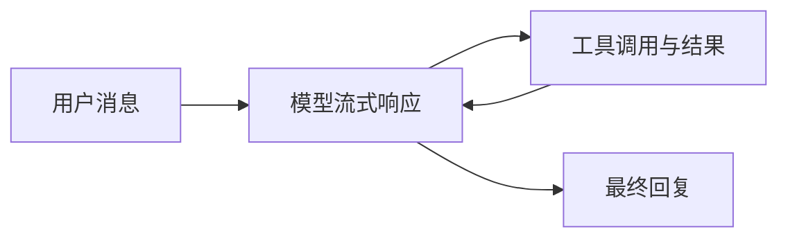

# fox-agent-core

FoxCode 的通用 Agent 内核，负责模型循环、工具执行、事件和上下文管理。



## 职责与边界

- 驱动多轮模型调用，校验工具参数，汇总工具结果。
- 管理 Agent 状态、插话与后续消息队列、取消和事件订阅。
- 提供 session、compaction、hooks 与 harness。
- 依赖 `fox-ai`；工具通过 `AgentTool` 协议注入。

文件访问、权限、工作区、CLI、MCP 和桌面协议由上层宿主负责。宿主 hook 可以收紧工具策略。

## 源码导航

| 模块 | 内容 |
| --- | --- |
| [`agent.py`](src/agent.py) | Agent 状态、队列与外部调用入口 |
| [`agent_loop.py`](src/agent_loop.py) | 多轮模型与工具循环 |
| [`types.py`](src/types.py) | 工具协议、事件与配置类型 |
| [`event_stream.py`](src/event_stream.py) | 事件流与最终结果 |
| [`harness/`](src/harness/) | 会话编排、上下文压缩与 hooks |

## 验证

从仓库根目录运行：

```bash
uv run python -m unittest discover -s tests -v
```

使用 Faux provider 验证工具循环、插话、取消、状态与 compaction，无需真实模型密钥。
项目启动方式见 [FoxCode README](../../README.md)。
