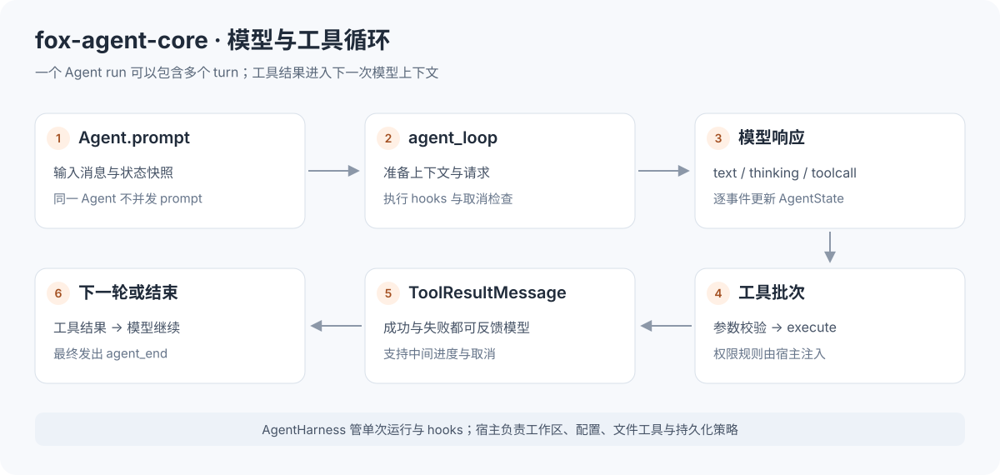
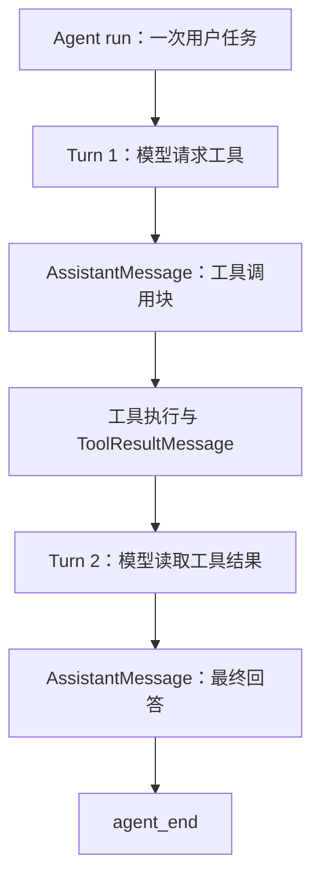
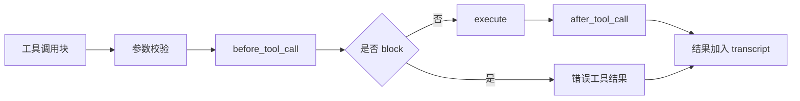
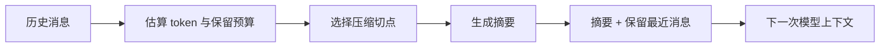

# fox-agent-core 学习指南

`fox-agent-core` 是 FoxCode 的通用 Agent 内核。它把“调用一次模型”扩展为
“模型提出工具调用 → 执行工具 → 把结果交回模型 → 继续或结束”的循环。

内核依赖 `fox-ai`，工具通过 `AgentTool` 协议注入。它不绑定工作区、配置文件、CLI、MCP 或 Electron；
具体编码能力由 `fox-coding-agent` 装配。
示例与测试命令均从**仓库根目录**运行。

> 建议先了解 [fox-ai 的消息和事件](../fox_ai/README.md)，再依次阅读
> [核心对象](#1-理解核心对象) → [工具示例](#2-运行一个离线工具循环) →
> [事件与队列](#4-状态事件与消息队列) → [Harness](#5-harness会话与压缩)。



## 1. 理解核心对象

### 1.1 四个不同层次

| 对象 | 负责什么 | 什么时候使用 |
| --- | --- | --- |
| `agent_loop` / `agent_loop_continue` | 模型、工具与消息的循环 | 需要底层事件流与自定义编排 |
| `Agent` | 持有状态、队列、取消和事件订阅 | 长期维护一个 Agent 实例 |
| `AgentHarness` | 单次运行门控与生命周期 hooks | 把 Agent 包装为可持久化服务 |
| 上层 `AgentSessionRuntime` | 工作区、配置、会话切换与扩展装配 | Coding Agent 宿主 |

`AgentOptions` 注入初始 model、system prompt、tools、`stream_fn`、执行模式与 hooks。
每次运行使用消息/工具的上下文快照，避免共享列表被另一个调用意外改写。

### 1.2 run、turn、message 与 tool



一次 run 可以包含多个 turn，一个 AssistantMessage 可以包含多个正文、思考和工具调用块。
`turn_end` 不是整个任务完成；UI 与队列应依据 `agent_end` 和宿主状态判断整轮结束。

## 2. 运行一个离线工具循环

先执行 `uv sync`。下面示例定义只返回文本的 `echo` 工具，并通过两个 Faux 脚本驱动两次模型调用。
不联网、不访问工作区、不需要密钥。

```python
import asyncio
from fox_ai.src import TextContent, ToolCall
from fox_ai.src.providers.faux import (
    FAUX_MODEL, FauxScript, clear_scripts, push_script,
)
from fox_agent_core.src import Agent, AgentOptions, AgentToolResult

class EchoTool:
    name = "echo"
    label = "Echo"
    description = "返回输入文本"
    execution_mode = "sequential"
    parameters = {
        "type": "object",
        "properties": {"value": {"type": "string"}},
        "required": ["value"],
        "additionalProperties": False,
    }

    async def execute(self, tool_call_id, params, cancel_event=None, on_update=None):
        if cancel_event is not None and cancel_event.is_set():
            raise asyncio.CancelledError()
        return AgentToolResult(content=[TextContent(text=params["value"])])

async def main():
    clear_scripts()
    push_script(FauxScript(tool_calls=[
        ToolCall(id="echo-1", name="echo", arguments={"value": "hello"}),
    ]))
    push_script(FauxScript(text="工具已返回 hello"))
    agent = Agent(AgentOptions(
        initial_state={"model": FAUX_MODEL, "tools": [EchoTool()]},
        max_turns=3,
    ))
    event_types = []
    unsubscribe = agent.subscribe(lambda event, cancel: event_types.append(event.type))
    try:
        await agent.prompt("调用 echo，再回复结果")
        print(" → ".join(event_types))
        print(agent.state.messages[-1].content[0].text)
        assert "tool_execution_end" in event_types
        assert event_types[-1] == "agent_end"
    finally:
        unsubscribe()
        clear_scripts()

asyncio.run(main())
```

第一个 Faux 响应只提出工具调用；内核校验参数后执行 `EchoTool.execute()`，
创建工具结果，再进行第二次模型调用。最后一条 AssistantMessage 是“工具已返回 hello”。
Faux 的最终回答是预设文本，学习重点是调用链，不能把它当作模型推理效果。

## 3. 工具契约与执行规则

### 3.1 AgentTool 与 AgentToolResult

`AgentTool` 是结构化协议，不要求继承具体基类。
工具需提供名称、描述、JSON Schema 参数、label、执行模式与 execute 方法。

```text
execute(tool_call_id, params, cancel_event, on_update)
    └── await → AgentToolResult
```

| 字段/参数 | 含义 |
| --- | --- |
| `tool_call_id` | 区分同一工具的不同调用，与模型消息关联 |
| `params` | 已经经过工具参数 schema 校验 |
| `cancel_event` | asyncio 取消信号，耗时工具需配合退出 |
| `on_update` | 中间进度回调，传 `AgentToolResult` |
| `result.content` | 返回给模型的文本或图片 |
| `result.details` | 日志/UI 元信息，按约定不作为工具正文发送给模型 |
| `result.added_tool_names` | 补充元信息，不会自动注册工具 |
| `result.terminate` | 当前批次全部结果都要求终止时，结束循环 |

工具函数正常返回表示执行成功；抛异常会被循环转成错误工具结果。
“工具输出里写了 error 字样”不能替代失败语义。
未知工具和非法参数也需要形成可解释的失败结果，不能让外层界面永远等待。

### 3.2 并行与顺序

`AgentOptions.tool_execution` 可选 `parallel` 或 `sequential`，工具还可声明自己的 `execution_mode`。
相互独立的读取可以并行；依赖顺序、修改共享资源的调用需要相应的顺序执行策略。

内核负责调度与结果关联，宿主负责声明哪些工具能运行。
不要从“工具在内核注册了”推导“可以访问任何路径”；文件与权限检查在宿主工具/hook 中实现。

### 3.3 执行前后 hooks



`before_tool_call` 可以收紧执行策略，Coding Runtime 在这里组合信任、模式、沙盒、权限和扩展 hook。
`after_tool_call` 用于结果处理或宿主补充信息。
请求准备、上下文转换与回合终止也有相应 callbacks，完整签名以
[AgentOptions](src/agent.py) 和 [AgentLoopConfig](src/types.py) 为准。

## 4. 状态、事件与消息队列

### 4.1 AgentState

状态包含模型、system prompt、消息、工具、流式消息、pending tool calls 等。
流事件经过 `Agent` 的事件处理逻辑更新状态，再广播给订阅者。
订阅 callback 接收 `(event, cancel_event)`，`subscribe()` 返回取消订阅函数。

| 事件层 | 典型事件 | 用途 |
| --- | --- | --- |
| Agent | `agent_start`, `agent_end` | 整轮生命周期 |
| Turn | `turn_start`, `turn_end` | 一次模型/工具回合 |
| Message | `message_start`, `message_update`, `message_end` | 消息正文、思考与最终内容 |
| Tool | `tool_execution_start/update/end` | 实际工具执行进度与结果 |

模型层的 `toolcall_delta` 是工具参数生成进度；Agent 层的 `tool_execution_update` 是执行中的工具进度。
两者不能合并成同一种“工具正在运行”。

### 4.2 steer 与 follow_up

| 动作 | 场景 | 含义 |
| --- | --- | --- |
| `prompt` | 空闲时发起任务 | 开始一轮，不允许同一 Agent 并发 prompt |
| `continue_` | 已有上下文需要继续 | 从现有消息继续循环 |
| `steer` | 当前任务执行中追加信息 | 在循环允许的位置注入插话，不承诺立即抢占每条工具 |
| `follow_up` | 当前任务后继续处理 | 排队下一条消息 |
| `abort` | 终止正在运行的任务 | 设置取消并让模型/工具清理 |

steering 与 follow-up 使用各自队列，`one-at-a-time` 每次取一条，`all` 一次取全部。
上层可能提供显式中断后再继续的操作，但这需要宿主协调，不能绕过 Agent 的单次运行限制。

### 4.3 错误和取消

模型/工具失败通常编码为消息和事件，以便模型或 UI 看见失败。
配置、持久化与事件接收器错误可以向宿主抛出。
订阅者不应因普通显示逻辑抛错而破坏整个 Agent run。

取消要贯穿 provider、工具与上层任务。自定义耗时工具应检查 `cancel_event`，
并在取消后停止后台工作，而不是只把显示状态改成“取消”。

## 5. Harness、会话与压缩

### 5.1 Harness 做什么

[AgentHarness](src/harness/harness.py) 以 `run(action)` 包装单次操作，
通过 busy 门控拒绝并发运行，`finally` 恢复空闲状态。

| Hook | 用途 |
| --- | --- |
| `before_run` | 运行前准备 |
| `persist_message` | 在 message_end 时保存完整消息 |
| `after_run` | 运行后清理 |

Harness 不知道 cwd、用户配置和凭据；宿主注入准备好的 `AgentOptions` 与持久化 hooks。
Coding 层的 `AgentSession` 在此基础上添加编码会话策略。

### 5.2 会话与 transcript

[harness/session.py](src/harness/session.py) 提供通用条目和存储协议，
Coding 层再提供 JSONL 文件、目录布局、恢复与分支管理。
**消息历史**是模型上下文，**会话条目**还可包含设置与分支关系，**UI 时间线**则是显示状态。
这三种表示不能互相替代。

### 5.3 压缩不是简单截断



[harness/compaction.py](src/harness/compaction.py) 提供 token 估算、触发判断、切点与摘要逻辑。
切点要维护工具调用和结果的关联，不能只按数组长度删除前半段。
压缩摘要可能调用模型；离线测试通过可控 summary 函数验证预算与消息保留。
Coding 层决定何时自动压缩、如何持久化、如何向 UI 通知恢复过程。

## 6. 源码阅读与开发验证

### 6.1 阅读顺序

| 顺序 | 文件 | 要回答的问题 |
| --- | --- | --- |
| 1 | [types.py](src/types.py) | 工具、状态、事件和循环配置有哪些契约？ |
| 2 | [agent_loop.py](src/agent_loop.py) | 什么条件继续下一 turn，何时执行工具？ |
| 3 | [agent.py](src/agent.py) | 状态、队列、订阅与取消怎么维护？ |
| 4 | [event_stream.py](src/event_stream.py) | 循环事件如何被消费与终止？ |
| 5 | [harness/harness.py](src/harness/harness.py)、[hooks.py](src/harness/hooks.py) | 如何加入单次运行门控与持久化？ |
| 6 | [harness/session.py](src/harness/session.py)、[compaction.py](src/harness/compaction.py) | 会话与预算如何抽象？ |

### 6.2 可操作练习

| 练习 | 操作 | 验收 |
| --- | --- | --- |
| 参数失败 | Faux 工具参数将 value 改成数字 | 工具不执行，结果明确报告校验错误 |
| 工具进度 | execute 中通过 on_update 发出中间文本 | 收到 update，最终结果仍独立完成 |
| 未知工具 | 脚本请求未注册工具 | 产生错误结果，内核不会静默卡住 |
| 批次执行 | 两个 echo 调用，观察不同执行模式 | call id 和结果对应关系稳定 |
| 队列 | 在可控运行中 steer/follow_up | 消息按配置消费，不并发改写 transcript |

示例脚本固定成功回答；学习错误语义时应检查工具结果和事件，不能只看最后一句话。

```bash
uv run --with pytest python -m pytest tests/test_agent_core.py tests/test_harness_tools.py -q
uv run --with pytest python -m pytest tests/test_streamed_write.py -q
```

[test_agent_core.py](../../tests/test_agent_core.py) 覆盖工具批次、hooks、插话、取消和压缩；
[test_harness_tools.py](../../tests/test_harness_tools.py) 验证内核/工具契约与隔离；
[test_streamed_write.py](../../tests/test_streamed_write.py) 进一步验证 Coding 工具与流式行为。

继续阅读 [fox-coding-agent](../fox_coding_agent/README.md)，理解这些通用能力如何连接真实工作区。
