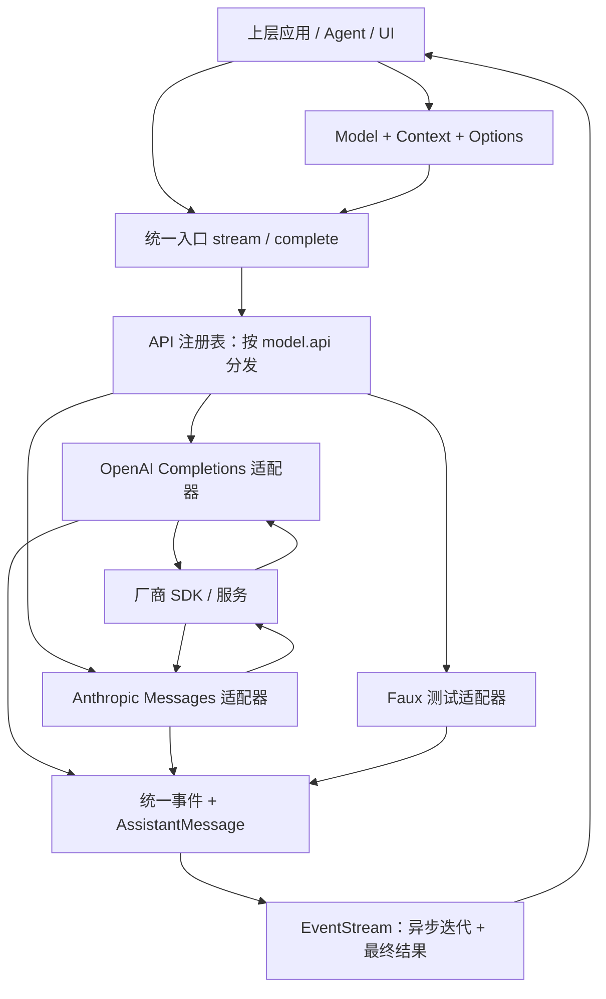
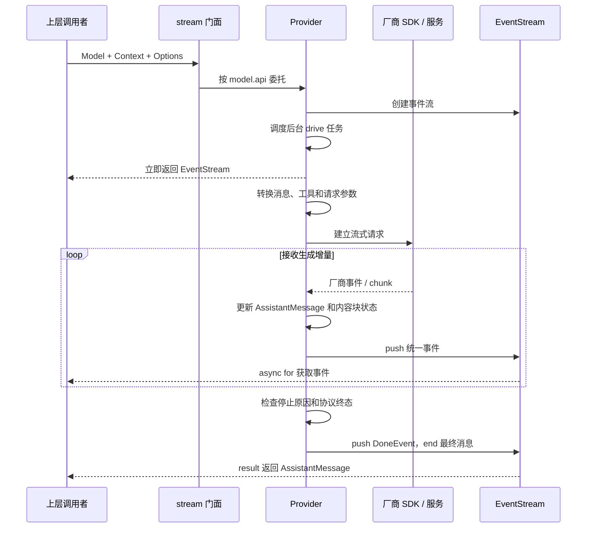
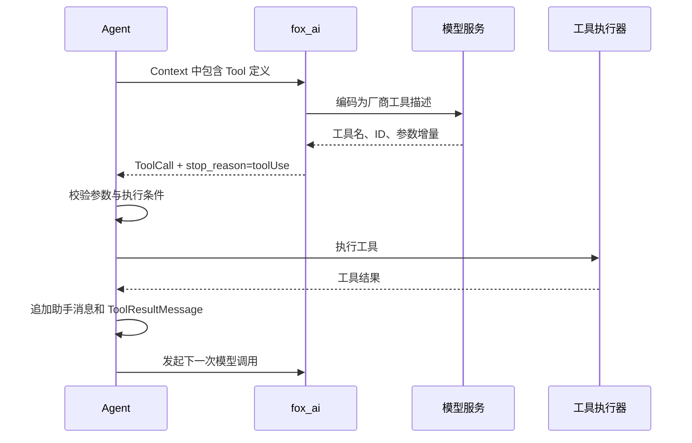

# Fox AI 架构学习文档：从模型接入层到面试表达

> 阅读目标：理解 `fox_ai` 负责什么、一次调用如何流转、为什么采用这些抽象，以及面对扩展和故障时应该怎样设计。
>
> 本文依据当前仓库 `packages/fox_ai/src` 的实现整理。文中的“当前实现”指本地代码；“设计建议”指可以继续演进的方向。源码中保留了 `pi-ai`、`pi_ai` 和上游版本标记，它们不代表当前目录已经完成同名 Python 包的安装配置，也不代表所有上游能力都已实现。厂商相关描述用于解释本地适配逻辑，不作为最新 API 支持情况或价格说明。

## 阅读路线与目录

第一次阅读，建议按第 1～6 章建立整体认识，再用第 7～11 章理解难点。面试前重点复习第 12、14、15 章，避免只会复述类名。

动手配套：[DeepSeek 模型调用实验室](DEEPSEEK_MODEL_LAB.ipynb)。通过真实 API 观察流式事件、思考开关与强度、用量、多轮上下文，以及工具请求和结果回传。

| 章节 | 要回答的问题 |
| --- | --- |
| [1. 定位与边界](#chapter-01) | 为什么需要独立的 AI 接入层？ |
| [2. 整体架构](#chapter-02) | 模块如何分工，变化应该留在哪里？ |
| [3. 统一领域模型](#chapter-03) | 为什么拆成 Model、Context、Options？ |
| [4. 模型注册与协议分发](#chapter-04) | provider 和 api 有什么区别？ |
| [5. 一次调用的完整生命周期](#chapter-05) | 从调用入口到最终消息经过什么？ |
| [6. 流式事件与状态管理](#chapter-06) | 为什么要 Queue、Future 和内容块事件？ |
| [7. Provider 的适配职责](#chapter-07) | 厂商差异如何被收敛？ |
| [8. 工具调用与受约束生成](#chapter-08) | 参数为什么不能收到一点就执行？ |
| [9. 错误、重试与取消](#chapter-09) | 哪些失败重试，谁负责重试？ |
| [10. 能力、推理与用量](#chapter-10) | 如何兼顾统一接口和特殊能力？ |
| [11. 扩展与测试](#chapter-11) | 怎样新增厂商，怎样验证契约？ |
| [12. 当前实现的边界](#chapter-12) | 哪些能力不能在面试中说成已经完成？ |
| [13. 从零设计与演进](#chapter-13) | 如果重新做一次，先做什么？ |
| [14. 面试回答与追问](#chapter-14) | 如何把设计讲清楚并接受追问？ |
| [15. 源码阅读与自测](#chapter-15) | 哪些代码值得读，怎样判断自己懂了？ |

## 第 1 章：fox_ai 的定位与职责边界

### 1.1 一句话定义

**`fox_ai` 是面向上层应用或 Agent 的统一 LLM 接入层：把统一的模型、上下文和调用选项转换成厂商请求，再把厂商响应转换成统一的事件流和助手消息。**

这里的重点是“统一交互契约”。一次生成可能包含文本、思考内容、工具调用、用量和失败状态，因此它处理的内容远多于一个字符串。

### 1.2 它要解决什么问题？

假设一个编程助手开始只接入一家模型服务。上层可以直接用厂商 SDK。但随着需求增加，业务代码会逐渐承担这些工作：

| 变化或问题 | 如果直接散落在上层，会发生什么？ | fox_ai 的处理位置 |
| --- | --- | --- |
| 新增不同协议的模型 | 每个调用点都判断厂商 | 注册表与 Provider |
| 厂商消息格式不同 | 历史消息和工具结果反复转换 | 统一消息模型与消息转换器 |
| 流式响应结构不同 | UI 和 Agent 分别解析厂商事件 | 统一事件协议 |
| 工具参数分片返回 | 上层处理半截 JSON、索引和 ID | Provider 内部的累加状态 |
| 网络失败、限流、流中断 | 重试散落各处，次数难控制 | 请求重试与助手调用重试 |
| 缓存与 token 口径不同 | 统计、预算、展示各算一套 | 统一 Usage |

因此，独立这一层的价值是：**让厂商变化集中在接入边界，让业务流程依赖稳定的数据和行为约定。**

### 1.3 它和 Agent 层如何分工？

最关键的边界是：**模型提出工具调用，Agent 执行工具。**

例如用户要求“查看项目结构并解释入口文件”：

1. Agent 组装历史消息和可用工具列表。
2. `fox_ai` 请求模型，返回“调用目录查看工具”的 `ToolCall`。
3. Agent 判断是否允许执行，调用实际工具，得到结果。
4. Agent 把 `ToolResultMessage` 放回上下文。
5. 再次调用 `fox_ai`，模型继续回答或继续提出工具调用。

| 责任 | fox_ai | 上层应用或 Agent |
| --- | --- | --- |
| 将统一消息转换成厂商消息 | 负责 | 使用转换结果 |
| 将厂商流转换成统一事件 | 负责 | 消费事件 |
| 描述工具、传递调用参数和结果 | 负责表示与转换 | 负责提供工具定义和结果 |
| 文件读写、命令执行、权限判断 | 不在本层执行 | 负责 |
| 决定是否继续下一轮 | 提供停止原因 | 负责控制循环 |
| 历史持久化、上下文裁剪与摘要 | 接收 Context | 负责构造和维护 |
| 重试策略 | 提供机制 | 决定调用级策略与用户体验 |
| 页面展示、任务管理 | 输出事件和结果 | 负责 |

当前仓库的 `packages` 下主要是 `fox_ai` 代码。本文涉及 Agent 的流程是在解释该层的预期使用边界，不表示仓库中已经存在完整 Agent 实现。

### 1.4 面试中如何解释这个拆分？

可以这样说：

> Agent 关注任务怎么推进，AI 接入层关注一次模型交互怎么完成。我把协议转换、流式解析和模型用量归一化放在接入层，把工具执行和多轮决策留在 Agent。这样新增模型协议时，业务循环不需要跟着改。

这也解释了为什么不应该把“执行 shell 工具”塞进 Provider：厂商协议与本地执行权限是两个不同的变化方向。

## 第 2 章：整体架构——稳定契约与可替换适配器

### 2.1 先看一张图



这张图表示逻辑职责，不意味着这些模块是独立服务。当前实现是同一 Python 进程内的包和异步任务，没有服务间 RPC，也没有消息中间件。

### 2.2 模块地图

| 模块 | 架构职责 | 阅读重点 |
| --- | --- | --- |
| [`src/__init__.py`](src/__init__.py) | 公共入口、导出符号、触发内置注册 | 用户看见的接口与导入副作用 |
| [`src/types.py`](src/types.py) | 领域数据契约 | 输入、输出、能力和状态怎么表示 |
| [`src/models.py`](src/models.py) | 模型注册、协议实现注册、Provider 契约 | 模型数据和实现代码如何解耦 |
| [`src/stream.py`](src/stream.py) | 调用门面与分发 | 为什么入口保持很薄 |
| [`src/events.py`](src/events.py) | 流式事件的语义 | 如何向上层报告生成过程 |
| [`src/event_stream.py`](src/event_stream.py) | 生产者与消费者之间的异步桥梁 | Queue、Future、结束信号 |
| [`src/providers/openai_provider.py`](src/providers/openai_provider.py) | OpenAI Completions 风格协议适配 | chunk、工具索引、finish_reason |
| [`src/providers/anthropic_provider.py`](src/providers/anthropic_provider.py) | Anthropic Messages 风格协议适配 | 内容块、工具结果合并、签名 |
| [`src/constrained_sampling.py`](src/constrained_sampling.py) | 工具生成约束的转换 | strict Schema、grammar、降级策略 |
| [`src/provider_retry.py`](src/provider_retry.py) | 请求建立阶段的重试 | HTTP 状态、重试头、退避 |
| [`src/retry.py`](src/retry.py) | 一次助手调用的重试 | 最终错误消息、重试预算、回调 |
| [`src/exceptions.py`](src/exceptions.py) | 异常类型定义 | 与实际错误事件路径的区别 |
| [`src/providers/faux.py`](src/providers/faux.py) | 可编排的假模型 | 在无网络条件下验证上层行为 |
| [`src/user_agent.py`](src/user_agent.py) | 客户端标识 | 次要基础设施，不是架构主线 |

### 2.3 最值得理解的三种设计思想

**统一入口，也就是门面。** 上层调用 `stream` 或 `complete`，不必知道内部要使用哪家 SDK。门面集中的是调用方式，不应该集中所有厂商细节。

**Provider 适配器。** 每个适配器负责将内部契约与外部协议双向转换。它像协议翻译层，避免厂商消息对象进入业务流程。

**注册表与策略选择。** 运行时通过 `model.api` 找到实现，替代入口里不断增长的 `if/elif`。新增协议主要是增加适配器并注册。

从更大的设计角度看，这接近“端口与适配器”的思路：上层面向 `ProviderStreams` 约定，具体 SDK 封装在边界。当前仍然使用全局注册表和导入时注册，并不是完整的依赖注入容器。

### 2.4 为什么让 stream.py 保持很薄？

薄入口使变化按性质分开：

- 想支持新协议，修改或新增 Provider。
- 想改变业务重试策略，使用 `retry_assistant_call`。
- 想换一个模型，替换 Model 或注册数据。
- 想改变 UI 的增量显示，调整事件消费者。

如果入口同时承担 Schema 转换、工具 JSON 拼接和厂商错误判断，每加一个厂商都需要修改公共核心，测试范围也会扩大。

这种分层的代价是代码会增加，而且 Provider 之间可能出现重复逻辑。当前两个真实 Provider 都有 JSON 容错解析和费用计算；后续可以抽取稳定的公共部分，但不能为了减少行数，把不同协议的状态机硬合成一个大函数。

## 第 3 章：统一领域模型——先决定系统用什么语言交流

源码入口：[`types.py`](src/types.py)。

### 3.1 为什么把输入拆成 Model、Context、Options？

这三者回答不同的问题，也具有不同的生命周期。

| 对象 | 回答的问题 | 典型内容 | 通常何时变化 |
| --- | --- | --- | --- |
| `Model` | 调用谁，通过什么协议，有什么能力？ | ID、provider、api、URL、能力、费率 | 切换模型或更新模型配置时 |
| `Context` | 这次模型需要知道什么？ | 系统提示、历史消息、可用工具 | 每一轮对话 |
| `StreamOptions` | 这一次怎样调用？ | 密钥、输出上限、超时、重试次数、温度 | 每次请求 |

例如，同一个 Model 可以用于多个会话；同一个 Context 可以用于比较不同模型；同一个模型也可以在不同请求中使用不同输出上限。

如果全部塞进一个大字典，就很难分辨某个字段是模型能力、会话内容还是请求覆盖项。拆开以后，配置复用、测试构造和问题定位都有明确的对象边界。

**需要注意：Model 中声明了能力，不等于当前代码已经对所有能力做了运行时检查。** 例如 `context_window` 是元数据，本层没有自动统计并裁剪上下文。

### 3.2 为什么消息不是一个 content 字符串？

一条助手消息可能同时包含：

```text
AssistantMessage
├── ThinkingContent：服务端返回的思考内容或相关载荷
├── TextContent：给用户的解释
└── ToolCall：希望上层执行的工具调用
```

如果只保留字符串，工具名和参数就要从自然语言中猜；思考签名、多模态输入、工具结果也无处安放。

因此，消息有两层判别结构：

- 第一层按 `role` 区分用户、助手、工具结果。
- 第二层按内容块的 `type` 区分文本、图像、思考、工具调用。

这是“先识别类型，再解释字段”的设计。消费者遇到 `ToolCall` 时直接读取结构化参数，不需要把文本重新解析成某种工具指令。

### 3.3 为什么不同角色允许不同的内容块？

| 消息角色 | 当前允许的内容 | 设计含义 |
| --- | --- | --- |
| `UserMessage` | 字符串，或文本与图像块 | 用户提供输入 |
| `AssistantMessage` | 文本、思考、工具调用块 | 模型生成回答与行动请求 |
| `ToolResultMessage` | 文本与图像块 | 工具返回执行结果 |

把可用内容限定在角色范围内，可以在模型构造时挡住一部分无效组合。例如，工具调用应当来自助手消息，而工具结果需要单独携带关联 ID。

这不等于业务语义已经全部验证：`ToolCall.arguments` 是字典，并不会因为使用了 Pydantic，就自动按对应工具的 JSON Schema 完成参数校验。

### 3.4 为什么 system_prompt 放在 Context 顶层？

因为内部模型要表达“系统指令”这个稳定含义，而不同协议对它的承载位置不同。

本地 OpenAI 转换器把它变成一条 `system` 消息；Anthropic 转换器把它放进独立的 `system` 参数。上层只填写 `Context.system_prompt`，由适配器选择协议格式。

这是统一模型的一个好例子：**统一的是业务含义，具体字段位置交给边界转换。**

### 3.5 AssistantMessage 为什么包含停止原因和用量？

最终结果需要支持上层决策，而不只是展示文本：

| `stop_reason` | 含义 | 上层应如何理解 |
| --- | --- | --- |
| `pending` | 尚未得到终态 | 不应当作为正常最终结果 |
| `stop` | 模型正常结束 | 本轮生成结束 |
| `length` | 达到生成长度限制 | 请求已结束，但内容可能不完整 |
| `toolUse` | 本轮包含工具使用决策 | Agent 可以进入工具处理流程 |
| `error` | 调用失败或协议异常 | 判断展示错误或重试 |
| `aborted` | 调用被取消 | 终止当前流程，不再重试 |

`usage` 为统计提供数据；`raw_stop_reason` 保留厂商原始终止原因，方便排查统一映射是否丢失信息；模型、provider、时间戳等字段提供结果归属信息。

**`DoneEvent` 可以携带 `length`。因此“流成功结束”和“任务已经完整回答”是两个判断。**

### 3.6 为什么核心类型严格，Options 和 compat 又比较宽松？

多数核心类型使用 `extra="forbid"`，减少拼错字段或把厂商私有对象意外塞进公共契约的情况。字段别名允许同时适配 Python 命名和上游 camelCase 数据。

`StreamOptions` 则允许额外字段，`Model.compat` 是宽松字典，用来承载暂时无法标准化的厂商能力。

这形成一种取舍：

> 稳定的数据骨架尽量严格，快速变化的协议边界允许扩展；但扩展字段只有被对应 Provider 读取时才会生效。

代价是拼写错误、无效配置更可能悄悄通过。后续若能力趋于稳定，可以把常用 `compat` 字段升级为明确的能力类型，并在调用前校验。


## 第 4 章：模型注册与协议分发——为什么需要两张表？

源码入口：[`models.py`](src/models.py)、[`stream.py`](src/stream.py)。

### 4.1 provider、api、model.id 分别表示什么？

| 字段 | 表达的含义 | 对架构的作用 |
| --- | --- | --- |
| `provider` | 模型服务的归属或提供方标识 | 模型分类、查找与结果归属 |
| `api` | 采用的交互协议 | 选择具体适配器 |
| `id` | 发给服务端的模型标识 | 指定调用哪个模型 |
| `base_url` | 服务端地址 | 指向具体服务或网关 |

provider 不等于协议。一家服务可以暴露不同协议；不同服务也可能实现同一种兼容协议。

例如，假设某个私有网关实现了当前适配器可兼容的 Completions 协议，那么可以给它独立的 `provider` 和 `base_url`，仍然使用 `api="openai-completions"`。这样模型归属与协议复用互不冲突。

### 4.2 两张表的职责

```text
模型注册表：
    provider → model_id → Model
    解决“我要调用哪个模型配置”。

API 注册表：
    api → ProviderStreams 实现对象
    解决“这份配置应该交给哪段实现代码”。
```

如果把两张表合成“模型 ID → 实现”，每个模型都要重复绑定同一份协议逻辑；如果只用 provider 分发，又会把服务归属与协议类型绑死。

当前 `get_model` 查不到时返回 `None`，`get_api_provider` 查不到时抛出 `KeyError`。这也提醒调用方：模型查询成功和协议实现已注册，是两个独立条件。

另外，模型注册表是便利设施。已经拥有合法 `Model` 对象的调用方，可以直接传给 `stream`，不必先注册该模型；对应 `api` 的实现仍然必须存在。

### 4.3 只看一段关键代码

下面是 `stream.py` 中决定分发方式的核心逻辑：

```python
impl = get_api_provider(model.api)
return impl.stream(model, context, options)
```

这两行的价值是：调用入口依赖 Provider 的行为契约，而没有把具体模型名称写进入口。

`ProviderStreams` 使用 Python `Protocol` 描述 `stream` 与 `stream_simple` 两个方法。实现类只要提供约定行为，就可以接入，不要求继承某个固定基类。

但当前注册函数只是把对象放进字典，没有主动执行完整的接口和行为校验。类型约定不能替代契约测试。

### 4.4 导入时注册有什么好处和代价？

`__init__.py` 会调用 `register_builtins()`，注册两个真实协议适配器和 Faux，同时注册少量内置模型。

好处是开箱即用，调用方不用手动完成初始化；注册函数也用标记避免重复执行。

代价包括：

- 导入公共包就会加载多个 Provider，某个 SDK 缺失可能影响整个包的导入。
- 注册表是进程级全局状态，测试之间需要清理，运行中随意修改可能相互干扰。
- 单独清空注册表不会重置内置注册标记；测试若需要重新初始化，应使用配套的 `_reset_for_testing()`。
- 相同键再次注册会覆盖旧值，目前没有冲突提示或配置版本管理。

对于规模不大的库，这是简单实用的起点。若未来要隔离多个租户或测试环境，可以让应用持有独立的 Registry 实例，并显式注入依赖。

## 第 5 章：一次模型调用的完整生命周期

### 5.1 从调用者视角看

一次调用的概念形态是：

```python
event_stream = stream(model, context, options)
async for event in event_stream:
    handle_event(event)
message = await event_stream.result()
```

这段代码仅展示调用关系，`model` 等对象由调用方准备。应在运行中的异步上下文内使用；`stream` 是普通函数，并不意味着整个过程是同步执行，也不是 `await stream(...)`。

### 5.2 正常路径的时序图



图中省略了不同 Provider 的 `StartEvent` 发送时机差异。当前 OpenAI 在请求前发送，Anthropic 收到原生 `message_start` 后发送，因此不能直接用两者的 `start` 时间比较首包延迟。

### 5.3 请求侧的转换

Provider 会读取统一输入，完成三类转换：

1. **内容转换**：把用户消息、历史助手消息、工具结果改成厂商要求的结构。
2. **能力转换**：把工具 Schema、思考配置、兼容性选项变成实际请求参数。
3. **连接配置**：读取密钥、URL、请求头、超时和可选 HTTP 客户端。

上层不需要知道 Anthropic 的工具结果应该放在 user 内容块里，也不需要知道兼容端点使用哪个思考预算字段。

### 5.4 响应侧为什么要维护一个累积 output？

厂商每次只返回一部分内容，Provider 把增量合并到一个 `AssistantMessage`，同时发出对应事件。

这避免了 UI、日志模块和 Agent 各自维护一套完整消息拼接规则。消费者可以只看增量，也可以查看当前部分结果，最终再等待完整消息。

这里有一个容易讲错的细节：**完整消息主要由 Provider 在接收过程中构造，`complete()` 自己并没有重新遍历事件并拼接文本。**

### 5.5 流式与非流式为什么共用一条链路？

`complete()` 的核心就是：

```python
event_stream = stream(model, context, options)
return await event_stream.result()
```

这样文本解析、工具调用、用量和错误映射只维护一份。批处理用户只关心结果，交互界面还关心中间过程，但二者依赖同一套语义。

代价是：当前即使调用 `complete()`，底层仍然请求流式响应，并创建和保存事件。它不是单独的厂商非流式接口，也没有因为调用方不消费事件就省掉事件缓冲。

### 5.6 simple 接口应该怎样理解？

`stream_simple` 和 `complete_simple` 接受 `SimpleStreamOptions`，增加统一的思考级别、预算和工具选择字段。

设计意图是让上层表达更接近用户语义的选项。但当前两个真实 Provider 的 `stream_simple` 都直接调用各自同一个底层函数，统一选项是否完整映射仍取决于该函数的实现。特别是 Anthropic 的统一 `reasoning` 到私有思考配置的转换尚未完整接通，第 12 章会具体说明。

## 第 6 章：流式架构——事件协议、异步桥梁与状态所有权

源码入口：[`events.py`](src/events.py)、[`event_stream.py`](src/event_stream.py)。

### 6.1 为什么不能只向上层返回文本 delta？

因为模型生成过程还包含内容块的创建和结束、思考内容、工具参数、整体终止和失败。只有文本 delta，上层就无法判断“正在生成工具参数”与“已经生成完整工具调用”的区别。

当前事件体系可以分为三组：

| 事件组 | 类型 | 表达的含义 |
| --- | --- | --- |
| 整体开始 | `start` | 建立一次生成的初始结果 |
| 内容块生命周期 | `text_*`、`thinking_*`、`toolcall_*` | 某个内容块开始、增量更新、结束 |
| 整体终止 | `done`、`error` | 本轮生成成功结束或失败结束 |

三种内容块各有 `start / delta / end`，加上整体开始和两种终态，共 12 种事件。`toolcall_*` 中的 `toolcall` 连写，这是当前协议的命名方式。

### 6.2 一个正常事件序列长什么样？

```text
start
  text_start(content_index=0)
  text_delta("我先查看")
  text_delta("项目结构。")
  text_end
  toolcall_start(content_index=1)
  toolcall_delta(...)
  toolcall_delta(...)
  toolcall_end
done(reason="toolUse")
```

这是便于理解的正常路径示例。不同内容块的增量可能交错；某些请求会在生成内容前失败。不能假设所有调用都一定产生文本，也不能假设每次失败前都已经收到 `start`。

当前事件文件描述了“从 start 开始”的协议目标，但 Anthropic 建立请求失败和 Faux 的错误脚本都可能直接输出 `error`。设计目标和实际保证需要分开看。

### 6.3 content_index 为什么重要？

`content_index` 指向统一消息中 `AssistantMessage.content` 的位置。它告诉上层：这次增量在更新哪一个内容块。

例如同时存在一段文本和两个工具调用，不能把所有参数 delta 拼到同一个字符串里。每个块都需要独立状态。

更关键的是，厂商的事件索引不一定等于这个内部索引。适配器必须建立映射，不能把外部索引直接交给上层当作内部位置。

### 6.4 EventStream 为什么同时使用 Queue 和 Future？

它要满足两个不同的等待需求：

| 机制 | 解决的问题 | 谁使用 |
| --- | --- | --- |
| `asyncio.Queue` | 下一个事件什么时候到？ | `async for` 消费者 |
| `asyncio.Future` | 整体调用何时完成，结果是什么？ | `await result()` 调用者 |
| 结束哨兵 `_SENTINEL` | 如何告诉迭代器没有更多事件？ | 事件流内部 |
| `_events` 列表 | 如何查看已经推送的事件？ | 调试或事后检查 |

生产者 `push()` 一个事件，消费者就可以取出一个事件。生产者 `end(result)` 时，Future 得到最终结果，队列收到结束哨兵。

因此，即使调用方不遍历事件，只调用 `result()`，也能等到结果。反过来，只看事件的调用方也不需要自己管理 Provider 后台任务。

**Queue 和 Future 属于进程内协作工具。这里没有跨进程投递、持久化队列或断线续传语义。**

### 6.5 谁拥有生成状态？

Provider 拥有“正在构造的助手消息”，负责更新它；EventStream 负责传递通知；上层消费者负责展示和业务动作。

多数事件中的 `partial` 直接引用不断更新的同一个 `output` 对象。这样避免每个增量都深拷贝整条消息，减少复制成本。

但代价非常实际：

> 第一次收到事件时，`partial` 可能只有一个字；等整轮结束后再查看那个事件，它的 `partial` 可能已经包含完整回答。

因此，`partial` 更接近当前累积状态的视图，不能被当成该事件发生时的不可变快照。事件自身的 `delta` 更适合描述那一次变化；如果要保存时点快照，需要在消费时深拷贝，并接受相应成本。

`events` 属性只复制事件列表，不会深拷贝每个事件和消息。当前实现不能直接被称为完整的事件溯源系统。

### 6.6 这里最重要的三个工程取舍

**第一，无界缓冲与背压。** 当前队列没有容量限制，`push()` 使用 `put_nowait()`，所有事件还会保留在 `_events` 中。消费者再慢，也不会反向限制生产速度。长输出和高并发会增加内存占用；`complete()` 不消费队列也有缓冲成本。

演进时可以考虑有界队列、可选历史保留、合并高频文本增量，但需要一起设计慢消费者策略。仅仅给队列加上容量，而生产者仍然同步 `put_nowait()`，可能变成队列满时抛错。

**第二，单消费者与广播。** 当前多个消费者同时迭代同一个 EventStream，会竞争同一个队列，并不会每人收到完整事件；结束哨兵也只有一份。因此 UI 和日志需要同看一条流时，应由一个消费者统一分发，或另做订阅机制。

**第三，消费结束与请求结束。** 调用方提前 `break` 退出迭代，并不会自动取消后台 Provider。当前 EventStream 不持有公开的生产任务关闭接口。资源所有权和取消传播仍需补齐。

面试中谈这三个点，可以体现你理解了“异步流”背后的运行约束，而不只是会写 `async for`。

## 第 7 章：Provider 适配器——统一语义，保留必要差异

### 7.1 Provider 的职责可以分成四步

1. **编码输入**：Context 和 Tool 转为厂商请求结构。
2. **执行请求**：创建客户端、配置连接、建立流、处理请求级重试。
3. **解码增量**：读取厂商事件，更新内部内容块，发出统一事件。
4. **归一化终态**：映射停止原因、记录用量、返回最终消息或错误。

它负责的是一次交互的协议完整性。例如网络连接已经结束，但厂商没有提供正常停止依据，适配器应识别为异常，而不能仅仅因为没有更多字节就宣布成功。

### 7.2 两个真实 Provider 的主要差异

下面比较的是本地转换代码的行为。

| 维度 | OpenAI Completions 适配器 | Anthropic Messages 适配器 |
| --- | --- | --- |
| 系统提示 | 转成 messages 中的 system 项 | 转成独立 system 参数 |
| 工具定义 | function/custom tool 结构 | name、description、input_schema |
| 工具结果 | role 为 tool，关联 tool_call_id | 放入 user 消息中的 tool_result 块 |
| 连续工具结果 | 分别转换为 tool 消息 | 合并为一个 user 轮次 |
| 流解析基本单位 | chunk 中的 choice 与 delta | message/content_block 类型化事件 |
| 内容块定位 | 工具使用 index 与 ID 查找 | 原生 block index 映射内部位置 |
| 思考载荷 | 兼容多个文本字段，收集 reasoning_details | thinking、signature_delta、redacted_thinking |
| 用量 | 从 chunk 级 usage 提取 | message_start 初值 + message_delta 更新 |
| 正常终止依据 | 默认要求 finish_reason | 当前检查是否获得有效 stop_reason |

同一套内部类型不代表所有字段在所有协议中都能无损转换。例如当前工具结果类型支持图像，但 OpenAI 工具结果转换只提取文本；Anthropic 转换会保留文本和图像。上层不能把“类型允许”理解为“各 Provider 全部支持”。

### 7.3 为什么 Anthropic 要合并连续工具结果？

内部模型把每次工具结果看成独立的 `ToolResultMessage`，这样上层执行和记录工具比较自然。

Anthropic 适配器则把连续工具结果包装进同一条 user 消息的多个 `tool_result` 内容块。这个合并只发生在协议边界，不要求上层改变工具结果的存储方式。

这个例子说明：统一模型应该贴近上层业务的自然结构，适配器负责满足具体协议的组织要求。

### 7.4 为什么 OpenAI 工具调用需要 index 和 ID 两套索引？

工具调用不是一次性返回完整对象。某些增量带序号，某些增量补充 ID 或名称，多个工具调用还可能交错。

适配器用临时 `_ToolCallBlock` 保存参数原文和内部位置，并使用两张索引表找回同一块。这样后续信息到达时可以补全已有调用，而不是误建成另一个调用。

这里要区分三种标识：

| 标识 | 用途 |
| --- | --- |
| 厂商流里的 index | 在本次原生流中识别增量属于哪次调用 |
| tool_call.id | 将助手的工具请求与后续工具结果关联 |
| content_index | 定位统一 AssistantMessage 中的内容块 |

三者承担不同职责，不能相互替代。

### 7.5 思考签名为什么不能只当作展示文本？

思考相关内容可能包含普通文本，也可能包含签名、加密载荷等回传元数据。它们不一定都适合展示给用户，却可能是后续多轮请求需要保留的信息。

当前 Anthropic 适配器会累积签名，并在回传历史时携带；没有签名的普通 thinking 块会被跳过。OpenAI 适配器会收集 `reasoning_details`，放进思考块签名字段，再在历史转换时恢复成对应字段。

这也是统一消息不能只保留“屏幕上看得见的文字”的原因。

这些元数据仍具有协议归属，不能保证把一家模型的完整历史直接交给另一家就一定兼容。跨模型切换若需要清理或降级历史，应另设明确规则；当前代码没有完整的跨厂商历史规范化层。

### 7.6 为什么不能把所有 Provider 合并成一个大实现？

因为不同协议不仅字段名不同，事件顺序、块生命周期、用量更新时间和历史约束也不同。强行合并后，公共函数会充满“如果是某厂商就……”的分支。

更合适的共享边界是稳定的小规则，例如通用重试算法、Schema 转换或费用计算。状态机保留在具体适配器里，才能把协议假设写清楚。


## 第 8 章：工具调用与受约束生成——把结构化行动接入对话

源码入口：[`types.py`](src/types.py)、[`constrained_sampling.py`](src/constrained_sampling.py) 以及两个 Provider 的工具处理逻辑。

### 8.1 三个名字很像的对象，其实代表三个阶段

| 对象 | 谁提供 | 表达什么 |
| --- | --- | --- |
| `Tool` | 上层应用 | 有什么工具、用途是什么、参数结构如何 |
| `ToolCall` | 模型响应，经 Provider 归一化 | 希望调用哪个工具，传什么参数 |
| `ToolResultMessage` | 上层执行工具后 | 某次工具调用得到了什么结果 |

`Tool` 里没有 Python 执行函数，`ToolCall` 也不会自动触发文件操作。这个设计让模型接入与工具运行环境保持独立。

### 8.2 一轮工具调用如何闭合？



需要同时保留助手的工具调用消息和对应结果。`tool_call_id` 是关联依据，不能只存一段“工具执行成功”的文字。

### 8.3 为什么工具参数比文本流更难处理？

文本收到一段通常就可以显示；JSON 参数在传输途中经常不完整。例如依次到达：

```text
第 1 片：{"path":
第 2 片："src/main.py",
第 3 片："start":1}
```

当前 Provider 先保存完整的原始参数字符串，尝试标准 JSON 解析，失败时使用 `json-repair` 容错，再把阶段性结果更新到 `ToolCall.arguments`。

这解决的是“生成途中仍能观察参数”的问题，不意味着修复出来的中间对象就已经可以执行。展示层可以显示部分参数；执行层应等待可靠终态，并校验完整参数。

当前最终解析仍可能使用容错结果，工具参数是否满足业务约束应由工具执行边界确认。`toolcall_end` 表示本块解析结束，也不等价于整次请求已经成功。

### 8.4 每个 delta 都重解析，有什么代价？

实现简单，也能不断更新部分参数。但若参数很长、分片很多，反复解析不断增长的字符串会重复扫描旧内容。极端情况下，总解析工作量可能接近平方增长。

这是架构推导，而不是本仓库已有的性能测试结论。当前规模下可以先保留简单实现；如果性能分析确认这里是瓶颈，再考虑增量解析、降低解析频率，或仅在结束时严格解析。

### 8.5 constrained sampling 解决的是哪一层问题？

它解决“如何让模型更有约束地生成工具参数”，与“模型已经生成后如何修复 JSON”是两个阶段：

| 机制 | 发生阶段 | 解决的问题 |
| --- | --- | --- |
| strict JSON Schema / grammar | 发请求与服务端生成阶段 | 向服务端声明输出结构约束 |
| 流式 JSON 容错 | 接收增量阶段 | 观察不完整参数 |
| 执行前校验 | 上层准备执行工具时 | 检查实际参数和业务条件 |

生成格式约束不能替代执行前校验，也不负责判断某个文件路径是否允许访问。

### 8.6 strict Schema 为什么需要转换？

上层工具可以定义比较灵活的 JSON Schema，但本地 strict 转换器只接受一个受限子集。它会递归处理结构，主要包括：

- 对象禁止额外属性：`additionalProperties=false`。
- 把所有属性收拢进 `required`。
- 将原来的可选属性表示成“字段出现，但允许为 null”。
- 拒绝当前不支持的 `$ref`、部分组合结构等。

转换前会深拷贝 Schema，避免为了某个 Provider 修改上层工具定义，影响另一次调用。

“可缺省”转换为“可为 null”存在语义差异：业务如果区分“未传值”和“显式传 null”，就需要在参数处理时考虑这个变化。

### 8.7 为什么要区分尽量启用与强制要求？

当前 JSON Schema 约束逻辑会同时检查工具配置和 Provider 能力：

- 能力支持且 Schema 可转换，就使用 strict。
- 不支持或转换失败，默认可以退回普通工具。
- 若显式声明 `strict="require"`，则报错。

这是一个明确的产品语义选择：调用方可以表达“有就用”和“没有就不要继续”。

降级提高可用性，但不能把降级后的调用继续标记为受到同样约束。未来如果对生成可靠性有更高要求，可以把能力协商结果暴露给诊断信息。

### 8.8 grammar 为什么还要包装回 arguments？

部分工具可能希望模型生成符合语法规则的一段字符串。本地实现支持声明 Lark 或正则变体，并要求工具 Schema 能定位一个必填字符串属性。

适配器把厂商的原始字符串输入包装回统一 `ToolCall.arguments`，例如放到 `{"input": "..."}` 中。增量包装器负责引号转义和对象闭合，并要求内容只追加、不回退。

这样，即使底层工具协议是原始字符串，上层仍然读取统一参数字典。当前 grammar 适配集中在声明了相应能力的 OpenAI 路径，不是所有 Provider 的公共保证。

<a id="chapter-09"></a>

## 第 9 章：错误、重试与取消——恢复能力必须有明确边界

源码入口：[`provider_retry.py`](src/provider_retry.py)、[`retry.py`](src/retry.py)、[`exceptions.py`](src/exceptions.py)。

### 9.1 为什么把运行时失败表示成消息和事件？

一次流式请求可能已经输出半段文字才断开。如果只抛异常，上层还需要额外机制保存部分输出、用量和错误归属。

当前两个真实 Provider 的主要请求与流读取异常路径会：

1. 保留正在构造的 `AssistantMessage`。
2. 设置 `stop_reason="error"` 和 `error_message`。
3. 推送 `ErrorEvent`。
4. 用这条错误消息结束 EventStream。

这样 UI 能保留部分内容，Agent 能根据统一终态决定是否重试。

**但 `await complete()` 正常返回对象，不代表调用一定成功。调用方还要检查 `stop_reason`。**

### 9.2 ErrorEvent 和 EventStream.error() 不是一回事

| 方式 | 对 `result()` 的影响 | 当前主要用途 |
| --- | --- | --- |
| `push(ErrorEvent)` 后 `end(message)` | 返回错误状态的 AssistantMessage | 真实 Provider 的主要失败路径 |
| `EventStream.error(exception)` | 等待结果时抛出异常 | 通用事件容器提供的能力 |

前者把错误纳入结果协议，后者使用异常通道。当前常见 Provider 失败走前者，不能因为看到异常类型定义，就认为所有 HTTP 错误都会抛成对应的 `LLMRateLimitError` 等类型。

此外，未知 API、缺少密钥等仍可能同步抛异常；请求参数构建也有不在捕获范围内的路径。统一错误协议尚未覆盖所有失败位置。

### 9.3 为什么有两层重试？

两层重试的对象不同：

| 维度 | 请求级重试 `provider_retry.py` | 助手调用级重试 `retry.py` |
| --- | --- | --- |
| 包裹对象 | 一个异步请求创建函数 | 一个返回 AssistantMessage 的 `produce()` |
| 观察结果 | SDK 抛出的异常、HTTP 状态和响应头 | `stop_reason` 与 `error_message` |
| 生效范围 | 当前 Provider 建立流式请求的阶段 | 调用方提供的一整次助手生成 |
| 典型故障 | 请求建立时的 429、5xx 等 | 包括已转成错误消息的流中断等 |
| 等待方式 | 服务端等待头或带随机扰动的指数退避 | 无随机扰动的指数退避 |
| 是否默认启用 | 默认重试次数为 0 | 默认关闭，且需调用方显式包裹 |

注意：请求级包装器只包住 `client...create()`，不包住后续的 `async for` 读取循环。所以流已经建立后再中断，不会自动在这里续传。

### 9.4 请求级如何判断是否重试？

当前实现的顺序是：

1. 若有 `x-should-retry` 响应头，优先使用其 true/false 指示。
2. 否则检查状态码：408、409、429，以及 5xx 等属于可重试范围。
3. 无状态值时，还会检查异常是否具备相应状态属性；不是所有无状态异常都会自动重试。

等待时间优先使用 `retry-after-ms`，其次是 `retry-after`，否则使用带随机扰动的指数退避，基础曲线从约 0.5 秒增加并封顶到 8 秒。

服务端指定的等待时间超过允许上限时，会报错而不是无限等待。这里的 `max_retry_delay_ms` 主要约束服务端要求的等待值；没有响应头时使用单独的指数退避上限。

随机扰动的作用是避免很多客户端失败后在同一时刻再次发请求，形成同步重试高峰。

### 9.5 助手调用级为什么接收 produce 回调？

因为已经消费或失败的流不能简单“从头再读”。重试需要创建一次新的请求，也可能需要上层清理展示状态、更新计数或检查剩余预算。

`produce()` 把“如何发起一次完整尝试”交给调用者。包装器只负责判断结果和安排下一次尝试。

当前规则是：

- `aborted` 直接结束，不重试。
- 非 `error` 直接返回。
- `error` 先匹配不可重试模式，再匹配可重试模式。
- 不可重试、次数耗尽或未开启策略时，返回最终错误消息。

先排除配额、计费和余额错误很重要：它们可能也包含 `429`，但反复等待通常不能解决账号预算问题。

当前分类依赖错误文本正则，兼容范围较宽，但不如结构化错误码稳定。若 `produce()` 自己直接抛异常，这个包装器也不会自动把所有异常转换为可重试消息。

### 9.6 为什么要关掉 SDK 自带重试？

两个客户端都设置了 `max_retries=0`，再由项目代码控制请求级重试。

否则，SDK 重试、请求包装器重试、外层助手调用重试可能叠加，导致真实请求次数和等待时间远高于预期。

即便关闭 SDK 重试，剩下两层仍需要共享预算意识。假设外层最多重试 `r` 次，内层每次最多重试 `p` 次，在每轮都走满的条件下，请求创建尝试数最多可达到：

```text
(1 + r) × (1 + p)
```

当前实现没有统一的总耗时或总费用预算，调用方需要合理设置两层策略。

### 9.7 流中断后重试为什么还涉及 UI 和工具执行？

重新生成不保证逐字相同，也可能产生额外计费。如果第一次已经显示“我建议先修改……”，第二次生成了另一份回答，上层需要决定替换旧尝试、标记失败，还是保留两份记录。

对工具调用更需要清晰边界：如果失败尝试已经触发了有副作用的工具，重新生成后再执行可能重复操作。因此调用重试不应顺带盲目重跑工具执行；工具执行器应单独设计关联、去重和幂等策略。

当前 `retry.py` 提供重试开始、安排、结束回调，方便上层处理展示和状态；它没有实现工具执行去重，也没有实现从断点恢复原来的生成。

### 9.8 当前取消链路有哪些不足？

取消涉及请求、后台任务、等待时间和结果状态，单独提供一个 `cancel_event` 字段并不够。

当前实现中：

- 请求级退避会同时等待 sleep 和取消事件，可以提前结束等待。
- 助手调用级退避只在 sleep 前后检查 `cancel_event`，单纯设置它不能立即打断正在进行的 sleep；外部取消任务是另一条路径。
- 两个真实 Provider 的流读取循环没有持续监听 `cancel_event`，也没有完整的请求终止和关闭流程。
- Provider 捕获 `BaseException` 后统一写成 `error`，会把部分取消路径也归入普通失败，而不是稳定输出 `aborted`。

**设计建议：**让 EventStream 持有可取消的生产任务，在请求建立、流读取和退避等待期间统一传播取消；用 `finally` 关闭流和客户端，并把主动取消与服务故障区分为不同终态。

面试中可以说“类型和部分重试流程已经考虑取消，但当前实现尚未形成完整取消闭环”。这比宣称“已经全面支持中断”更准确。

<a id="chapter-10"></a>

## 第 10 章：模型能力、推理预算与用量归一化

### 10.1 统一接口为什么还需要 compat？

共同接口适合表达所有接入都需要的内容，但实际服务在 strict 工具、终止标记、思考预算和扩展字段上仍会不同。

`Model.compat` 是当前的能力声明与兼容性扩展入口。例如：

| 本地配置项 | 对应的适配行为 |
| --- | --- |
| `supportsFinishReason` | OpenAI 路径是否要求终止标记 |
| `supportsStrictMode` / `supportsStrictTools` | 是否尝试相应的 strict 工具格式 |
| `supportsOpenAIGrammarTools` | 是否采用 grammar 工具路径 |
| `thinkingTokenBudgetField` | 思考预算写入哪个请求字段 |
| `forceAdaptiveThinking` | Anthropic 私有思考配置的模式选择 |
| `allowedFallbackModels` | Anthropic 路径请求服务端 fallback，并提供本地候选费率 |

这些能力声明不会自动探测服务端，也不能凭配置创造服务端不存在的功能。请求字段能否被所用 SDK 接收、服务端是否实现，还需要对应集成验证。

### 10.2 能力声明与自动实现是两件事

`KnownApi` 中列出了 `openai-responses`，但当前没有对应的内置适配器。`Transport` 中列出了 WebSocket 相关值，但当前 Provider 没有据此切换传输方式。

类似地，`Model.input`、`context_window` 描述能力，并没有构成完整的调用前验证体系。

理解这一点后，就不会把“类型有字段”误说成“产品已经具备能力”。

### 10.3 思考预算为什么需要给答案留空间？

有些请求配置会让思考和最终输出共享 token 上限。如果思考消耗了全部预算，用户可能得不到最终答案，Agent 也可能得不到完整工具调用。

当前 OpenAI 兼容路径在适用条件下，把统一思考级别换算成预算，并尝试至少给最终答案保留 1024 token 的空间。

这是一个资源分配问题：推理质量、响应延迟、费用和最终输出完整性之间需要权衡。统一的 `reasoning="high"` 表达调用意图，而具体参数仍需按协议和能力映射。

当前映射只在相关能力条件下生效，不是给所有模型传入 `reasoning` 就会自动启用同样的行为。

### 10.4 配置覆盖顺序为什么也是契约？

在当前 OpenAI 路径中，先构造具名请求参数，再合并模型级 `sampling_params`，最后合并请求级 `sampling_params`。

因此，同名键的优先级从低到高是：

```text
代码构造的具名参数 < Model.sampling_params < StreamOptions.sampling_params
```

它允许请求级配置覆盖模型默认值，也意味着自由字典可能覆盖前面算好的上限或预算。扩展性更强，但调试时必须明确最终值来自哪里。

当前这些参数会直接参与 SDK 调用参数构造。非标准键能否送达后端，仍受 SDK 接口限制，不能保证所有兼容端点的私有参数都能无条件透传。

### 10.5 为什么统一 Usage，而不是直接保存厂商 usage？

业务希望回答“这轮用了多少输入、输出和缓存 token”，而不同服务的字段位置与是否包含缓存的口径可能不同。

当前代码归一化为：

```text
total_tokens = input + output + cache_read + cache_write
```

其中 `reasoning` 按类型语义是 output 的子集，`cache_write_1h` 是 cache_write 的子集，不能再次加进总数。

OpenAI 路径会从 prompt 总数中扣除识别到的缓存部分，避免重复计数；Anthropic 路径先读取起始用量，再只用后续非空字段更新，避免把已有统计错误覆盖成空值或零。

这个设计让上层统计逻辑不必了解每家服务的字段命名。

### 10.6 费用为什么只是本地估算？

当前 `_apply_cost` 根据 Model 的本地每百万 token 费率，分别计算输入、输出和缓存费用，再求和。

它的有效性依赖两个前提：服务端报告的用量正确、本地费率配置准确。内置费率只是代码中的配置，不应作为当前官方价格引用。

`ModelCost` 虽然定义了阶梯费率 `tiers`，当前费用计算并未选择不同阶梯，也没有完整处理各种差异化缓存价格。失败重试带来的历史尝试费用，也不会自动累积进最后一次返回的 Usage。

因此，可以把它用于展示和估算；若要做严格预算控制或账单核对，需要进一步完善。

### 10.7 请求模型与实际响应模型为什么可能不同？

Anthropic 路径存在服务端 fallback 适配：按配置把候选模型发给服务端，响应开始时读取实际模型，并在本地找到匹配候选费率后用于计算。

当前实现把实际模型写入 `output.model`，并没有完整地使用 `response_model` 字段建立“请求模型 / 响应模型”的独立记录。它也会拒绝已经开始产生内容之后出现的 fallback 声明块，避免混合输出语义。

这体现了一个架构原则：发生路由或降级时，应保留实际执行信息，统计和排查才能对应真实结果。但这里是特定 Provider 的服务端 fallback 适配，不是已经实现了通用客户端多模型容灾系统。

<a id="chapter-11"></a>

## 第 11 章：扩展与测试——如何证明这一层真的可替换？

### 11.1 接入一个新模型，先判断变化在哪里

不要一看到新厂商就新建一个 Provider。先分清它带来的变化：

| 变化类型 | 通常需要做什么 | 原有核心需要改变吗？ |
| --- | --- | --- |
| 同一服务增加模型型号 | 新增 Model 配置 | 通常不需要 |
| 新网关使用已有且兼容的协议 | 配置 provider、URL、密钥与能力 | 通常不需要，但要验证兼容性 |
| 现有协议的小差异 | 增加明确的能力项或局部转换 | 修改对应 Provider |
| 全新的交互协议 | 实现 ProviderStreams 并注册 | 公共入口通常不变 |
| 上层需要全新内容形态 | 演进类型与事件契约 | 需要评估所有消费者 |

这张表的意义是判断“应该改配置、适配器，还是公共契约”。如果任何变化都要改 `stream.py`，说明变化还没有被合理隔离。

### 11.2 新增协议时，先定义行为保证

比起先填满 SDK 参数，更应该先回答：

1. 如何把 Context 的三种消息角色转换出去？
2. 如何表示文本、思考和工具调用？
3. 如何将外部索引映射到内部内容块？
4. 什么条件表示正常完成，什么条件表示截断或失败？
5. 每一条失败和取消路径是否都能结束 EventStream？
6. 用量何时更新，失败时哪些部分结果仍然有效？
7. 哪些能力明确不支持，如何降级或报错？

然后实现转换、流解析、终态处理和注册。只有方法签名一致，却在终态和工具语义上表现不同，仍然算不上可替换。

### 11.3 为什么 Faux Provider 是一个架构部件？

Faux 提供与真实 Provider 相同的调用外形，根据预设脚本输出文本、工具调用、错误和用量，不需要发出真实请求。

它使上层可以验证：

- 收到文本增量时，界面是否正确更新。
- 收到 `toolUse` 时，Agent 是否进入工具处理流程。
- 首次失败、下一次成功时，重试流程是否正常推进。
- 不同停止原因是否导致不同的业务动作。

它的价值不仅是节省 API 费用，更是让关键场景可重复、可控制。

当前脚本消费实际采用 FIFO，尽管部分注释仍称它为“栈”。脚本队列是全局的，并行测试需要隔离状态。Faux 也没有完整模拟真实网络背压、取消和所有协议事件，不能替代真实 Provider 的解析测试。

### 11.4 建议的验证层次

以下是测试设计建议，不表示仓库已经有完整测试集。

| 层次 | 验证什么 | 为什么有价值 |
| --- | --- | --- |
| 数据转换测试 | 统一消息、工具 Schema 与请求字段的映射 | 不依赖模型输出，定位明确 |
| 协议流解析测试 | 多工具交错、参数分片、用量更新、提前断流 | 覆盖 Provider 最容易出错的状态转换 |
| 公共契约测试 | 最终结果、终态数量、错误与取消语义 | 检查各 Provider 是否真的可替换 |
| 上层流程测试 | 用 Faux 驱动工具循环与重试展示 | 验证 Agent 对统一协议的使用 |
| 少量真实集成验证 | SDK 参数接受情况、认证、服务端特性 | 覆盖离线测试无法确认的外部兼容性 |

现有 [`test.py`](test.py) 只是构造 `UserMessage` 和 `Context` 并打印，不能据此声称已经覆盖流式和异常场景。

### 11.5 哪些场景最值得优先验证？

如果只选几类高价值场景，应当优先选：

- **请求前失败也能结束等待**：如 strict Schema 不支持、客户端创建异常。
- **断流不能被误报成功**：收到部分内容但没有有效结束依据。
- **工具调用不串线**：多个工具 ID、index 和 JSON 分片交错。
- **取消不再重试**：请求阶段、退避阶段、流读取阶段都要检查。
- **统计不重复计数**：缓存与 reasoning 子集归一化。
- **消费者提前退出**：生产任务和连接不会无限继续占用资源。

这些测试验证的是外部可观察行为和恢复边界，而不是机械复制函数实现。

<a id="chapter-12"></a>

## 第 12 章：当前实现的边界——面试时如何区分完成度

这一章不是要求你把项目讲成一份缺陷清单，而是帮助你建立“代码证据 → 已有能力 → 后续改进”的表达方式。

### 12.1 已经能够从代码确认的架构能力

- 有统一的 Model、Context、消息和内容块类型。
- 有模型配置表与 API 实现表，并按 `model.api` 分发。
- 有 OpenAI Completions、Anthropic Messages 和 Faux 三条适配路径。
- 有统一流式事件与最终消息，并复用链路提供 `complete()`。
- 有工具参数增量累加、JSON 容错和部分受约束生成支持。
- 有请求级与助手调用级两种重试机制。
- 有 token 用量归一化与按本地费率计算费用的逻辑。

这些是源码实现层面的判断，不等于所有外部服务都已经完成真实连通性验证。

### 12.2 不能直接宣称已经实现的能力

| 容易误讲的说法 | 当前代码事实 | 对应源码 |
| --- | --- | --- |
| “列在 KnownApi 里的协议都支持” | Responses 只有类型名称，没有内置实现和注册 | `types.py`、`models.py` |
| “支持 SSE 与 WebSocket 自动切换” | 存在 transport 字段，Provider 没有据此选择传输 | `types.py`、两个 Provider |
| “支持完整会话缓存管理” | 有缓存用量解析，但 cache_retention/session_id 未形成完整行为；Anthropic 注释提到 cache_control，当前请求构建未实际接入 | `types.py`、`anthropic_provider.py` |
| “所有异常都会转换成 ErrorEvent” | 同步配置错误可能直接抛出；部分后台准备逻辑在 try 之外 | `stream.py`、两个 Provider |
| “调用后随时取消都能立刻停止” | cancel_event 主要接入请求重试等待，没有完整覆盖在途请求与流读取 | `provider_retry.py`、两个 Provider |
| “simple 的思考级别已经跨厂商统一” | Anthropic 读取 thinking_enabled/effort 等私有字段，未把统一 reasoning 完整转换过去 | `anthropic_provider.py` |
| “事件历史是不可变快照” | 大部分 partial 引用可变 output，events 只复制列表 | `event_stream.py`、两个 Provider |
| “已经支持阶梯计费与严格账单统计” | tiers 有类型，费用计算仍使用基础费率，重试总成本也未汇总 | `types.py`、两个 Provider |
| “AI 层会自动管理上下文和执行工具” | Context 只是输入数据，工具定义没有执行函数 | `types.py`、`stream.py` |

### 12.3 最值得优先修复的可靠性问题

**第一，后台异常可能让调用方一直等待。** 两个真实 Provider 都把客户端创建、部分消息和 Schema 转换放在主要 `try` 之前。这些步骤若抛出异常，后台任务可能结束，但 `EventStream` 的 Future 没有完成，调用方会继续等待。

改进方向是让整个生产任务都受到统一的终态保护：任意退出路径都应明确完成或失败，并保证终态只产生一次。

**第二，生产任务和连接缺少明确的关闭责任。** Provider 使用 `asyncio.ensure_future(drive())` 调度任务，但 EventStream 没有保留公开的取消和关闭句柄；也没有统一的 `finally` 收尾客户端和流。

改进时需要约定注入的 `http_client` 归谁所有，避免关闭调用方共享的连接池。资源释放需要按所有权设计，不能简单地在任何路径都把所有客户端关掉。

**第三，流式缓冲没有上限。** 当前队列和事件历史都会保留事件，长流和并发调用容易放大内存占用。应根据 UI、批处理和调试的不同需求，允许选择是否保留历史，并制定慢消费者策略。

**第四，原生终止依据的检查还不完全一致。** OpenAI 默认检查 `finish_reason`，可通过明确能力声明允许缺失；Anthropic 代码接收到 `message_stop` 时没有额外设置完成标记，最终主要依赖有效 `stop_reason`。不能把它描述为已严格检查所有原生结束事件。

### 12.4 打包与依赖也影响“架构可用性”

当前顶层 [`pyproject.toml`](../../pyproject.toml) 声明了 `anthropic`、`json-repair` 和 `pydantic`，但 OpenAI Provider 还会导入 `openai`，该依赖没有在这里直接声明。公共入口又会注册并导入这些 Provider，所以干净环境中的依赖完整性需要修复和验证。

`__init__.py` 示例仍使用 `from pi_ai import ...`，而当前目录是 `packages/fox_ai/src`；这不能直接当作已经可安装的公开包导入方式。示例中的 `get_model` 也没有出现在那行导入列表里。

这些问题不改变分层思路，但决定了其他人能否可靠使用这层代码。面试中可以把它们归为“封装发布与初始化隔离还需要完善”。

### 12.5 如何正确谈改进点？

推荐使用这样的结构：

> 当前用统一事件和最终消息封装一次生成，但后台任务的生命周期还没有完全收口。我的下一步会先保证任何异常与取消路径都能进入唯一终态，再补连接释放和有界缓冲。这样首先解决调用挂起和资源占用，之后再扩展更多协议。

这比泛泛地说“以后做高可用、做性能优化”更具体，也能解释优先级。

<a id="chapter-13"></a>

## 第 13 章：如果从零设计，应该按什么顺序做？

### 13.1 先列出必须稳定的行为

开始写 Provider 前，先确定这些契约：

- 输入由 Model、Context、Options 构成。
- 输出可以被增量消费，也可以等待最终消息。
- 工具调用和工具结果使用稳定 ID 关联。
- 一次调用最终必须结束，正常、失败、取消具有不同语义。
- 底层协议不完整时，不能轻易当作成功。
- 工具执行与多轮决策由上层负责。

这些要求比“先支持多少模型”更影响架构。如果终态、状态所有权和工具关联不清楚，后面新增模型只会放大问题。

### 13.2 建议的实现阶段

| 阶段 | 先完成什么 | 为什么按这个顺序 |
| --- | --- | --- |
| 1. 统一数据 | 消息、内容块、Context、Model、终态 | 后续组件先有共同语言 |
| 2. 事件与假实现 | EventStream、Faux、正常与失败路径 | 不依赖外部服务验证契约 |
| 3. 单个真实协议 | 文本、工具、用量、异常收尾 | 完成端到端最小链路 |
| 4. 第二个协议 | 接入结构明显不同的协议 | 检验抽象是否真正独立于首家厂商 |
| 5. 恢复和生命周期 | 超时、取消、连接释放、重试预算 | 降低实际使用中的挂起和重复请求 |
| 6. 能力协商 | strict、思考参数、特殊端点 | 在稳定核心上处理差异 |
| 7. 可观测与性能 | 延迟、用量、诊断、背压 | 根据运行证据优化 |

第二个 Provider 很关键：只有接入另一种协议后，才能发现哪些概念是公共领域概念，哪些只是第一家 API 的偶然结构。

### 13.3 哪些事情应当克制地后做？

**不要太早引入通用插件框架。** 当前注册表已经能替换协议实现，在没有复杂装载需求前，不需要增加动态发现和版本协商的全套机制。

**不要把所有私有参数都提升成公共字段。** 优先稳定常用共同能力；少数差异通过明确的 Provider 配置承载。等使用模式清楚后再收敛类型。

**不要未经测量就把解析器重写成复杂状态机。** 先保留正确、可测试的实现，再用参数长度、分片数和解析耗时确认优化收益。

**不要把调用恢复等同于业务恢复。** 重新发模型请求、重新执行工具、恢复整个 Agent 任务，是三个不同层级的问题。

### 13.4 如果项目继续增长，建议优先演进什么？

优先级可以按“会不会挂住 → 会不会泄漏或放大资源 → 会不会误用能力 → 是否便于维护”来排：

1. **生命周期完整性**：覆盖所有异常路径，可靠取消，确保唯一终态。
2. **资源控制**：连接所有权、并发限制、有界缓冲、总重试时间预算。
3. **能力校验**：调用前检查不支持的参数、输入类型与工具约束，提供明确诊断。
4. **结构化错误**：保留状态码、错误类别、是否可重试、服务端等待提示，减少正则依赖。
5. **配置与初始化**：补齐打包依赖，按需加载 Provider，隔离注册表状态。
6. **可观测性**：记录请求耗时、首个内容事件时间、重试次数、实际响应模型及各次尝试用量。

这些是演进建议，不是当前仓库已经具备的完整功能清单。

<a id="chapter-14"></a>

## 第 14 章：面试时如何讲，以及如何应对追问

### 14.1 一分钟介绍版本

下面是一份可按自己实际参与程度调整的表达，不应把尚未完成的能力说成个人已经交付的成果：

> fox_ai 是一个统一的大模型接入层，主要解决多厂商消息格式、流式协议和工具调用格式不一致的问题。
>
> 它用 Model 表达模型与协议配置，用 Context 表达对话和工具，用 Options 表达请求级参数。调用入口按 model.api 从注册表选择 Provider，适配器负责请求转换和响应解析，向上层输出统一事件与 AssistantMessage。
>
> 流式和完整结果共用一条生成链路，工具执行留给 Agent。可靠性上区分请求建立重试与整次助手调用重试。当前主要适配 Completions 和 Anthropic Messages；取消、背压和部分能力映射还需要完善。

### 14.2 三分钟展开顺序

按“问题 → 边界 → 主链路 → 难点 → 取舍”展开，不要按文件名逐个背诵。

1. **问题**：多厂商差异侵入业务，切换和维护成本高。
2. **边界**：本层负责一次模型交互，Agent 负责工具执行和多轮任务。
3. **主链路**：统一输入 → api 分发 → Provider → 统一事件与最终消息。
4. **难点**：多工具增量状态、协议终态判断、思考载荷回传、两层重试。
5. **取舍**：可扩展字典与类型安全、共享 partial 与快照成本、无界队列与背压。

如果面试官继续深入，再用实际场景解释：例如“两个工具调用的 JSON 片段交错到达时，为什么需要索引映射”。

### 14.3 高频追问与回答要点

#### 问题一：直接用 SDK 不就行了吗？

只有单个调用点时直接用 SDK 很合理。独立接入层的价值出现在多协议、工具循环、流式展示和统一可靠性需求同时存在时：把反复出现的转换和状态逻辑集中维护，使业务不依赖厂商对象。代价是增加一层抽象和维护成本，所以边界应限制在真正需要统一的交互行为。

#### 问题二：为什么按 api 分发，而不按 provider？

provider 表达模型服务归属，api 表达交互协议。不同服务可能共用协议，同一服务也可能提供多个协议。将两者分离，可以复用适配器，同时保留正确的模型归属和连接配置。

#### 问题三：为什么 Model 不自己实现 stream 方法？

当前把 Model 作为可注册、可复用的配置数据，把网络行为放在 Provider。这样一份协议实现可以处理多种模型，模型目录也不必携带 SDK 客户端行为。代价是多一次注册表分发，但换来配置与实现的独立演进。

#### 问题四：为什么非流式也走流式？

这样只维护一份解析、工具累加、用量和终态逻辑。`complete()` 等待 Provider 构造好的最终消息即可。代价是即使只需要最终结果，也有流式事件和缓冲成本，后续可以按使用场景优化事件保留策略。

#### 问题五：EventStream 为什么不用一个 async generator 就够了？

异步生成器适合按顺序拉取事件；这里还希望不消费事件也能等待完整结果，因此使用队列传递过程、Future 表达最终完成。这个选择也带来后台任务生命周期、取消和内存管理责任，不能只谈便利性。

#### 问题六：为什么工具参数要累积字符串再解析？

网络片段不保证是合法 JSON，且多个工具调用可能交错。按工具建立独立缓冲可以保留原文，容错解析可以提供部分预览。最终执行仍需校验，不能把任何一次解析成功都当成可执行信号。

#### 问题七：为什么不在 Provider 里面执行工具？

Provider 知道如何交换工具调用数据，但不应拥有本地执行权限与业务决策。工具执行可能涉及文件、网络或用户授权，把它放在 Agent 的执行边界能独立管理权限、幂等与错误反馈。

#### 问题八：请求结束为什么还要检查 finish_reason？

连接结束既可能是正常完成，也可能是中途断开。必须依据协议终态区分。当前 OpenAI 默认要求终止标记；对明确声明不提供该标记的兼容端点，才按配置允许推断。这是在完整性与兼容性之间做显式取舍。

#### 问题九：有两层重试，会不会请求次数失控？

会有叠加风险，所以代码先关闭 SDK 默认重试，两层机制也默认不重试。实际使用时还需要共享总耗时和费用预算，明确外层重试只重做生成，不盲目重复工具副作用。当前预算还没有完全统一，这是可改进点。

#### 问题十：统一抽象会不会丢失厂商特性？

会，因此采用公共类型加 Provider 适配和能力配置。对共同语义进行统一，对签名等必要载荷保留元数据，对特殊功能显式声明能力。但要承认跨厂商转换不一定无损，能力声明也需要测试验证。

#### 问题十一：当前架构的最大风险是什么？

优先关注生命周期闭环：部分准备步骤的异常可能无法结束 Future，取消也没有覆盖整个流。这比再增加一个模型更影响可用性。其次是无界事件缓冲和全局状态带来的资源与隔离问题。

#### 问题十二：如果让你优化，你怎么证明有效？

先明确指标和场景。可靠性看异常与取消后是否及时进入终态、是否还保留后台任务；流式性能看首个内容延迟、长输出内存和工具参数解析耗时；重试看总尝试数与总等待时间。再用可重复的假流测试和必要的真实集成验证检查改动，避免只有重构没有证据。

### 14.4 用一个具体场景回答综合设计题

场景：模型已经生成一段解释，随后开始生成工具参数，但流中断了。

一个完整回答应当覆盖：

1. Provider 保留已经累积的内容和工具参数，并识别缺失终态或读取异常。
2. 通过错误消息和错误事件报告本次失败，而不是把不完整内容当作正常结果。
3. Agent 不因为看到参数预览就执行工具。
4. 若错误被判定为可重试，外层重新创建一次生成；不是恢复旧流。
5. UI 按尝试区分部分内容，避免把两次回答直接拼在一起。
6. 重试结束、取消或预算耗尽后，必须释放资源并给出明确最终状态。

前四点在当前设计中已有对应机制或边界；UI 的具体处理、完整资源收尾和统一预算需要上层实现或继续完善。

<a id="chapter-15"></a>

## 第 15 章：怎样读源码，怎样判断自己理解了？

### 15.1 建议的源码阅读顺序

| 顺序 | 阅读入口 | 只带着这个问题去读 |
| --- | --- | --- |
| 1 | [`stream.py`](src/stream.py) | 调用入口究竟决定什么？ |
| 2 | [`types.py`](src/types.py) | 输入、输出与工具闭环用什么表示？ |
| 3 | [`models.py`](src/models.py) | 配置与实现如何找到彼此？ |
| 4 | [`events.py`](src/events.py) + [`event_stream.py`](src/event_stream.py) | 过程和最终结果如何同时提供？ |
| 5 | [`providers/faux.py`](src/providers/faux.py) | 最小 Provider 如何驱动整个契约？ |
| 6 | [`providers/openai_provider.py`](src/providers/openai_provider.py) | 工具分片如何归属，什么时候判定完成？ |
| 7 | [`providers/anthropic_provider.py`](src/providers/anthropic_provider.py) | 第二种协议如何映射到同一套类型？ |
| 8 | [`provider_retry.py`](src/provider_retry.py) + [`retry.py`](src/retry.py) | 两种失败恢复的边界在哪里？ |
| 9 | [`constrained_sampling.py`](src/constrained_sampling.py) | 生成约束如何协商、转换与降级？ |
| 10 | [`__init__.py`](src/__init__.py) | 最后有哪些公开接口和初始化副作用？ |

不建议第一次阅读就从两个接近千行的 Provider 文件开始逐行看。先理解输入输出和事件契约，再带着问题寻找状态更新点，会更容易理解细节为什么存在。

### 15.2 真正值得记住的代码位置

无需背实现，只需知道这些函数各自承担的设计责任：

| 函数或结构 | 需要理解的设计点 |
| --- | --- |
| `stream()` / `complete()` | 薄门面、按协议分发、复用生成链路 |
| `ProviderStreams` | 以行为契约替换具体实现 |
| `EventStream.push/end/result` | 事件通道与完成通道分离 |
| `_convert_messages()` | 内部领域结构与外部协议的边界 |
| `_ToolCallBlock` / `_Block` | 流式解析状态不直接泄漏给上层 |
| `_parse_streaming_json()` | 部分参数可观察，但仍需最终校验 |
| `retry_provider_request()` | 基于请求异常与服务端提示恢复 |
| `retry_assistant_call()` | 基于最终消息决定是否重建调用 |
| `make_strict_json_schema()` | 工具描述转换成受限生成约束 |

### 15.3 不看源码，尝试回答这些问题

- 我能画出上层、入口、注册表、Provider、SDK 和 EventStream 的关系吗？
- 我能解释“换模型、换服务商、换协议”分别需要改哪一层吗？
- 我能说清 `Tool`、`ToolCall`、`ToolResultMessage` 的先后关系吗？
- 我知道是谁构造最终 AssistantMessage，而不是只知道 complete 会返回它吗？
- 我知道 `partial` 为什么可能变化，以及为什么不能随意多消费者迭代吗？
- 我能区分请求建立失败、流中断、主动取消和参数配置错误吗？
- 我能解释重试为什么不能自动保证幂等或断点续传吗？
- 我能举出一个“类型已定义，但实际尚未完整支持”的例子吗？
- 如果只允许做一项改进，我能依据具体失败场景说明优先级吗？

如果这些问题能用具体调用场景回答，而不只是复述术语，就已经具备从架构角度介绍 `fox_ai` 的基础。
