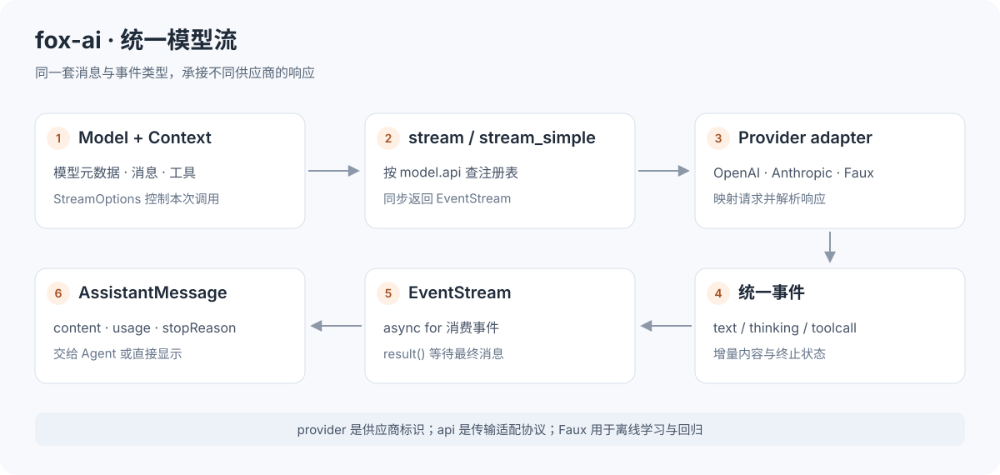
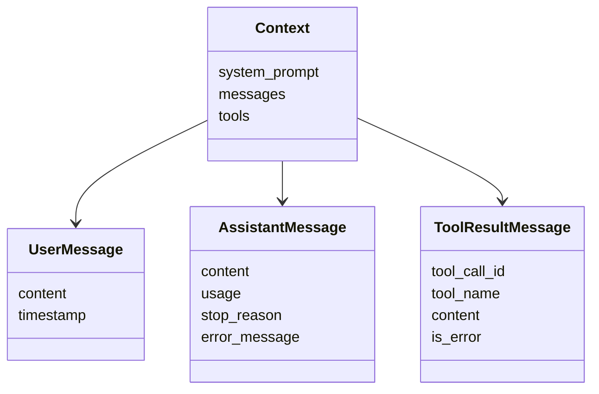
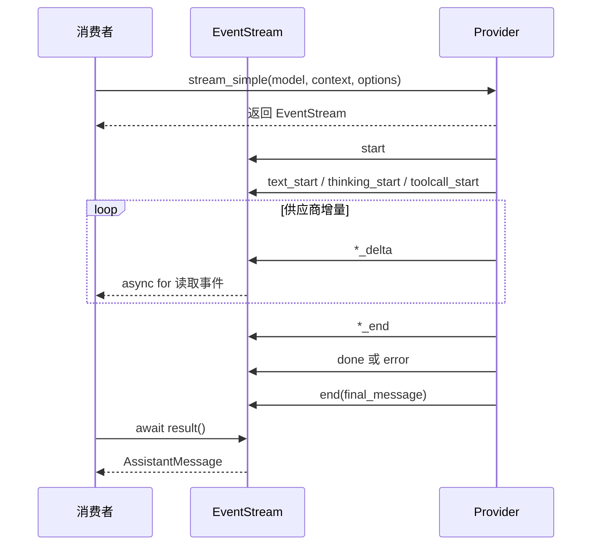

# fox-ai 学习指南

`fox-ai` 是 FoxCode 的统一模型协议层。它把不同供应商的请求、文本、思考、工具调用与用量，
转换为同一套 Python 类型和事件流，供 Agent 内核消费。

它接收 `Model + Context + StreamOptions`，产出流式事件和最终 `AssistantMessage`。
工作区、会话文件、权限、扩展与界面状态由上层处理。
本文示例与测试命令均从**仓库根目录**运行。

> 阅读路线：[类型](#1-先理解输入与输出类型) → [离线示例](#2-运行第一个离线流式示例) →
> [流式契约](#3-理解流式事件和终止行为) → [适配器](#4-模型目录与供应商适配) →
> [源码与验证](#6-源码阅读与验证)。



## 1. 先理解输入与输出类型

### 1.1 三个输入对象

| 类型 | 代表什么 | 重点字段 |
| --- | --- | --- |
| `Model` | 模型及其调用协议 | `id`, `provider`, `api`, `base_url`, `context_window`, `max_tokens` |
| `Context` | 本次模型可见的上下文 | `system_prompt`, `messages`, `tools` |
| `StreamOptions` | 本次请求的传输和采样选项 | 超时、取消、凭据、输出预算等，见 [types.py](src/types.py) |
| `SimpleStreamOptions` | 简化的请求选项 | 包含统一思考级别，由适配器转换为供应商参数 |

**`provider` 和 `api` 的区别**：provider 标识供应商，api 选择协议适配实现。
多个供应商可以共用 `openai-completions` 协议，同时拥有不同 Base URL 和模型元数据。

`Model.max_tokens` 是模型元数据，调用时的输出预算由本次 options 和上层配置决定。
上下文窗口、输出预算和输入 token 统计也不是同一个指标。

### 1.2 消息与内容块



用户消息支持文本与图片；Assistant 内容包含 `TextContent`、`ThinkingContent`、`ToolCall`。
工具结果通过 `tool_call_id` 对应此前的工具调用，支持文本或图片反馈。
不要把整个 Assistant 内容拼成普通字符串后再传回模型，工具关联和思考元信息需要保留。

Python 字段通常用 `snake_case`，部分模型定义 camelCase 别名，方便序列化。
实际线上 DTO 由调用方选择是否使用别名；桌面帧规则由 `fox_serve/protocol.py` 定义。

## 2. 运行第一个离线流式示例

先执行 `uv sync`。将下面代码保存到本地临时文件，或在 `uv run python` 中运行。
它使用 Faux provider，不访问网络、不需要 API Key。

```python
import asyncio
from fox_ai.src import Context, UserMessage, stream_simple
from fox_ai.src.providers.faux import FAUX_MODEL, FauxScript, clear_scripts, push_script

async def main():
    clear_scripts()
    push_script(FauxScript(text="Hello FoxCode"))
    context = Context(messages=[UserMessage(content="问候我")])
    events = stream_simple(FAUX_MODEL, context)
    try:
        async for event in events:
            if event.type == "text_delta":
                print(event.delta, end="", flush=True)
        message = await events.result()
        print("\nstop_reason:", message.stop_reason)
        assert message.stop_reason == "stop"
        assert message.content[0].text == "Hello FoxCode"
    finally:
        await events.aclose()
        clear_scripts()

asyncio.run(main())
```

Faux 逐字符发出 delta，所以可以直接观察“收到片段 → 累积正文 → 最终消息”的过程。
脚本按 FIFO 消费；这是进程级测试辅助状态，并发测试应使用独立的脚本控制与显式 `stream_fn`，
不要把 Faux 当作真实供应商。

只需要最终消息时使用 `await complete(...)` 或 `await complete_simple(...)`。
它们在内部等待流的最终结果；`stream()` 和 `stream_simple()` 则**同步返回 EventStream**，不需要 await 调用本身。
创建流必须位于运行中的 asyncio event loop 内。

## 3. 理解流式事件和终止行为

### 3.1 一次调用的事件序列



| 事件 | 用途 | 消费注意点 |
| --- | --- | --- |
| `start` | 响应开始 | 可以初始化本次显示 |
| `text_start/delta/end` | 普通正文块 | 依 `content_index` 定位，delta 是追加片段 |
| `thinking_start/delta/end` | 思考块 | 与正文分开显示，保留供应商需要的签名信息 |
| `toolcall_start/delta/end` | 工具调用与增量参数 | 参数未完整时不要执行工具 |
| `done` | 模型响应正常结束 | 查看 final message 和 stop reason |
| `error` | 响应失败或中断 | 查看错误消息与终止状态 |

同一 Assistant 响应可以含多个块。`content_index` 指向块的位置，不能用“最近收到的字符串”
代替块身份。工具参数 JSON 在流中可能尚未闭合，[partial_json.py](src/partial_json.py) 支持增量解析，
最终参数仍由 Agent 工具层校验。

### 3.2 EventStream 的双通道

[EventStream](src/event_stream.py) 同时提供事件队列和最终结果 Future：

- `async for` 消费过程事件；`await result()` 取得最终消息。
- `push()` 放入事件，`end()` 完成结果并结束迭代。
- `set_producer()` 绑定后台任务，让 `aclose()` 可以取消生产者并等待清理。
- `events` 返回已推送事件的副本，用于查看或回放。

提前退出 `async for` 时要显式关闭流，否则生产者可能继续进行网络请求。
正常结束后关闭流不会丢掉已完成结果。

### 3.3 正常、工具、截断与错误

常见 `stop_reason` 包括 `stop`、`toolUse`、`length`、`error` 和 `aborted`。
`toolUse` 只说明模型请求了工具，工具是否执行由 Agent 与宿主决定；`length` 需要检查输出预算，
不能直接当作完整答案。

适配器通常将请求失败编码为 error 事件与 Assistant 错误消息，
因此“`result()` 返回了一个对象”不等于调用成功。
仍应检查 `stop_reason` 与 `error_message`。注册表缺失、配置错误或生产者异常也可能直接抛异常，
消费方需要区分配置失败与模型响应失败。

## 4. 模型目录与供应商适配

### 4.1 注册表

[models.py](src/models.py) 提供两类注册：

| API | 作用 |
| --- | --- |
| `register_model`, `get_model`, `list_models` | 注册/查询模型元数据 |
| `register_api_provider`, `get_api_provider` | 注册/查询 `model.api` 对应的传输实现 |
| `register_builtins` | 幂等注册内置适配实现与模型 |

包的 `src/__init__.py` 导入时注册内置实现。
用户的 `models.json` 与 `auth.json` 由 `fox-coding-agent` 装配，不由本层直接扫描工作区。

### 4.2 现有适配器

| 文件 | 作用 | 阅读重点 |
| --- | --- | --- |
| [openai_provider.py](src/providers/openai_provider.py) | OpenAI compatible 调用 | 消息映射、工具参数增量、reasoning 与 usage |
| [anthropic_provider.py](src/providers/anthropic_provider.py) | Anthropic Messages 调用 | content block、思考、工具与终止原因 |
| [faux.py](src/providers/faux.py) | 离线脚本适配器 | 最简流式生产者、错误和工具调用样例 |

适配器负责供应商差异，上层循环只处理统一事件。
新增供应商时先判断能否使用现有 compatible 协议；只有传输语义确实不同才增加实现。

### 4.3 扩展适配器的步骤

1. 实现 `ProviderStreams.stream()` 与 `stream_simple()`，同步返回 EventStream。
2. 在后台任务中构造统一消息、推送增量与终止事件。
3. 正确映射工具 id、参数、usage、stop reason 和错误；绑定 producer 支持关闭。
4. 注册 api，实现对应模型元数据；真实凭据通过 options/credential 边界传递。
5. 用固定响应验证文本、思考、多个工具、截断、错误与取消。

完整接口定义在 [types.py](src/types.py) 与 [models.py](src/models.py)。

## 5. 重试、凭据与费用

### 5.1 两层重试

| 位置 | 解决的问题 | 阅读入口 |
| --- | --- | --- |
| Provider 请求阶段 | 发送请求时的短暂失败与限流 | [provider_retry.py](src/provider_retry.py) |
| Assistant 调用恢复 | 返回错误消息后的循环层重试与通知 | [retry.py](src/retry.py) |

两层不能无上限叠加。重试需要遵循预算与取消信号，终止后不能继续请求。
Agent 上层还处理上下文溢出与压缩，这是另一种恢复策略，不是 provider 简单重复同一请求。

### 5.2 凭据与 usage

[credentials.py](src/credentials.py) 定义凭据协议和内存实现；Coding Runtime 决定凭据来自哪个用户目录。
显式配置的用户凭据应保持隔离，不能因缺少某个 key 就意外读入另一个环境的密钥。

`Usage` 包含输入、输出、缓存、思考等用量，`UsageCost` 与模型费率支持费用估算。
供应商缺失用量字段时不能把估算宣称为账单。
工具结果进入下一次模型上下文后会影响输入预算；本层只报告单次调用数据，上层负责会话汇总。

## 6. 源码阅读与验证

### 6.1 建议阅读顺序

| 顺序 | 文件 | 学习目标 |
| --- | --- | --- |
| 1 | [types.py](src/types.py) | 区分模型、消息、内容、usage 与 options |
| 2 | [events.py](src/events.py)、[event_stream.py](src/event_stream.py) | 理解事件与最终结果通道 |
| 3 | [stream.py](src/stream.py)、[models.py](src/models.py) | 理解分发与注册 |
| 4 | [providers/faux.py](src/providers/faux.py) | 看最小适配器如何产生事件 |
| 5 | 两个真实 provider | 找出供应商差异如何被归一化 |
| 6 | partial JSON、采样与 retry 模块 | 理解边界条件与恢复 |

### 6.2 练习与测试

| 练习 | 修改示例 | 验收 |
| --- | --- | --- |
| 观察事件 | 打印上面示例的所有 `event.type` | start、块事件、done 顺序可解释 |
| 观察错误 | 将脚本改为 `FauxScript(error="demo failure")` | error 事件与最终错误消息一致 |
| 观察工具调用 | 使用带 `ToolCall` 的脚本 | 只输出调用，不执行文件或 Shell |
| 观察终止 | 设置 `stop_reason="length"` | 能区分预算耗尽与正常 stop |

错误练习需移除示例中断言正常 stop 的两行。
验证供应商映射与模型/凭据装配的测试集中在根目录，部分测试跨包验证：

```bash
uv run --with pytest python -m pytest tests/test_backend_refactor.py tests/test_auth_models.py -q
uv run --with pytest python -m pytest tests/test_agent_core.py -q
```

学习过程中先用 Faux 和固定响应，再按需进行真实模型 smoke test。
继续阅读 [Agent Core](../fox_agent_core/README.md)，看工具调用如何变成完整 Agent 循环。
