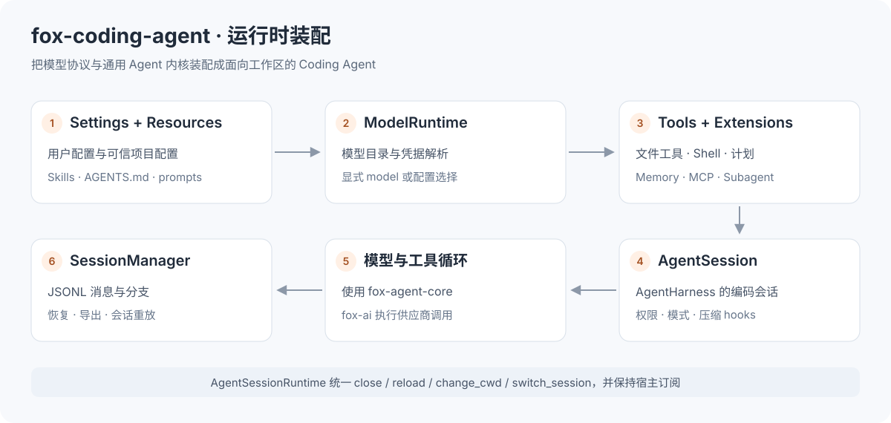
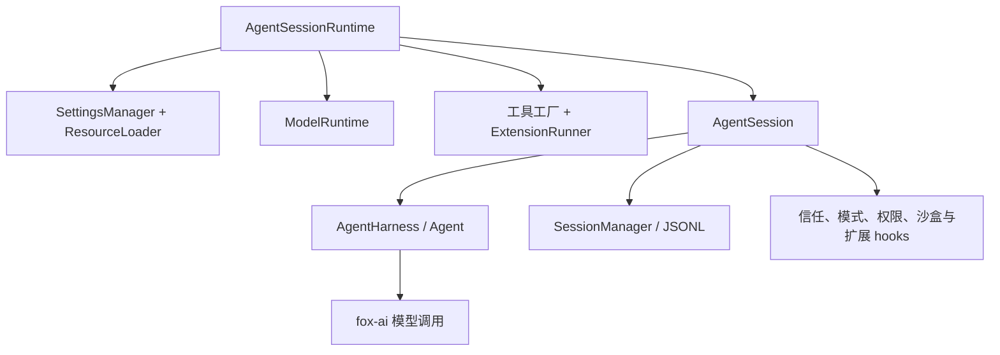
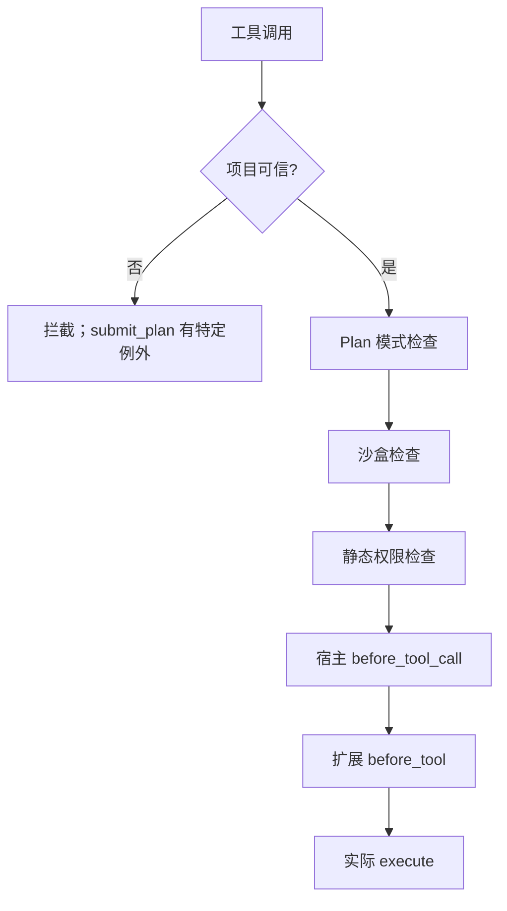
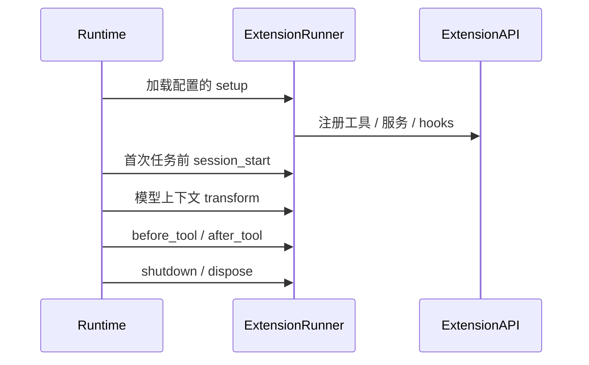

# fox-coding-agent 学习指南

`fox-coding-agent` 把通用 Agent 内核装配为面向真实代码工作区的运行时与 CLI。
它提供模型与凭据配置、文件工具、权限、会话、资源和扩展；CLI 与 Desktop 共用这些能力。

建议先读 [fox-ai](../fox_ai/README.md) 和 [Agent Core](../fox_agent_core/README.md)，
再从本文的离线工作区示例追踪到 [Serve](../../fox_serve/README.md) 与 [Desktop](../../desktop/README.md)。
本文命令默认在**仓库根目录**执行。

> 阅读路线：[核心对象](#1-三个核心对象的分工) → [离线示例](#2-运行一个真实文件离线模型的示例) →
> [配置与资源](#4-配置凭据与资源) → [工具与权限](#5-工具权限与执行模式) →
> [扩展](#6-skills模板与-extensions) → [源码与验证](#8-源码阅读与学习验证)。



## 1. 三个核心对象的分工

| 对象 | 负责 | 阅读入口 |
| --- | --- | --- |
| `AgentSessionRuntime` | 当前工作区与会话的生命周期、资源重载、订阅保持、工具装配 | [runtime.py](src/core/runtime.py) |
| `AgentSession` | 编码会话的 prompt、模式、工具选择、压缩和恢复 | [agent_session.py](src/core/agent_session.py) |
| `SessionManager` | 会话条目、消息、设置、分支与存储 | [session_manager.py](src/core/session_manager.py) |

Runtime 在构造时解析配置、选择模型、创建或读取会话、装配工具与扩展，再建立 AgentSession。
一次 `await runtime.prompt()` 会等待本轮完成；Serve 将它放到后台执行，以便桌面继续接收其他命令。



## 2. 运行一个真实文件、离线模型的示例

先执行 `uv sync`。以下完整示例在临时目录中执行真实 `write` 工具，模型响应由 Faux 固定脚本产生。
示例结束后临时工作区与用户数据自动删除，不需要供应商配置或密钥。

```python
import asyncio
from pathlib import Path
from tempfile import TemporaryDirectory
from fox_ai.src import ToolCall
from fox_ai.src.providers.faux import FAUX_MODEL, FauxScript, clear_scripts, push_script
from fox_coding_agent.src import AgentSessionRuntime

async def main():
    with TemporaryDirectory(prefix="foxcode-runtime-learn-") as temp:
        root = Path(temp)
        workspace = root / "workspace"
        workspace.mkdir()
        clear_scripts()
        push_script(FauxScript(tool_calls=[
            ToolCall(id="write-1", name="write", arguments={
                "path": "hello.txt", "content": "Hello from Coding Runtime\n",
            }),
        ]))
        push_script(FauxScript(text="文件已写入"))
        runtime = AgentSessionRuntime(
            cwd=workspace,
            user_dir=root / "user",
            model=FAUX_MODEL,
            project_trusted=True,
            settings_overrides={"permission_mode": "workspace-modify"},
        )
        unsubscribe = runtime.subscribe(lambda event, cancel: print(event.type))
        try:
            await runtime.prompt("写入 hello.txt 后回复完成")
            text = (workspace / "hello.txt").read_text(encoding="utf-8")
            print(text.strip())
            assert text == "Hello from Coding Runtime\n"
            assert runtime.session_file.is_file()
        finally:
            unsubscribe()
            await runtime.close()
            clear_scripts()

asyncio.run(main())
```

此例同时验证四件事：工作区路径装配、权限允许工作区写入、工具真实执行、会话真实落盘。
Faux 不决定工具参数，只按脚本输出固定调用；真实模型通过同样的 AgentTool 契约访问工具。

## 3. CLI 与 SDK 使用方式

### 3.1 CLI

```bash
uv run fox --help
uv run fox --list-models
uv run fox --trust-project --interactive
uv run fox --model provider/model-id -p "解释这个仓库"
uv run fox --resume
```

交互与非交互 prompt 使用配置的模型，可能产生模型用量。
模型 reference 的有效值来自用户模型目录，`provider/model-id` 是形状占位符。

| 交互命令 | 用途 |
| --- | --- |
| `/new`, `/resume`, `/fork` | 新建、恢复与分支会话 |
| `/cwd`, `/reload` | 切换工作区、重新加载资源 |
| `/model`, `/thinking` | 模型选择与推理强度 |
| `/compact`, `/usage`, `/export` | 压缩、用量与导出 |
| `/skill`, `/prompt` | 显式调用静态技能与模板 |
| 扩展命令 | Memory、MCP、Subagent 注册的入口 |

完整命令与参数以 [cli.py](src/cli.py) 和当前 `--help` 为准。
CLI 和 sidecar 都使用 runtime；sidecar 额外提供配置管理和桌面审批，不应把两者参数直接混用。

### 3.2 Runtime 操作

| 方法 | 行为 |
| --- | --- |
| `prompt`, `continue_` | 运行任务或继续已有上下文 |
| `invoke_skill`, `invoke_prompt`, `run_command` | 调用发现的资源/命令 |
| `subscribe` | 注册事件监听，返回取消函数 |
| `abort` | 请求终止当前任务 |
| `compact` | 压缩上下文，可能调用模型 |
| `new_session`, `switch_session` | 新建或恢复会话 |
| `fork` | 从当前或指定条目创建分支 |
| `change_cwd` | 装配新工作区与独立会话 |
| `reload` | 保留当前会话，重新装配配置与资源 |
| `set_project_trust`, `set_permission_mode` | 修改运行时策略并按需重建 |
| `close` | 取消任务、清理扩展并关闭 runtime |

切换会先取消并等待旧任务的清理与持久化。
构造或资源加载失败时保留原 AgentSession；订阅在成功切换后继续生效。
工具工厂接收新的 cwd，不能复用绑定旧工作区的工具对象。
Serve 为后台会话保留多个 runtime 的机制属于宿主层，单个 Runtime 自身只拥有一个当前 AgentSession。

## 4. 配置、凭据与资源

### 4.1 配置优先级


用户目录默认 `~/.foxcode`，可用 `user_dir` 指定。
项目设置只在可信项目中加载。普通配置按字段合并，`extensions` 数组采用整体替换，
项目列表不会自动追加到用户列表。

| 文件/目录 | 用途 | 关键边界 |
| --- | --- | --- |
| `settings.json` | 模型选择、权限、模式、预算和扩展列表 | 用户与可信项目作用域 |
| `models.json` | 供应商、协议、Base URL 和模型元数据 | 用户模型目录 |
| `auth.json` | API Key / OAuth 凭据 | 始终属于用户目录 |
| `skills/` | 静态 SKILL.md 资源 | 项目资源受信任边界约束 |
| `extensions/` | 可执行扩展 | 只加载配置/资源允许的来源 |
| `prompts/` | 显式调用的文本模板 | 惰性文本资源，自动指令边界另行处理 |
| `agents/`, `mcp.json` | 子角色与 MCP 工具服务器 | 由对应扩展解释 |
| `sessions/` | 按工作区组织的会话 JSONL | 用户目录统一管理 |
| `projects/<workspace-hash>/memory/` | 工作区长期记忆 | Memory 扩展管理 |

推荐通过 Desktop 设置中心修改模型与凭据，通过插件页管理扩展配置。
SettingsManager 不接受把 API Key 写入普通设置，项目文件也不携带用户凭据。
更完整的路径规则见 [文件系统与沙盒](../../docs/FILESYSTEM_AND_SANDBOX.md)。

### 4.2 模型装配

`ModelConfig` 读取并校验模型目录，`ModelRegistry` 解析 reference，`ModelRuntime` 为调用绑定凭据。
`ModelConfig.parse(data, source=path)` 也可在内存中校验待保存的完整目录，返回 `ModelConfigSnapshot`；
桌面配置服务与文件加载复用此入口，避免两套校验规则。配置、凭据与会话持久化共用
[`core/_io.py`](src/core/_io.py) 的原子写入实现。
构造 Runtime 时，显式 model 优先，然后考虑恢复会话的模型、设置选择与目录默认模型。
无法确定模型时 Runtime 会报错；Serve 额外提供无模型配置时的首次设置启动模式。

对自定义/兼容供应商，需要同时明确供应商 id、协议 api、Base URL 与模型元数据。
模型名字相同不意味着供应商和费用配置相同。

### 4.3 ResourceLoader 与 system prompt

[ResourceLoader](src/core/resources.py) 发现上下文文件、静态技能、系统提示覆盖、追加内容与模板。
可信项目可以从祖先目录到工作区读取 `AGENTS.md`；项目自动资源与可执行资源受信任约束。
Prompt 模板是显式调用的惰性文本，不能把它和自动注入的指令混为一谈。

[system_prompt.py](src/core/system_prompt.py) 组合工作区、工具、Skills、资源与模式信息。
新增提示规则应放在明确的资源/扩展入口，避免在多个上层宿主重复拼接不同版本的 system prompt。

## 5. 工具、权限与执行模式

### 5.1 内置工具

| 类别 | 典型工具 | 阅读重点 |
| --- | --- | --- |
| 文件读取 | `read`, `ls` | 大文件、图片、路径与输出截断 |
| 搜索 | `grep`, `find` | 查询与结果限制 |
| 修改 | `write`, `edit` | 路径校验、编辑失败、原子行为 |
| Shell | Bash / PowerShell 工具 | 进程取消、输出、执行环境 |
| 计划 | `submit_plan` | 结构化计划与后续确认 |

工具实现位于 [tools.py](src/core/tools.py)，注册与可用集合由
[tool_registry.py](src/core/tool_registry.py) 维护，计划工具见 [plan_tool.py](src/core/plan_tool.py)。
工具 schema 描述模型输入，权限和路径声明帮助宿主判断调用边界。

### 5.2 三种策略相互独立

| 策略 | 值 | 回答的问题 |
| --- | --- | --- |
| 权限 | `read-only / workspace-modify / full-access` | 允许执行什么能力？ |
| 执行环境 | `local / sandbox` | 工具在哪里、受什么隔离执行？ |
| 交互模式 | `auto / default / plan` | 本轮直接行动还是先计划？ |

`auto` 根据本轮输入推断实际模式，运行时区分配置模式与 effective mode。
Plan 阶段允许安全的分析与结构化计划，不允许未经模式切换就执行实现。
沙盒能力取决于原生 backend；只有文件策略而没有原生进程隔离时，沙盒 Shell 会禁用。

### 5.3 工具检查顺序



每一层都能收紧后续执行。未信任项目中常规 Agent 工具被拒绝；`submit_plan` 只封装已生成文本，
有明确例外。桌面文件预览是 Serve 的管理接口，不能据此推断 Agent 可执行同样操作。

直接使用 Runtime 时由静态权限检查执行档位。
Desktop sidecar 内部使用 full-access 让调用到达审批 hook，再由 Serve 的 PermissionPolicy 实现用户档位。
本机 Shell、越界写入和 session 允许策略的细节见 [Serve 审批说明](../../fox_serve/README.md)。

## 6. Skills、模板与 Extensions

### 6.1 三种资源的区别

| 资源 | 本质 | 使用场景 |
| --- | --- | --- |
| Skill | 带元数据的静态 SKILL.md 指令 | 特定任务的可复用流程 |
| Prompt template | 显式调用并插入参数的文本 | 常见输入模板 |
| Extension | 通过 setup 注册工具、命令、服务和 hooks 的 Python 代码 | 扩展运行时能力 |

Skill 的发现与调用不等于扩展生命周期。项目没有自进化 Skill 扩展，静态 Skills 保留正常使用。

### 6.2 ExtensionAPI 与生命周期

| API | 作用 |
| --- | --- |
| `register_tool` | 注册 Agent 可调用工具 |
| `register_command` | 注册会话命令 |
| `on` | 订阅生命周期/工具相关事件 |
| `register_service` / `get_service` | 共享可复用的扩展服务 |
| `register_context_transform` | 在模型调用前转换上下文 |
| `add_prompt_guideline` | 添加工具/行为使用指导 |

常见 spec 形状为 `module:package.module:setup`、`entrypoint:name` 或文件路径。
[extensions.py](src/core/extensions.py) 负责加载、调用 hooks 和清理。



注册不等于启动外部进程。MCP 在运行生命周期中建立连接；扩展目录探测不能执行服务器。
Memory 管理服务可以由 Serve 在首条 prompt 前单独绑定，解决桌面提前管理的问题。

### 6.3 内置扩展学习入口

| 扩展 | 核心链路 | 详细文档 |
| --- | --- | --- |
| Memory | 受控写入 → Markdown 存储 → 混合检索 → 预算注入 | [Memory](src/extensions/memory/README.md) |
| MCP | 配置 → stdio 协商 → 工具发现 → 代理调用 | [MCP](src/extensions/mcp/README.md) |
| Subagent | 角色发现 → 工具交集 → 独立上下文 → 报告 | [Subagent](src/extensions/subagent/README.md) |


## 7. 会话持久化与恢复

会话使用用户目录中的 JSONL 存储。`SessionLayout` 管理工作区归属，
`SessionManager` 从条目构建消息与设置；会话分支保留父子关系，而不只是复制一段显示文本。

| 动作 | 数据变化 |
| --- | --- |
| 消息结束 | 持久化完整消息，保留工具调用与结果关系 |
| 恢复 | 从会话条目还原模型上下文和相关设置 |
| 分支 | 从选定历史位置建立新的会话路径 |
| 压缩 | 摘要与保留尾部进入后续上下文，记录相应条目 |
| 导出 | 输出 JSON 或 Markdown 到指定位置 |

`active_tools` 保存基础工具的选择。扩展贡献的工具随当前运行时配置重新注册，
通过 `AgentSessionConfig.runtime_tool_names` 标记为运行时能力，不成为恢复会话的固定依赖。
旧记录若包含当前已启用扩展的工具名，会在装配时归一化；扩展关闭后可以重新加载会话，
再次启用时工具也会重新加入。`settings.tools` 仍可显式限制生效工具范围。

流式 partial 用于实时显示，完整消息用于落盘。
恢复中断会话要处理未完成工具，不能让模型看到只有调用、没有结果的非法历史。
桌面时间线由 Serve 重放为帧；修改持久化语义时要同步考虑历史重放。

## 8. 源码阅读与学习验证

### 8.1 阅读顺序

| 顺序 | 文件 | 关注问题 |
| --- | --- | --- |
| 1 | [runtime.py](src/core/runtime.py) | `_prepare → _build → _install` 如何装配？ |
| 2 | [agent_session.py](src/core/agent_session.py) | 怎样把 Harness 扩展为 Coding 会话？ |
| 3 | [settings.py](src/core/settings.py)、[model_runtime.py](src/core/model_runtime.py) | 配置、模型与凭据如何隔离？ |
| 4 | [tools.py](src/core/tools.py)、[permissions.py](src/core/permissions.py) | 调用如何真正触达文件？ |
| 5 | [interaction.py](src/core/interaction.py)、[sandbox.py](src/core/sandbox.py) | Plan 与沙盒在哪里约束？ |
| 6 | [resources.py](src/core/resources.py)、[skills.py](src/core/skills.py)、[extensions.py](src/core/extensions.py) | 静态文本与可执行能力如何加载？ |
| 7 | [session_manager.py](src/core/session_manager.py)、[session_layout.py](src/core/session_layout.py) | 恢复、分支与目录布局如何实现？ |

### 8.2 练习

| 练习 | 操作 | 验收 |
| --- | --- | --- |
| 只读边界 | 示例改为 `read-only` | hello.txt 不存在，工具结果含拒绝原因 |
| 信任边界 | 示例改为 `project_trusted=False` | 真实 write 不执行 |
| 工作区隔离 | 临时创建两个 workspace，调用 change_cwd | 新工具绑定新路径，会话归属正确 |
| 会话恢复 | 记住临时 session_file，关闭后重新构造 | 历史消息保留，新的订阅仍可工作 |
| 扩展生命周期 | 在隔离目录启用 Memory | 首次运行与 close 对应正确的加载/清理 |

边界练习需把原示例“文件存在”的断言替换为“不存在”的断言，并检查相应工具错误。

```bash
uv run --with pytest python -m pytest tests/test_runtime.py tests/test_coding_agent.py -q
uv run --with pytest python -m pytest tests/test_plan_mode.py tests/test_sandbox.py -q
uv run --with pytest python -m pytest tests/test_memory_extension.py tests/test_subagent_mcp_extensions.py -q
uv run python tests/memory_eval.py
```

评估器与 golden fixtures 位于 `tests/`，不随运行时包发布。
完整项目回归入口见 [根 README](../../README.md)。
