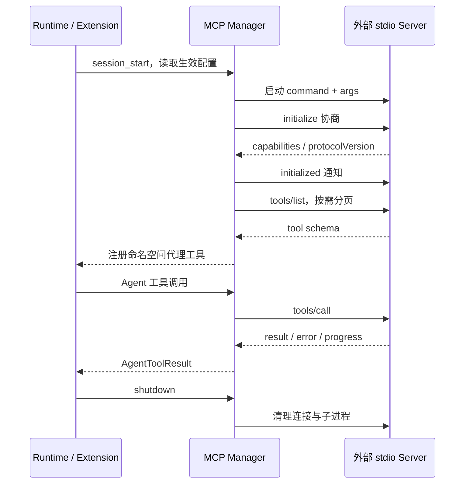

# MCP

连接 MCP 工具服务器，将外部工具注册到 FoxCode 当前会话。

## 启用

桌面端「插件 → 扩展管理」支持添加、编辑和删除服务器。保存服务器后宿主会启用 MCP 扩展并重载。
也可在 `settings.json` 的 `extensions` 列表中添加：

```json
"module:fox_coding_agent.src.extensions.mcp:setup"
```

用户配置为 `~/.foxcode/mcp.json`，项目配置为 `<workspace>/.foxcode/mcp.json`。
只有可信项目会加载项目服务器；同名项目配置覆盖用户配置。

## 配置示例

```json
{
  "mcpServers": {
    "filesystem": {
      "command": "npx",
      "args": ["-y", "@modelcontextprotocol/server-filesystem", "."],
      "enabled": true,
      "permission": "read-only",
      "timeout": 30
    }
  }
}
```

工作目录与服务器权限应按所需能力配置。环境变量由后端保存；桌面快照只返回变量名。
项目不可信时不会执行服务器命令。

## 运行机制

- 使用 stdio 传输、JSON-RPC 请求与协议版本协商。
- 初始化后分页发现工具，注册带服务器命名空间的代理工具。
- 映射工具结果、错误与进度；管理超时、取消和连接断开。
- 会话重载或结束时清理服务器进程。
- 外部工具继续受宿主权限与扩展 hook 约束。

`/mcp` 提供会话内管理入口。MCP 服务不会在扩展目录探测阶段启动。

## 学习图解：外部工具如何成为 Agent 工具



这里的 stdio JSON-RPC 通道连接外部服务器；Desktop 到 fox_serve 使用另一条 NDJSON 命令通道。
MCP 的 tool schema 描述外部输入，代理工具把它接入 AgentTool 契约，再受宿主权限限制。
服务器声明工具不等于 FoxCode 允许执行工具。

### 按源码追踪四步

| 步骤 | 入口 | 要回答的问题 |
| --- | --- | --- |
| 配置 | `config.py` | 用户/项目同名配置怎么覆盖，env 从哪里来？ |
| 传输 | `client.py` | 请求 id、通知、协商、超时与取消怎么区分？ |
| 工具 | `manager.py` | 远端 schema 怎样成为带命名空间的代理？ |
| 生命周期 | `extension.py` | 何时连接、重载、清理，为什么探测不执行？ |

### 学习练习与错误路径

优先阅读 [离线扩展测试](../../../../../tests/test_subagent_mcp_extensions.py) 的本地测试服务器，
再运行真实外部服务器。验证初始化失败、空工具列表、工具报错、进度通知、超时与 shutdown。
不要仅以“进程启动成功”判断连接成功，需确认协商、工具发现与一次调用结果。

桌面保存流程是 `config.mcp.save → 配置校验 → 启用扩展 → runtime 重载`。
真正的 MCP 连接还依赖扩展生命周期启动；配置保存成功不代表外部工具已经可用。
前端入口和脱敏快照见 [Desktop](../../../../../desktop/README.md)，配置接口见
[Serve](../../../../../fox_serve/README.md)。

## 源码与验证

| 文件 | 内容 |
| --- | --- |
| [`config.py`](config.py) | 配置模型、合并与环境变量解析 |
| [`client.py`](client.py) | stdio 客户端、协商、请求与通知 |
| [`manager.py`](manager.py) | 服务器生命周期和工具代理 |
| [`extension.py`](extension.py) | 工具、命令与 hooks 注册 |

从仓库根目录执行：

```bash
uv run python -m unittest discover -s tests -v
uv run python -m unittest discover -s fox_serve/tests -v
```
