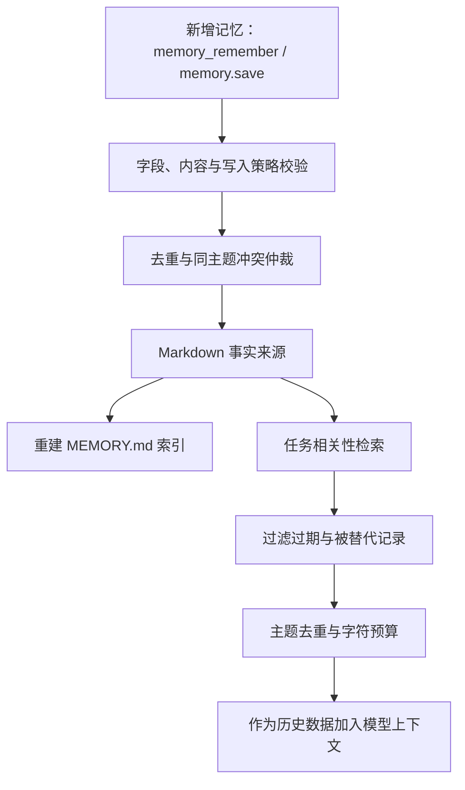

# Memory

按工作区隔离的长期记忆扩展，用 Markdown 保存用户偏好、反馈、项目决策和参考资料。

## 启用与管理

在桌面端打开「插件」，启用 `memory`。项目受信任后，下方「扩展管理 → 项目记忆」支持：

- 列表与全文查看，搜索名称、描述、正文、主题和标签。
- 按用户偏好、反馈纠正、项目决策、参考资料筛选。
- 新增，编辑描述和正文，置顶与取消置顶。
- 确认后删除，刷新查看后端最新内容。

桌面操作走真实 sidecar 接口，刷新或重新启动后仍保留。浏览器演示模式只保留当前窗口数据。
Agent 运行期间禁止桌面修改记忆；未启用扩展或项目未受信任时禁止访问。

也可手动配置生效作用域的 `settings.json`：

```json
{
  "extensions": ["module:fox_coding_agent.src.extensions.memory:setup"]
}
```

存在其他扩展时，将此 spec 添加到原列表。项目级列表整体覆盖用户级列表。

## 存储与生命周期

```text
~/.foxcode/projects/<workspace-hash>/memory/
├── MEMORY.md                  派生索引
└── <type>_<slug>-<hash>.md     记忆正文与 YAML 元数据
```

工作区路径经规范化后生成哈希，两个工作区不共享记录。Markdown 是事实来源，索引由写入和删除更新。

| 字段 | 说明 |
| --- | --- |
| `name`、`type` | 稳定身份；桌面编辑时保持不变 |
| `description`、正文 | 可编辑的摘要与内容 |
| `topic` | 同主题冲突的归组依据 |
| `status` | `active`、`superseded`、`expired` |
| `pinned` | 在注入预算内优先进入上下文 |
| `expiresAt` | 可选的 ISO 8601 有效期 |
| `sourceSession`、时间戳 | 来源与更新记录 |

更新已有记录保持身份、来源与生命周期；置顶不会恢复已被替代或过期的记忆。
单条名称最多 100 字符，描述 500 字符，正文 20,000 字符；每个工作区最多 200 条。
存储拒绝空内容、非法文件名和疑似凭据，写入采用原子替换。

## Agent 与桌面接口

| 接口 | 用途 |
| --- | --- |
| `memory_remember` | Agent 受控写入、去重与主题冲突处理 |
| `memory_recall` | Agent 按任务相关性检索历史资料 |
| `memory_forget` | 在用户明确要求后遗忘指定记录 |
| `/memory` | CLI 管理入口 |
| `memory.list` | 桌面管理列表；可传 `query`，包含历史记录 |
| `memory.save` | 新增；传 `filename` 时编辑描述、正文或置顶状态 |
| `memory.delete` | 删除指定 `filename`，返回 `deleted` |

管理列表使用文本搜索；Agent 召回使用混合检索，两者服务于不同场景。

## 检索与注入

召回使用三项可解释信号：字段加权 BM25F、同义概念图、时间与事实状态仲裁。
阈值和主题去重决定最终候选；过期及被替代记录不参与有效召回。
置顶由注入层处理，不额外抬高检索分数。

记忆作为历史数据注入，正文不获得指令优先级。注入和工具召回均有字符预算。
默认自动召回最多 3 条，注入上限 12,000 字符，工具召回上限 6,000 字符。

## 学习图解：一条记忆如何进入上下文


图中的入口位于「插件 → 扩展管理」，上方扩展开关负责能力启停，下方管理区负责记录操作。
点击名称查看全文，编辑只修改描述、正文和置顶；记录身份与生命周期保持稳定。



学习时区分三个状态：**写入已接受**、**记录仍有效**、**本次任务实际注入**。
成功保存不代表每次都会召回；置顶只影响预算内注入顺序；失效记录仍可能出现在管理列表。

### 从接口到源码

| 阅读顺序 | 要理解的机制 |
| --- | --- |
| `extension.py` 的 setup 与服务注册 | Agent 工具和桌面管理为什么共享 memory.store |
| `store.py` 的 save/update/delete | 新增策略、稳定身份、原子写入与索引 |
| `retrieval.py` | BM25F、概念信号、时间与状态如何排序 |
| `injection.py` | 置顶、相关记录、历史数据边界与字符预算 |
| `fox_serve/host.py` 的 memory handlers | 首次 prompt 前服务绑定、参数校验与运行中限制 |
| `MemoryManager.tsx` | 200ms 搜索防抖、旧响应保护、失败保留草稿 |

### 离线学习练习

在隔离可信工作区启用 Memory，新增两条不同主题的中文记录，再更新其中一条。
记录每次返回的 filename、topic 和 status，确认另一条不会被无关主题替代。
随后搜索、置顶、重启读取并删除；从另一个工作区查询应看不到这些记录。

检索练习使用现有固定样例：比较同义词、过期事实与冲突主题的候选，检查评分解释和预算。
修改阈值后运行评估器，不能只用一条查询判断整体提升。
详细接口示例见 [Serve 指南](../../../../../fox_serve/README.md)，前端行为见
[Desktop 指南](../../../../../desktop/README.md)。

## 源码与验证

[`store.py`](store.py) 管持久化，[`retrieval.py`](retrieval.py) 管检索，
[`injection.py`](injection.py) 管预算化注入，[`extension.py`](extension.py) 注册工具、服务和 hook。

从仓库根目录执行：

```bash
uv run python -m unittest discover -s tests -v
uv run python -m unittest discover -s fox_serve/tests -v
uv run python tests/memory_eval.py
```

评估器和固定样例位于 `tests/memory_eval.py`、`tests/fixtures/memory_eval/`。
它们用于检索、过期过滤、预算与写入策略回归，不能替代真实任务效果评估。
