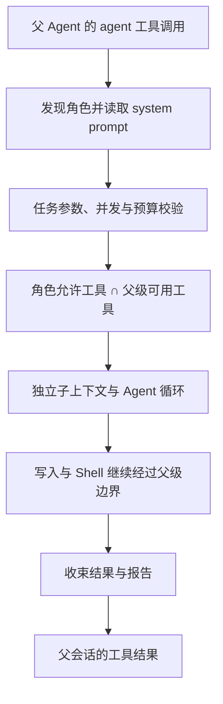

# Subagent

通过独立上下文执行明确的子任务，工具和权限受父 Agent 约束。

## 启用与配置

桌面端「插件 → 扩展管理」支持添加、编辑和删除角色。保存角色后宿主会启用扩展并重载。
手动启用时，在 `settings.json` 的 `extensions` 列表中添加：

```json
"module:fox_coding_agent.src.extensions.subagent:setup"
```

用户角色位于 `~/.foxcode/agents/*.md`，项目角色位于 `<workspace>/.foxcode/agents/*.md`。
项目角色只在项目受信任时加载，同名项目角色覆盖用户角色。

```markdown
---
name: review
description: 只读检查代码风险
allowed-tools: [read, grep, find, ls]
---
检查指定代码的正确性和边界条件，提供文件位置与可执行的修复建议。
```

内置角色包括只读探索与测试验证。`/agents` 查看当前可用角色，Agent 通过 `agent` 工具委派任务。

## 隔离与权限

子任务使用独立历史与 system prompt，完成后返回报告；不会直接合并其全部消息到父会话。
工具能力为角色允许工具与父 Agent 能力的交集，子任务不能提升父权限。
子任务写入与 Shell 调用继续走父级审批和沙盒边界。

管理器负责并发限制、进度、取消和执行预算。项目切换、重载和会话结束会清理相关状态。
MCP 与自定义工具是否可用取决于父会话注册的能力和角色允许列表。

## 学习图解：父任务如何委派子任务



**角色**描述可复用的职责，**任务**是一次具体调用，**子上下文**是执行这次任务的消息历史。
修改角色文件不会把旧任务历史变成新角色。报告作为工具结果回到父上下文，不直接拼接整个子 transcript。

### 权限示例

| 父级能力 | 角色 allowed-tools | 子任务能用什么 |
| --- | --- | --- |
| read、grep、write | read、grep | read、grep |
| read、grep | read、write | read；缺失的 write 不会凭空获得 |
| 包含 MCP 工具 | 只读文件工具列表 | 只使用交集，不自动继承所有外部工具 |

工具集合与执行权限是两层约束：即使交集里有 write，也仍要满足父级权限、信任、模式和沙盒规则。
取消必须传递到子模型和子工具，不能只删除前端的进度显示。

### 源码阅读与练习

先看 `models.py` 的角色/任务类型，再看 `discovery.py` 的内置、用户与可信项目合并，
最后追踪 `extension.py` 的任务管理、工具交集、进度、取消与结果收束。

使用 [离线扩展测试](../../../../../tests/test_subagent_mcp_extensions.py) 验证角色覆盖、
缺失工具、权限收紧和取消。随后在隔离目录创建上面的 review 角色，确认其只读工具范围。
学习完成时应能解释：为何子任务拥有独立历史，为什么不能扩大父权限，以及失败如何返回父会话。

角色配置的桌面入口是「插件 → 扩展管理」；保存使用 `config.subagent.save` 并触发扩展启用与重载。
详细调用链见 [Serve](../../../../../fox_serve/README.md) 和 [Runtime](../../../README.md)。

## 源码与验证

| 文件 | 内容 |
| --- | --- |
| [`models.py`](models.py) | 角色与任务模型 |
| [`discovery.py`](discovery.py) | 内置、用户与项目角色发现 |
| [`extension.py`](extension.py) | 子任务管理器、工具与命令注册 |

从仓库根目录执行：

```bash
uv run python -m unittest discover -s tests -v
uv run python -m unittest discover -s fox_serve/tests -v
```
